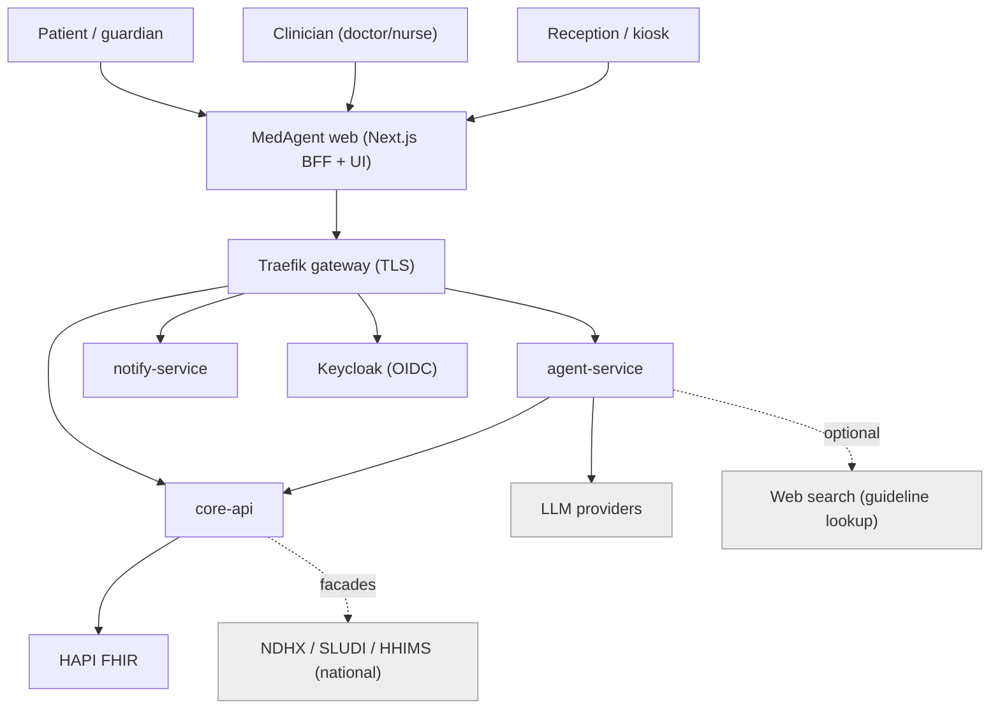
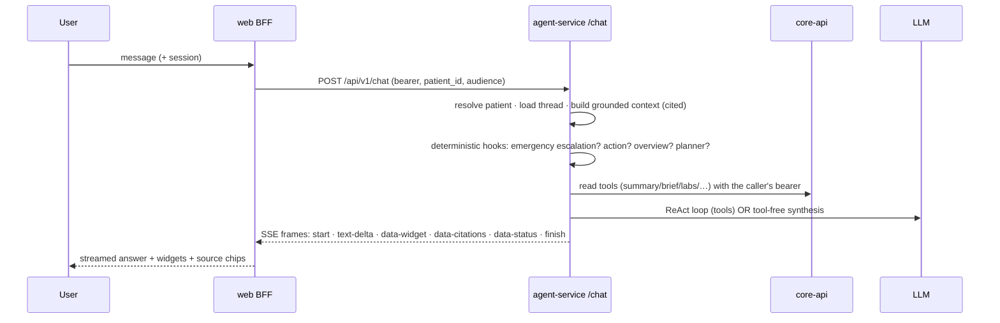

# MedAgent — System Architecture (current state)

_The authoritative, current-state architecture of the MedAgent platform. Grounded in a
full read of the running system (services, routers, interceptors, compose overlays) as of
2026-09. Companion docs: [ROADMAP.md](ROADMAP.md) (what's done/remaining),
[BUILD-PLAN.md](BUILD-PLAN.md) (build tracker), [THREAT-MODEL.md](THREAT-MODEL.md) +
[SECURITY-REVIEW.md](SECURITY-REVIEW.md) (security), [CLINICAL-VALIDATION.md](CLINICAL-VALIDATION.md),
and the design set under `docs/solution/` (00–23). Where this doc and a solution doc
disagree, **this doc reflects what is actually built**; the solution docs are the design intent._

_For the **deep mechanical detail** — full DB schema, the agent turn lifecycle, the 24 tools, the
two audit chains, auth/consent/check-in flows, and failure modes — see the companion
[ARCHITECTURE-INTERNALS.md](ARCHITECTURE-INTERNALS.md)._

---

## 1. What MedAgent is

A **conversation-first, safety-gated medical AI platform** for a national health system
(Sri Lanka context). Two human-facing experiences share one grounded, cited AI agent and one
deterministic clinical-safety core:

- **Patient portal** (PWA) — a chat-first concierge: ask about your record, book/refill/video,
  upload a report, get proactive nudges, manage consent.
- **Doctor cockpit** — a copilot-primary workspace: cited Q&A over the patient record, consult
  sessions with FHIR write-back, prescription pre-screen + e-sign, orders, queue, referrals.

**North-star principle — "safety is topology, not prompt":** the model *proposes*; every
irreversible or clinical action is *committed* by deterministic, consent/authz/safety-gated
backend routes after an explicit human tap. The deterministic Rx-safety engine and the
fail-closed FHIR boundary sit **outside** the model and cannot be overridden by it.

---

## 2. System context (C4 L1)



- **Actors:** patients/guardians, clinicians, reception/kiosk.
- **External systems:** LLM providers (cloud or self-hosted — see §7), the national health
  systems (integrated via **facades**, §11), and optional web search for guideline lookups.

---

## 3. Container view (C4 L2) — services & ports

All services run in Docker (`infra/compose/`). Host ports are dev conveniences; real traffic
flows through the gateway.

| Container | Tech | In-container | Host port | Responsibility |
|---|---|---|---|---|
| **gateway** | Traefik v3.3 | 80/443 | 80, 443 | TLS termination, routing, rate-limit; the only public entrypoint |
| **web** | Next.js 16 (App Router) | 3000 | 3000 | UI (patient portal + doctor cockpit) **and** the BFF (`/api/*` token-attach proxies, OIDC session, SSE tickets) |
| **core-api** | FastAPI (Python 3.12) | 8000 | 8001 | Clinical read/write over FHIR, decision-checked; the deterministic write spine |
| **agent-service** | FastAPI + LangGraph | 8000 | 8002 | The AI agent (chat, vision, consult agenda, rx-safety, telemetry, feedback) |
| **notify-service** | FastAPI | 8000 | 8003 | SSE fan-out (`/stream`), personal notifications, SSE tickets |
| **fhir** | HAPI FHIR v8.10 | 8080 | — (internal only) | FHIR R4 store; fail-closed interceptors in ENFORCE (§8) |
| **keycloak** | Keycloak 26 | 8080 | 8081 | OIDC identity provider; realm-as-code |
| **postgres** | Postgres 16 | 5432 | — | 3 DBs: `app_db` (core-api + agent checkpointer), `hapi_db` (FHIR), keycloak |
| **redis** | Redis 7 | 6379 | — | Per-service ACL; SSE tickets, notifications, agent memory/threads, consent cache |
| **minio** | MinIO | 9000 | 9001 | Object store (uploads/exports) |
| **mailpit / face-sim** | — | — | 8025 / — | Dev mail capture; face-recognition simulator |
| **ollama** *(overlay)* | Ollama | 11434 | 11434 | Self-hosted LLM (Qwen2.5-7B), GPU — see §7 |
| **vllm** *(overlay)* | vLLM | 8000 | 8010 | Production self-hosted LLM (server GPU) — see §7 |
| **national-sim** *(overlay)* | stdlib HTTP | 8000 | — | NDHX/SLUDI/HHIMS simulator for the facades (§11) |
| observability *(profile)* | Prometheus / Grafana / Tempo / Loki / otel-collector | — | 9090 / 3001 | Metrics + dashboards + alerts (§12) |

**Networks:** `edge` (gateway ↔ app services, has outbound internet) and `internal`
(`internal: true` — **air-gapped**: FHIR/Postgres/Redis live only here; members get no outbound
internet). App services straddle both; the data tier is internal-only.

---

## 4. The six-layer platform

```
┌─ EDGE ─────────── Traefik (TLS, rate-limit) ─────────────────────────────┐
│                                                                           │
├─ APP ──── web (Next BFF + UI) · core-api · agent-service · notify-service │
│                                                                           │
├─ PLATFORM ─────── HAPI FHIR (+ fail-closed interceptors) · Keycloak      │
│                                                                           │
├─ DATA ─────────── Postgres (app_db/hapi_db/keycloak) · Redis · MinIO     │
│                                                                           │
├─ INTEGRATION ──── NDHX · SLUDI · HHIMS facades · SNOMED CT · web search   │
│                                                                           │
└─ OBSERVABILITY ── Prometheus · Grafana · Tempo · Loki · OTel · audit chain┘
```

---

## 5. The reusable spine (every real write)

```
UI action → web BFF (attach session bearer) → core-api router
          → decision gate (authz + care-relationship + consent)
          → FHIRClient (pooled) → HAPI FHIR
          → AuditOutbox (same transaction) → AuditEvent (hash-chained)
```

Every clinical write — a prescription, a consult note, a lab order, a booking, a refill Task,
a consent change — follows this exact shape. The model never writes to FHIR directly; it calls
core-api with the **caller's bearer**, so consent + authz + audit are always enforced.

---

## 6. Request flows

### 6.1 A chat turn (grounded, cited, streamed)



**SSE frame protocol** (Vercel-AI-SDK style): `start`, `text-start`, `text-delta`,
`data-status` (reasoning trace / "Consulting as cardiology"), `data-widget` (typed generative
UI), `data-citations` (`[source: Type/id]` chips), `data-proposals` / `data-cards`
(back-compat), `text-end`, `finish`, `[DONE]`.

**Answer paths (in priority order), all grounded + cited:**
1. **Emergency escalation** (deterministic, additive) — a red-flag detector surfaces an
   `escalation` widget first (§10), never blocking the answer.
2. **Overview / 360 fast path** — a broad "full profile" is synthesised in one pass from the
   pre-loaded cited context; on a slow/leaky model it falls to a deterministic sectioned 360
   (`_overview_from_context`). Budget is configurable (`overview_synth_budget_seconds`).
3. **Action fast path** (patient) — a clear refill/book/video request returns a `confirm-action`
   card instantly (the model proposes; the tap commits).
4. **Planner** — a multi-part ask streams a `plan-steps` widget, then executes.
5. **ReAct loop** — tool-using Q&A; a **reflect/critic** pass appends a note only if a real
   plan step was missed.
6. **Answer floor** — the stream is never silent; a graceful message always closes it.

**Resilience:** free-text synthesis is buffered + validated so a hallucinated tool-call (Qwen
failure mode) is never streamed as the answer (`_looks_like_tool_leak` + `_synth_answer`);
a quota/leak/empty result falls back to grounded deterministic synthesis.

### 6.2 Propose-then-commit (a prescription)

```
model → draft_prescription (proposal) → confirm/verdict widget
  → clinician taps sign → core-api /proposals/prescreen (DETERMINISTIC Rx engine)
      block  → 409, cannot be signed          (topology: block never reaches commit)
      warn   → 422, explicit override required
      pass   → /proposals/commit → FHIR MedicationRequest + verdict extension + audit
```

### 6.3 Doctor consult session
`agent-service POST /consult/agenda` derives a grounded, cited agenda deterministically →
`consult-session` widget (confirm each item) → `core-api POST /consult/encounter` writes a real
FHIR **Encounter** + **DocumentReference** note → receipt.

---

## 7. AI agent platform (`services/agent-service`)

- **Graph:** a single LangGraph `create_react_agent` (patient-scoped), grounded by a pre-loaded
  cited context block (`app/agent/context.py`, deduped + human-formatted). A compiled supervisor
  graph exists in `app/graph/` but is **dormant** — its value (plan→do→self-check) is delivered
  by the planner/reflect functions on the proven single-ReAct path; promoting it is a deferred,
  tested pass (see ROADMAP §2).
- **Tools** (`app/agent/tools.py`): ~14 FHIR **read** tools (all via core-api, cited) +
  `present_card`/`render_widget` (generative UI, allow-listed kinds) + action tools
  (`request_refill`, `book_appointment`, `start_video`, `order_lab` — each **stages** a confirm
  card, never executes) + `draft_prescription`. `fhir_headers()` forwards the service key +
  role + purpose when set.
- **Modules:** `build.py` (LLM construction + system prompts), `context.py` (grounding),
  `memory.py` (long-term semantic memory in Redis, consent-scoped, PHI-safe),
  `threads.py` (server-owned conversation threads → server-side multi-turn),
  `escalation.py` (deterministic emergency detector, §10), `safety_guards.py` (PHI outbound
  guard for web search), `websearch.py` (keyless, `[web: …]` provenance kept separate from
  patient `[source: …]`), `vision.py` (Anthropic vision: image/PDF → structured extraction),
  `telemetry.py` (PHI-free per-turn aggregates), `stub.py` (offline deterministic model).
- **Routers:** `chat`, `vision`, `consult`, `rx_safety`, `telemetry`, `feedback` (+ `learning/`
  for the governed self-improvement loop, §12).

**LLM providers (provider-agnostic via `langchain_openai.ChatOpenAI` + `ChatAnthropic`):**

| Mode | Model | Notes |
|---|---|---|
| Cloud OpenAI-compat (default) | Groq **`qwen/qwen3.8-27b`** | Reliable structured tool-calls + clean synthesis; `reasoning_format` gated to Groq only |
| Cloud Anthropic | `claude-sonnet-5` | ReAct loop when `agent_react_provider=anthropic` + key + quota; always used for vision |
| Self-hosted (overlay) | Ollama **`qwen2.5:7b-instruct`** | Sovereign/offline, GPU; `docker-compose.ollama.yml` |
| Self-hosted production (overlay) | vLLM (70B on a server GPU) | Guided decoding = guaranteed-valid tool JSON; `docker-compose.vllm.yml` |
| Offline | `stub` | Deterministic, no API — CI/demo |

Swapping provider is **config only** (`AGENT_LLM_MODE`, `LLM_OPENAI_BASE_URL/MODEL`,
`AGENT_REACT_PROVIDER`) — no agent code change. The self-hosted overlays
(`infra/compose/docker-compose.ollama.yml`, `docker-compose.vllm.yml`) carry the details.

---

## 8. FHIR data platform (`platform/fhir`, `services/core-api`)

- **Store:** HAPI FHIR R4 on `hapi_db`, reachable only in-network.
- **Access:** core-api is the sanctioned path — routers `patients`, `consult`, `lab`/`lab_order`,
  `imaging`, `referrals`, `schedule`, `telemedicine`, `proposals`, `registry`, `analytics`,
  `queue`, `audit`, `authz`, `consent`, `face_events`, `integrations`. A shared, pooled
  `FHIRClient` (single-flight JWKS, bounded pool + retry-once) handles all FHIR I/O.
- **Fail-closed interceptor stack** (Java, `platform/fhir/interceptors/`), activated by the
  opt-in overlay `docker-compose.fhir-enforce.yml`:
  - **AuthzInterceptor** (ENFORCE) — trusted-service credential (`X-MedAgent-Service-Key`) +
    role/scope write-gate + **no-trawl** search shaping on patient-compartment types +
    purposeOfUse stamp, fail-closed.
  - **ConsentInterceptor** (EVALUATE) — masks a resource whose subject has an active
    record-sharing **deny** consent, evaluated **per purpose** (`X-MedAgent-Purpose`);
    default-allow + fail-open + the face-recognition biometric-consent exclusion preserved so
    no read that flows today is newly masked (§9).
  - **AuditInterceptor** (PERSIST) — writes a complete FHIR `AuditEvent`, **SHA-256 hash-chained
    and continued across restarts** (bootstraps the head hash from the store, fail-safe to
    genesis) — tamper-evident; `/internal/audit/verify`.
- **Activation:** base dev runs without the overlay (app-layer authz gates the real paths);
  ENFORCE is one overlay away and verified (read 200 + cited, gated write 201, credential-less
  raw read 403). Run under the overlay before multi-facility (residual risk R-1, largely closed).

---

## 9. Identity, access, consent, audit

- **AuthN:** Keycloak (realm-as-code), OIDC via the web BFF; **split-horizon** — services validate
  token `iss` against the public issuer but fetch JWKS from the internal URL. 11 roles, 7 clients.
- **AuthZ:** care-relationship decision service (`/internal/authz/decision`) + Redis consent
  cache; the patient portal is **self-scoped** — the PHN comes from the session claim, never the
  client, so a patient can only ever reach their own compartment.
- **Consent:** per-purpose (TREATMENT/RESEARCH/MARKETING) as scoped FHIR `Consent` resources +
  the biometric face-recognition consent; enforced app-layer and (under the overlay) at the FHIR
  boundary. Changes publish `events:consent:invalidate`.
- **Audit:** transactional outbox → FHIR `AuditEvent` (C/R/U/D/E), hash-chained (§8); surfaced as
  the patient access log (FR-5.8) and record exports (FR-5.6).

---

## 10. Safety architecture (invariants that hold every release)

1. **Deterministic Rx-safety engine, outside the model** — DDI/allergy/dose screening; a `block`
   verdict can never reach sign-off (topology). core-api re-screens on commit (409/422).
2. **Propose-then-commit HITL** — the model renders a confirm/verdict widget; a gated core-api
   route commits on the human tap. `confirm-action`/`escalation` are **not** in the
   `render_widget` allow-list, so the model can't forge them.
3. **Deterministic emergency escalation** (`app/agent/escalation.py`) — red flags (anaphylaxis,
   FAST/stroke, cardiac chest-pain + feature/history, severe breathing, sepsis, first-person
   self-harm, an already-CRITICAL chart result) surface an `escalation` widget (Call 1990
   Suwaseriya / nearest ETU / 1926 helpline) — additive, never diagnoses.
4. **Grounding is authoritative** — patient facts come from FHIR with `[source: …]` citations;
   web results are `[web: …]` and never mixed in. PHI is guarded on any outbound web query.
5. **Tool-leak guard** — a hallucinated tool-call is never streamed as an answer (§6.1).
6. **Learning never touches safety** — the self-improvement loop cannot modify the Rx dataset,
   prompts, or clinical behaviour (§12).

---

## 11. National integrations (facades — `services/core-api/app/integrations/`)

Honest **facades** over the §09 spec: real adapter clients that point at a local **simulator**
today (`services/national-sim`, `docker-compose.national.yml`) and at the real endpoints when
configured. **All OFF by default.**

- **NDHX** (National Data Exchange) — FHIR R4: share a summary DocumentReference, fetch a record
  locator via MPI.
- **SLUDI** (MOSIP) — verify a national digital identity → partner token (never the UIN), resolve PHN.
- **HHIMS** — hospital-HIS FHIR facade: exchange an encounter/discharge summary.
- **SNOMED CT** (`integrations/terminology.py`) — licensed FHIR terminology server when enabled;
  otherwise a small non-authoritative offline subset (never guesses a code).
- Endpoints under `GET/POST /api/v1/integrations/*`, role-guarded + audited; disabled → 503, not 500.

**Going live needs the external systems + credentials (and the SNOMED licence)** — the code is
ready to point at them.

---

## 12. Observability & governed self-improvement

- **Metrics:** all 3 Python services expose `/metrics` (prometheus-fastapi-instrumentator) +
  Traefik metrics; scraped by Prometheus; Grafana "Golden Signals" dashboard.
- **Alerts:** `infra/observability/prometheus/alerts.yml` — service/gateway down, 5xx ratio
  (warn/page), p95 > 2s (NFR-2), scrape-target missing.
- **Perf:** k6 harness — `record-load.js`, `checkin-burst.js`, `chat-concurrency.js`, `soak.js`.
- **Agent telemetry:** PHI-free per-turn aggregates (path, latency p50/p95, tokens) +
  `GET /api/v1/quality` drift snapshot (thumbs-down/reject/override/refusal, citation-coverage,
  latency, error rate, tokens) scored against thresholds.
- **Self-improvement (governed):** feedback capture → `app/learning/analyze.py` +
  `growth.py` mine recurring failure patterns into **candidate** golden eval cases under
  `evals/candidates/` (human-confirm only; never the Rx dataset/prompts). The eval gate
  (`evals/run.py`, **38/38**) runs in CI and blocks regressions.
- **Tracing/logs:** OTLP traces/logs → Tempo/Loki is the remaining observability item (deferred).

---

## 13. Web / frontend (`apps/web`)

- **BFF pattern:** every backend call goes through a Next.js route (`app/api/*`) that attaches the
  session bearer — `auth`, `chat`, `consult`, `lab`, `portal/*` (results/summary/booking/refill/
  consent/…), `proposals`, `queue`, `referrals`, `sse`. The browser never holds a raw token.
- **Surfaces:** patient concierge (`(patient-portal)/portal/concierge.tsx`) and doctor cockpit
  (`(doctor)/patients/[id]/`), both chat-first, both rendering the same widget registry.
- **Generative-UI widget registry** (`components/widgets.tsx`, ~15 kinds): safety-alert,
  escalation, record-links, metric-trend, stat-grid, next-best-action, timeline, summary,
  confirm-action, access-log, consent-panel, consult-session, order-status, receipt, plan-steps.
- **Streaming:** a hand-rolled SSE reader adapts the frame protocol (§6.1) to the UI part-model.
- **Design system:** committed **premium-dark `.mh` skin** (`app/mh-theme.css`) — near-black
  canvas, teal accent, health-metric category palette, soft shadows, Inter + JetBrains Mono via
  `next/font`. A dormant clinical-light token set (`packages/ui/styles/tokens.css`) exists; a
  real light/dark/system theme is a candidate next step (see ROADMAP §6).
- **PWA:** manifest + service worker + `/offline`; En/Si/Ta localisation; voice mode.

---

## 14. Deployment topology (compose overlays)

Base: `docker-compose.yml`. Layer overlays with `-f`:

| Overlay | Purpose |
|---|---|
| `docker-compose.dev-fhir.yml` | stock HAPI for dev/seed (skeleton interceptors) |
| `docker-compose.fhir-enforce.yml` | **fail-closed data layer** — registers the 3 interceptors, ENFORCE + shared service key |
| `docker-compose.ollama.yml` | sovereign self-hosted LLM (Qwen2.5-7B, GPU) |
| `docker-compose.vllm.yml` | production self-hosted LLM (server GPU, guided decoding) |
| `docker-compose.national.yml` | NDHX/SLUDI/HHIMS simulator + enables the facades |
| `docker-compose.tunnel.yml` | demo tunnel |
| `docker-compose.test.yml` | integration tests |
| `--profile observability` | Prometheus/Grafana/Tempo/Loki/OTel |

Typical national-pilot bring-up:
`docker compose -f docker-compose.yml -f docker-compose.fhir-enforce.yml up -d --build`.

---

## 15. Data stores

- **`app_db`** (Postgres) — only 4 operational tables: `patients_mpi` (identity/link index),
  `queue_entries` (live queue), `audit_outbox` (transactional audit), `audit_chain_head` (audit
  chain head). **Proposals, consent, and all clinical data live in FHIR, not here.** The LangGraph
  checkpointer is provisioned-for but not yet wired (Redis threads are the live mechanism). Full
  table/column detail: [ARCHITECTURE-INTERNALS.md](ARCHITECTURE-INTERNALS.md) §1.
- **`hapi_db`** (Postgres) — the FHIR store (HAPI `hfj_*`).
- **keycloak DB** — realm/users/clients.
- **Redis** (per-service ACL) — SSE tickets, personal notifications, agent long-term memory +
  conversation threads, consent verdict cache.
- **MinIO** — uploaded reports/images, generated exports.
- **FHIR resources in use:** Patient, Condition, MedicationRequest, AllergyIntolerance,
  Observation (vitals/labs), DiagnosticReport, Appointment/Slot/Schedule, Encounter,
  DocumentReference, ServiceRequest, Task, Consent, AuditEvent, RelatedPerson, Immunization.

---

## 16. Security & compliance posture

Deterministic safety + fail-closed data boundary + full audit are the pillars. Residual risks
(tracked in [SECURITY-REVIEW.md](SECURITY-REVIEW.md) / [THREAT-MODEL.md](THREAT-MODEL.md)):
**R-1** (FHIR-boundary enforcement) — largely closed, run under the enforce overlay by default
before multi-facility; **R-3** (LLM load) — harness built, staging numbers pending. Dependency
audits (pip-audit + pnpm audit + gitleaks) gate CI. DPIA-lite + STRIDE in
[COMPLIANCE-PACK.md](COMPLIANCE-PACK.md). Externally gated: accredited security certification and
clinical validation ([CLINICAL-VALIDATION.md](CLINICAL-VALIDATION.md)).

---

## 17. Repository layout

```
apps/web/                 Next.js UI + BFF (patient portal, doctor cockpit, kiosk)
packages/ui/              design tokens + shared UI primitives + tailwind preset
packages/ts-sdk/          generated typed clients from service OpenAPI
services/core-api/        FastAPI clinical read/write spine (FHIR, decision-gated)
services/agent-service/   LangGraph agent (chat, vision, consult, rx-safety, learning)
services/notify-service/  SSE fan-out + notifications
services/national-sim/    NDHX/SLUDI/HHIMS simulator (dev)
platform/fhir/            HAPI image + Java interceptors (authz/consent/audit)
platform/keycloak/        realm-as-code + config-cli
platform/gateway/         Traefik dynamic config
infra/compose/            base compose + overlays + env
infra/observability/      prometheus (+ alerts), grafana, tempo, loki, otel
infra/perf/               k6 scenarios
evals/                    golden eval gate + governed candidate queue
docs/                     this doc + solution set (00–23) + ROADMAP/THREAT-MODEL/…
```

---

## 18. What is intentionally NOT in the running system yet

See [ROADMAP.md](ROADMAP.md) for the full list. In short: **live** national links (facades ready,
need the real systems + creds), the SNOMED licence, an accredited security certificate, executed
clinical validation, the supervisor-graph promotion (deferred — value already delivered, highest
`/chat` risk), OTLP distributed tracing, LiveKit production video, a full accessibility pass, and
offline-first sync. Each is either externally gated or a scoped next pass — none blocks a
single-facility supervised pilot.
