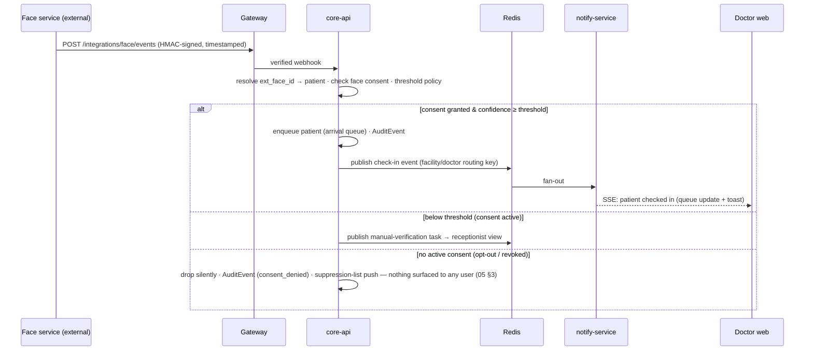

# 01 · System Architecture

Version 1.0 · July 2026 · MedAgent Platform
Status: Draft for review

## Executive summary

The platform is a six-layer national architecture (spec §3.1) realised as a **monorepo of independently deployable services** around a HAPI FHIR R4 clinical core. Phase A runs the full stack for one hospital on a single environment footprint; Phase B scales the identical topology horizontally (more facilities, read replicas, search offload) without re-architecture. Everything clinical is FHIR; everything real-time flows through Redis pub/sub; every access passes the gateway where authentication, consent, and audit are enforced.

## 1. Layered view (spec §3.1 → deployables)

```mermaid
flowchart TB
    subgraph CH[Channels]
      WEB[Doctor workspace<br/>Next.js 16]
      PWA[Patient portal PWA]
      KIOSK[Check-in kiosk view]
    end
    subgraph EDGE[Edge]
      GW[API Gateway — Traefik<br/>TLS · rate limit · authN(JWT) · request validation]
    end
    subgraph APP[Application services — Python/FastAPI]
      CORE[core-api<br/>BFF · MPI · queue · scheduling<br/>consent + audit write paths]
      AGENT[agent-service<br/>LangGraph orchestrator + specialists]
      NOTIFY[notify-service<br/>SSE/WS fan-out · SMS/push adapters]
    end
    subgraph PLAT[Platform]
      KC[Keycloak 26.x<br/>OAuth2/OIDC · RBAC · MFA]
      FHIR[HAPI FHIR JPA 8.10.x<br/>authz + consent + audit interceptors]
      REDIS[(Redis<br/>pub/sub · queues · rate state)]
      PG[(PostgreSQL<br/>hapi_db · app_db · keycloak)]
      S3[(Object storage<br/>patient files)]
    end
    EXT[External: face-recognition service · SMS gateway · SLUDI (adapter reserved) · NDHX/HHIMS/DHIS2 (Phase B)]

    CH --> GW
    GW --> CORE & AGENT & NOTIFY & KC
    CORE --> FHIR & REDIS & PG & S3
    AGENT --> FHIR & CORE & REDIS
    NOTIFY --> REDIS
    FHIR --> PG
    KC --> PG
    EXT -->|webhooks| GW
```

Design rules:

- **Nothing reaches HAPI FHIR except through the gateway path with a validated token.** The HAPI starter ships with no security; it is network-isolated, and its request pipeline carries three custom interceptors: authorisation (role/scope + doctor↔patient relationship), consent (runtime check against active `Consent` resources), audit (`AuditEvent` on every read and write). See 03.
- **core-api is the only writer of non-FHIR state** (MPI links, queue entries, notification preferences) in `app_db`. Clinical truth never lives in `app_db`.
- **agent-service never talks to the UI directly for events** — chat streams via the AI SDK protocol over the gateway; asynchronous events (face check-in, critical values) go Redis → notify-service → SSE.
- **notify-service is stateless fan-out over Redis pub/sub**, fixing the prototype's in-process-queue defect (breaks beyond one worker) by construction.

## 2. Monorepo layout

```
medagent-platform/
├── apps/
│   └── web/                     # Next.js 16 — doctor workspace, patient portal, kiosk route group
├── services/
│   ├── core-api/                # FastAPI — BFF, MPI, queue, scheduling, consent/audit write paths
│   ├── agent-service/           # FastAPI + LangGraph — orchestrator + specialist agents
│   └── notify-service/          # FastAPI — SSE/WebSocket endpoints, SMS/push adapters
├── platform/
│   ├── fhir/                    # HAPI JPA image build: interceptors (Java), config, IG/profiles
│   ├── keycloak/                # realm-as-code (keycloak-config-cli), theme
│   └── gateway/                 # Traefik dynamic config, route → service map
├── packages/
│   ├── ts-sdk/                  # OpenAPI-generated TS clients + shared types (consumed by web)
│   └── ui/                      # design system components (see 06)
├── infra/
│   ├── compose/                 # docker compose profiles: dev, staging-like
│   ├── iac/                     # environment IaC
│   └── ci/                      # GitHub Actions workflows (see 10)
└── docs/                        # this document set
```

One `docker compose up` gives a full local stack including Synthea-seeded FHIR data (10). Contracts are code-generated: FastAPI OpenAPI → `packages/ts-sdk`; FHIR profiles validated in CI.

## 3. Identifier & data ownership model

| Data | System of record | Notes |
|---|---|---|
| Clinical record (all of spec §3.4) | HAPI FHIR (`hapi_db`) | Resources per 03; PHN as `Patient.identifier` |
| PHN issuance, demographic dedup, SLUDI link | core-api MPI (`app_db`) | Projects to FHIR `Patient`; SLUDI adapter interface reserved (02) |
| Biometric templates & raw captures | **Face service (external)** — never enters the platform | Platform stores only `ext_face_id` linkage + `FaceCheckinEvent` log (05) |
| Consent | FHIR `Consent` + core-api enforcement cache | Single source in FHIR; Redis-cached decisions (03) |
| Audit | FHIR `AuditEvent`, append-only partitions | Tamper-evidence via hash chaining (08) |
| Queue / check-in state | core-api (`app_db`) + Redis | Ephemeral operational state, not clinical |
| Files (scans, PDFs) | Object storage | FHIR `DocumentReference` points at S3 key |
| Chat transcripts | agent-service (`app_db`, LangGraph checkpointer) | Clinical *outcomes* of chat are FHIR resources; transcript is operational data (04) |

## 4. Key flows (spec §3.5, engineered)

### 4.1 Face check-in → doctor workspace (FR-1.x)



Under 3 s capture-to-record (NFR-1): the face service match dominates the budget; platform-side path (webhook → queue → SSE) is engineered < 300 ms.

### 4.2 Agent chat with cited answers (FR-3.x) and write-back with sign-off (FR-4.x)

Chat requests stream token-by-token from agent-service (LangGraph `astream_events` → AI SDK data protocol). A write intent (diagnosis, prescription, note, vitals, order) pauses the graph at a **human-in-the-loop interrupt**; the UI renders a structured proposal card; Rx proposals are screened by the Rx-safety agent *before* the card is shown; the clinician's e-sign-off (step-up auth for prescriptions) resumes the graph, which commits FHIR resources through core-api and emits audit. Full design: 04.

### 4.3 Patient portal consent change (FR-5.2)

Portal → core-api → FHIR `Consent` update → consent cache invalidation (Redis) → the next face-service event for that patient is **dropped silently** — `AuditEvent(consent_denied)` plus a suppression-list push to the face service; nothing is surfaced to any user (05 §3). Only below-threshold matches for consent-active patients create manual-verification tasks. Consent history is itself audited.

## 5. Non-functional engineering (NFR-1…10)

| NFR | Target | Mechanism |
|---|---|---|
| NFR-1 identification | < 3 s | Face service SLA + <300 ms platform path; measured end-to-end in staging load tests |
| NFR-2 record load | < 2 s | Summary assembled from FHIR `$everything`-scoped query set, cached per encounter; HAPI tuned (pool, indexes) |
| NFR-3 availability | ≥ 99.9 % | Stateless services ×2 replicas behind gateway; Postgres HA (managed or Patroni); Redis sentinel; health-checked rollouts |
| NFR-4 scalability | clinic → national | Horizontal service replicas; HAPI: Postgres partitioning + Elasticsearch search offload + read replicas at national load (Phase B) |
| NFR-5 reliability | offline-first rural | Phase A: graceful degradation (queue/notes capture retried, agent unavailable offline). Phase B: PowerSync client SQLite with field-level merge (09) |
| NFR-6 accessibility | WCAG 2.1 AA | Design-system level enforcement + CI axe checks (06) |
| NFR-7 localisation | Si/Ta/En | next-intl scaffold from day 1; all strings externalised; translations Phase B |
| NFR-8 auditability | 100 %, tamper-evident | Interceptor-enforced (cannot bypass); hash-chained append-only partitions (08) |
| NFR-9 observability | dashboards + alerting | OpenTelemetry traces across gateway→services→FHIR; Grafana/Loki/Tempo; AI eval dashboards (04, 10) |
| NFR-10 data protection | encryption everywhere | TLS 1.3; encrypted volumes; per-service DB credentials; secrets in vault; biometric isolation is architectural (data never arrives) |

## 6. Environments

| Env | Purpose | Shape |
|---|---|---|
| dev (local) | full stack via compose, Synthea data | single node |
| staging | CI-deployed on merge; UAT, load tests, restore drills | 1× small cluster, prod-shaped |
| pilot (prod) | pilot hospital | 2× app replicas, HA Postgres, daily encrypted backups + tested restore |

Cloud vs on-premise hosting for pilot is a deployment decision, not architectural: everything is containerised and IaC-defined (10). National deployment (Phase B) targets government infrastructure per NDHX direction.

## 7. Decisions

| ADR | Decision | Rationale | Rejected |
|---|---|---|---|
| A-1 | Modular monolith-adjacent: 3 Python services, not microservices-per-module | 2-dev team; boundaries follow change cadence (product vs agents vs fan-out); split further only on scale evidence | 10+ microservices; single monolith (couples agent deploys to API deploys) |
| A-2 | Traefik as gateway for Phase A | Lightweight, config-as-code, native Docker; APISIX only if plugin-level FHIR authz at gateway becomes preferable to interceptors | Kong/APISIX day 1 |
| A-3 | Redis pub/sub for all cross-service events | Fixes prototype in-memory queue defect; one mechanism for queue/notifications/cache invalidation | RabbitMQ/Kafka (overkill Phase A; Kafka reconsidered for national analytics) |
| A-4 | Chat transcripts in LangGraph checkpointer (Postgres), clinical outcomes in FHIR | Transcript ≠ record; keeps FHIR clean while enabling session resume | Transcripts as FHIR `Communication` (noisy, wrong altitude) |
| A-5 | `app_db` kept deliberately small | Everything that can be FHIR is FHIR; prevents shadow-EMR drift the prototype exhibited | Bespoke clinical schema alongside FHIR |
