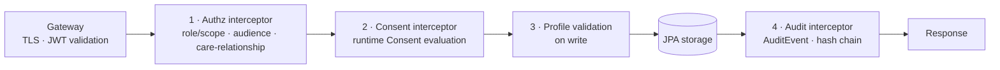

# 03 · FHIR Data Platform, Consent & Audit

Version 1.0 · July 2026 · MedAgent Platform
Status: Draft for review

## Executive summary

All clinical truth lives in a **HAPI FHIR JPA 8.10.x** server on PostgreSQL — containerised, network-isolated, partitioning-enabled from day 1, validating every write against platform profiles. Because the HAPI starter ships with **no security layer**, the request pipeline carries three custom interceptors that make the platform's safety invariants unbypassable at the storage boundary: **authorisation** (role/scope + care-relationship decision from core-api, 02 §7), **consent** (runtime evaluation of FHIR `Consent` with Redis-cached decisions), and **audit** (`AuditEvent` on every read and write, hash-chained in append-only partitions). This document fixes the spec §3.4 entity→resource mapping for both phases, the terminology strategy (ICD-10 now; SNOMED CT pending a Sri Lanka licence; LOINC for labs; RxNorm as drug vocabulary with an NMRA formulary mapping work item), performance tuning with explicit Elasticsearch offload triggers, Synthea seeding, and the PDPA data-subject-rights implementation including the erasure-versus-retention decision tree.

## FR traceability

| Requirement | Section |
|---|---|
| FR-3.4 answers cite record entries (resource-level addressability) | §3 (every mapped resource has stable id + provenance); agent side in 04 |
| FR-4.1–4.6 coded diagnosis, screened Rx, notes, vitals, orders as FHIR | §3 mapping, §4 (validation on write) |
| FR-4.9 committed writes as FHIR resources with audit entry | §5.3 |
| FR-5.2 consent controls who may view records | §5.2 |
| FR-5.6 export/share as PDF | §8.1 |
| FR-5.8 access log | §5.3 (audit query path; UX in 07) |
| FR-6.3 immutable audit trail review | §5.3, §5.4 |
| FR-6.4 consent records & DSR (export/deletion) | §8 |
| FR-7.3/7.4, FR-8.6, FR-9.1, FR-10.x Phase B clinical entities | §3 Phase B rows |
| Spec §3.4 core data model | §3 (complete mapping) |
| Spec §4.3 PDPA rights, retention | §8, pointers to 08 |
| NFR-2 record load < 2 s | §6 |
| NFR-8 100 % audit coverage, tamper-evident | §5.3, §5.4 |
| NFR-10 encryption, consent runtime checks | §1, §5.2 (crypto detail in 08/10) |

## 1. HAPI FHIR JPA deployment

- **Version:** HAPI FHIR JPA server starter, 8.10.x line (current stable, July 2026), built as a custom image in `platform/fhir`: starter WAR + our interceptor JAR + configuration. Upgrades track the 8.10.x patch stream; minor-version bumps go through staging with the full search-regression suite.
- **Isolation:** the container is reachable **only** from core-api, agent-service, and the gateway's authenticated FHIR route (01 §1 design rule 1). No port is published beyond the internal network; the starter's Web UI (testpage overlay) is disabled in staging/pilot.
- **Database:** dedicated `hapi_db` in the platform PostgreSQL cluster, own credentials; the HAPI DB role additionally has **no UPDATE/DELETE privilege on audit partitions** (§5.4).

Configuration knobs that matter (starter `application.yaml`, values are Phase A pilot settings):

| Knob | Setting | Why |
|---|---|---|
| `fhir_version` | `R4` | Spec mandate; R5 on roadmap (spec §5.1) |
| `partitioning.enabled` | **`true` from day 1**, request-tenant partition interceptor; Phase A runs everything in one partition (`pilot-facility`) plus a dedicated `audit` handling per §5.4 and a `synthetic` partition (§7) | Retro-fitting partitioning onto a populated HAPI store is a migration project; enabling it empty costs one config line. Phase B maps partition ↔ facility for data-residency and per-facility scaling |
| `validation.requests_enabled` | `true` | Reject malformed writes at the door (FR-4.9 quality gate) |
| Profile validation | Platform IG package (`medagent.fhir.r4`) loaded via `implementationguides` config; writes validated against the profiles in §3 | Guarantees identifiers/codings agents and UI rely on are actually present |
| `enforce_referential_integrity_on_write` / `_on_delete` | `true` / `true` | No dangling `Encounter.subject`; a resource referenced elsewhere cannot vanish |
| `allow_external_references` | `false` | Closed store; cross-system references arrive only via the interop layer (09) |
| `client_id_strategy` | server-assigned only (client-assigned ids rejected) | Ids are citation anchors for FR-3.4; clients must not mint them |
| `allow_multiple_delete` | `false`; `expunge_enabled: false`; `delete_expunge_enabled: false` | Clinical data is corrected by versioned update or status change, never destroyed (§8.2 governs the sole exception) |
| Resource-level delete | Disabled for clinical types via interceptor (authz layer refuses `DELETE` except the §8.2 erasure path) | Tamper-evidence and retention law |
| `subscription.*` | all disabled Phase A | Real-time events flow app-side via Redis (01); HAPI subscriptions reconsidered Phase B for interop |
| `cors` | disabled | Browser traffic never reaches HAPI directly |
| `narrative_enabled` | `false` | Narratives generated at presentation layer; store stays lean |
| `bulk_export_enabled` | `true` | `$everything` / `$export` for DSR export (§8.1) and analytics feeds (Phase B) |
| Search result caching | `reuse_cached_search_results_millis: 60000` | Queue/summary polling patterns |
| Paging | default 20, max 200 | Bounded response sizes behind the 2 s budget |
| Hibernate Search (Lucene/ES) | **off** Phase A | `_text`/`_content` not needed for pilot; §6.3 defines the switch-on triggers |
| Connection pool | Hikari `maximumPoolSize: 20` (pilot sizing; §6.2) | Matches 2-replica app tier fan-in |

## 2. Interceptor pipeline (position in request flow)

Order is load-bearing: authorisation fails fastest and cheapest; consent filters what authorised users may see; audit records the final outcome including denials (denials short-circuit but still emit audit from their own hook). Details in §5.

## 3. Resource mapping (spec §3.4, complete)

Canonical base for profiles and identifier systems: `https://fhir.medagent.health.lk` (published as a small IG in `platform/fhir/ig`; system URIs swap to national URIs when NDHX publishes its registry — tracked open item, 00 §7.4). Every profile requires: `meta.profile` set, business identifier populated, and the codings noted below. **Bold rows = Phase A**; others Phase B with their owning module.

| Spec entity | FHIR R4 resource | Key elements & identifiers | Profile notes | Phase |
|---|---|---|---|---|
| Patient | **`Patient`** | `identifier`: PHN (system `/id/phn`, required), NIC (optional), SLUDI ref (Phase B slice); name in native script + Latin (two `name` entries, `use` distinguishing); `birthDate`, `gender`, `telecom`, blood group as `Observation` (LOINC 882-1) not an extension; consent *flags never here* — consent is the `Consent` resource | Projected from MPI (02 §8); `Patient.link` on merge | **A** |
| Staff | **`Practitioner`** + **`PractitionerRole`** | `identifier`: SLMC registration no. (doctors); `PractitionerRole.specialty`, `.organization` (facility), `.location` (department), `period` end-dated on leave (02 §10.1) | Keycloak `sub` ↔ Practitioner id mapping claim (02 §2) | **A** |
| Encounter | **`Encounter`** | `status` lifecycle (planned→in-progress→finished), `class` (AMB pilot), `subject`, `participant` (drives encounter-based grants, 02 §7.1), `period`, `serviceProvider` | One per consultation incl. telemedicine (Phase B `class` VR) | **A** |
| Diagnosis | **`Condition`** | `code`: ICD-10 required, SNOMED CT slice reserved (§4); `clinicalStatus`, `verificationStatus`, `encounter`, `recorder` = signing clinician | Written only via sign-off path (04) | **A** |
| Prescription | **`MedicationRequest`** | `medicationCodeableConcept`: RxNorm RxCUI required + NMRA product code slice (§4.4); `dosageInstruction` (structured, UCUM units); `requester`; **safety-check result as contained `Provenance`-linked extension `rx-safety-verdict`** (screening outcome, dataset version, overrides) — FR-4.2/4.3 evidence | `status` on-hold until e-signed; step-up enforced upstream (02 §5.2) | **A** |
| Allergy | **`AllergyIntolerance`** | `code` (RxNorm ingredient / ATC class), `criticality`, `reaction.manifestation`, `verificationStatus` | Red-flag rendering (FR-2.2) keys off `criticality` | **A** |
| Vitals / growth | **`Observation`** | LOINC-coded per FHIR vital-signs profile (8867-4 HR, 85354-9 BP panel, 29463-7 weight, 8302-2 height, 8310-5 temp, 2339-0 glucose); UCUM units; `effectiveDateTime`; growth percentiles as `derivedFrom` Observations (Phase B) | Vital-signs base profile compliance enforced | **A** |
| Consent | **`Consent`** | `scope` = privacy; `category`: face-recognition, record-sharing, reminders (platform CodeSystem); `provision` (permit/deny, actor class, purpose, period); `performer` marks guardian-proxy grants (02 §9) | Versioned; evaluated at runtime (§5.2) | **A** |
| Audit event | **`AuditEvent`** | `agent` (actor + grant type), `entity` (target resources + query), `action` C/R/U/D/E, `outcome`, `purposeOfUse` (TREAT / BTG / …), hash-chain extension (§5.4) | Write path is interceptor-only (§5.3) | **A** |
| Appointment / waitlist | **`Appointment`** (+ `Slot`/`Schedule`) | `status`, `participant` (patient, practitioner), `start/end`; waitlist = `Appointment.status: waitlist` + priority extension (national waitlist mechanics Phase B, FR-11.x) | Drives appointment-based grants (02 §7.1) | **A** (booking) / B (waitlists) |
| Documents / files | **`DocumentReference`** | `content.attachment.url` → S3 object key (01 §3), `type` (LOINC doc type), `securityLabel` | Binary never stored in FHIR; visit-summary PDFs (FR-5.6) registered here | **A** |
| Immunization | `Immunization` + `ImmunizationRecommendation` | CVX/national vaccine CodeSystem, dose number, due/missed via recommendation engine (FR-7.3) | Child-health module | B |
| Lab order | `ServiceRequest` + `Specimen` | accession no. as `Specimen.accessionIdentifier` (barcode value, FR-8.2); state machine FR-8.7 mapped to `ServiceRequest.status` + `Specimen.status` | LIS hub (09) | B |
| Lab / imaging result | `DiagnosticReport` (+ member `Observation`s, LOINC) | `resultsInterpreter` (validating pathologist FR-8.4), `issued`, critical flag → notify path (FR-8.5) | | B |
| Imaging study | `ImagingStudy` | DICOM Study UID identifier, modality, endpoint → PACS (FR-9.1); AI pre-read flag as extension pending radiologist confirmation (FR-9.3) | | B |
| Referral | `ServiceRequest` (referral) + `Task` | `Task` carries routing/closure state (FR-10.3/10.4); consent-gated receiving access via 02 §7.1 referral grants | Shaped for NDHX e-Referral compatibility (09) | B |
| Guardian link | `RelatedPerson` | relationship code, `period.end` = majority; projection of `app_db` guardian links (02 §9) | Needed in clinical context for telemedicine join (FR-12.2), CHDR | B |
| Biometric template | **none — deliberately outside FHIR and outside the platform** | Face service holds templates; platform holds `ext_face_id` in MPI only | 05 | — |
| Chat transcript | none (LangGraph checkpointer, `app_db`) | Clinical *outcomes* of chat are the resources above (01 ADR A-4) | 04 | — |

## 4. Terminology strategy

Delivered through HAPI's built-in terminology service (`CodeSystem`/`ValueSet` upload, `$validate-code` on write, `$expand` for UI pickers).

| Vocabulary | Use | Licensing / status | Phase |
|---|---|---|---|
| **ICD-10 (WHO)** | Primary diagnosis coding (FR-4.1) | WHO licence, free for member-state use; loaded from ClaML release into a `CodeSystem`; UI picker `$expand`s curated pilot ValueSets (common OPD diagnoses first, full list searchable) | **A** |
| **SNOMED CT** | Problem list depth, future CDS | **Sri Lanka is not a SNOMED International member (July 2026)** — production use of the full edition requires an affiliate licence or national membership. Recommendation to MoH: pursue membership alongside NDHX (the UNOPS-procured national EHR will face the same question). Interim: the **SNOMED Global Patient Set (GPS)** is free-for-use and covers a useful subset; the `Condition.code` SNOMED slice is *reserved* in the profile and populated only when licensing is resolved. No SNOMED content ships in Phase A | B (licence-gated) |
| **LOINC** | Vitals (Phase A codes fixed in §3), lab observations, document types | Free (Regenstrief licence); full load Phase B with the LIS hub | **A** (vitals subset) / B |
| **RxNorm** | Drug vocabulary: `MedicationRequest.medication`, DDI dataset key (RxCUI), allergy ingredient coding | Free (NLM); note RxNorm is US-scoped — hence the NMRA mapping below. DDI screening keyed by RxCUI against the self-hosted curated dataset (locked decision D7; design in 04) | **A** |
| **NMRA formulary → RxNorm map** | Bridge Sri Lanka registered products to RxCUI | **Named work item, Phase A sprint S4 prerequisite:** map the pilot hospital's formulary (hundreds of products, not the full national register) to RxNorm ingredients/clinical drugs; unmappable local products get codes in a platform `CodeSystem` (`/cs/nmra-product`) with an ingredient-level `ConceptMap` so safety screening still fires. Pharmacist review required (00 §7.2 clinician-time open item). Full national register mapping is Phase B | **A** (pilot formulary) |
| **ATC / RxClass** | Drug-class allergy screening (class-level conflicts) | Free; class membership resolved at dataset-build time, shipped with the DDI dataset (04) | **A** |
| **UCUM** | All quantities | Free; enforced by vital-signs profile validation | **A** |
| CVX / national immunisation codes | Vaccine coding | Phase B with child health; national schedule CodeSystem authored with Family Health Bureau | B |

Terminology content is versioned in `platform/fhir/terminology` and loaded by a CI job; every DDI/terminology dataset version is recorded in the Rx safety verdict extension (§3) for reproducibility of past screening decisions.

## 5. The three custom interceptors

All three live in one audited Java module (`platform/fhir/interceptors`), registered via the starter's custom-interceptor mechanism, covered by integration tests that assert **fail-closed** behaviour (core-api unreachable ⇒ staff clinical reads deny, never allow).

### 5.1 Authorisation interceptor

- Hooks: `SERVER_INCOMING_REQUEST_POST_PROCESSED` (token + scope + audience re-verification — defence in depth behind the gateway) and `STORAGE_PREACCESS_RESOURCES` / `STORAGE_PRESHOW_RESOURCES` (per-resource checks on search results).
- **Patient/guardian context** (`patient.self` scope): requests are confined to the subject's patient compartment (guardian: ward's compartment, validity re-checked via decision service). Compartment enforcement uses HAPI's authorization rule builder; anything outside the compartment is stripped or denied.
- **Staff context**: role/scope table (02 §3) gates resource types and interactions (e.g. receptionist: `Patient` demographics + `Appointment` only, no clinical types; nurse writes limited to vital-sign `Observation`). Then the **care-relationship check**: for each patient whose data the request touches, call core-api `GET /internal/authz/decision` (02 §7.2). Decisions are cached in Redis (`authz:{actor}:{patient}`, TTL 60 s) and invalidated by 02 §7.4 events; the interceptor and core-api share this cache, so the FHIR hot path normally costs one Redis GET, not an HTTP call.
- Search shaping: staff searches without a patient parameter are rejected for clinical resource types (no trawling); queue/worklist views come from core-api, which queries with explicit patient sets it is authorised for.
- Break-glass grants arrive through the same decision call; the interceptor stamps the request context `purposeOfUse=BTG` so §5.2 and §5.3 behave accordingly.

### 5.2 Consent interceptor

- Implemented on HAPI's `ConsentService` interface (`startOperation` / `canSeeResource` / `willSeeResource` hooks) — evaluating the patient's active `Consent` resources at request time (spec §4.3: "consent manager enforces at runtime").
- Evaluation: fetch active `Consent` for the subject → apply `provision` rules (actor class, purpose, period, category) → verdict. Phase A consent categories: face-recognition (enforced platform-side pre-webhook, 05, *and* here), record-sharing scope (FR-5.2), reminder channels (FR-15.3, read by notify-service).
- **Cache:** verdicts in Redis `consent:{patient}:{purpose}:{actorClass}` TTL 60 s. **Invalidation:** any write to a `Consent` resource triggers a `STORAGE_PRECOMMIT_RESOURCE_UPDATED/CREATED` hook that publishes `authz.invalidate` (shared channel with 02 §7.4) deleting the patient's consent keys — a portal consent flip takes effect within one round-trip, not a TTL (01 §4.3 flow).
- **Precedence:** deny-by-consent is overridden only by an active break-glass grant with `purposeOfUse=BTG` (treatment purpose only); the override itself is flagged in audit (§5.3) and the patient sees it in their access log. Consent can never block the patient's own access, emergency-profile minimal view (FR-5.7), or legally mandated disclosures (Phase B notifiable disease reporting, FR-14.2 — recorded with purpose `PUBHLTH`).

### 5.3 Audit interceptor

- Hooks: `STORAGE_PRECOMMIT_RESOURCE_*` (writes, inside the transaction — a write and its audit commit atomically or not at all), `STORAGE_PRESHOW_RESOURCES` + `SERVER_OUTGOING_RESPONSE` (reads and searches, including the query string and returned resource ids), plus authz/consent denial hooks (denials are audited too — FR-6.3 security signal).
- Every event is a FHIR `AuditEvent`: actor (Keycloak `sub` → Practitioner/Patient ref + grant type from request context), action (C/R/U/D/E), entities (resource refs; for searches, the query + result ids), facility, `purposeOfUse` (TREAT default, BTG for break-glass, PATRQT for portal self-access), outcome. This single choke point delivers NFR-8's 100 % coverage claim: there is no storage path around the interceptor.
- The patient access log (FR-5.8) and admin audit explorer (FR-6.3, 02 §10.3) are read-only queries over these events.

### 5.4 Tamper evidence: hash-chained append-only partitions

- AuditEvents are written to a dedicated **audit partition** whose underlying tables are Postgres-native **monthly range partitions**; the HAPI DB role has `INSERT`+`SELECT` only on them (no `UPDATE`/`DELETE` — enforced at the database, below the application).
- Each `AuditEvent` carries two extensions: `audit-seq` (per-partition monotonic sequence) and `audit-prev-hash` = SHA-256 over the canonical JSON of the previous event ⊕ its hash. Genesis hash per monthly partition is derived from the previous month's chain head. Any retro-modification breaks every subsequent hash.
- A nightly verification job re-walks the chain and posts status to the admin console (02 §10.3) and monitoring (10); the daily chain-head digest is **signed and anchored off-system** (write-once object storage / separate custody) so an attacker with full DB access still cannot rewrite history undetected. Key custody and anchoring detail: 08.
- Closed monthly partitions are detached to cheap storage per the retention schedule (08) — append-only there too.

## 6. Search and performance plan (NFR-2: summary < 2 s)

### 6.1 Query shape discipline

The patient summary (FR-3.1, FR-2.2) is not a naive `$everything`: core-api issues a fixed, indexed query set (active Conditions, active MedicationRequests, AllergyIntolerances, last-N vital Observations, recent Encounters) as one FHIR `batch`, assembled and cached per encounter (01 §5 NFR-2 row). `$everything` is reserved for DSR export (§8.1), not interactive paths.

### 6.2 Tuning

- **Indexes:** HAPI's token/date/string search-param indexes suffice for the Phase A query set; CI runs `EXPLAIN` checks on the canonical summary queries against a Synthea-seeded database and fails on sequential scans over `hfj_spidx_*`. Custom composite `SearchParameter`s (e.g. `Observation` patient+code+date) added only on measured need.
- **Pool/DB:** Hikari 20 connections (pilot); Postgres `shared_buffers`/`work_mem` sized in 10; `default_statistics_target` raised on search-index tables; autovacuum tuned for the append-heavy audit partitions.
- **Caching:** search-result reuse 60 s (§1); per-encounter summary cache in Redis with invalidation on any write for that patient (shares the 02 §7.4 event bus).
- Load test gate (S6, 11): summary p95 < 2 s and check-in platform path < 300 ms at 3× pilot expected concurrency.

### 6.3 Elasticsearch offload — trigger criteria (Phase B)

Hibernate Search + Elasticsearch is **off** in Phase A (one more stateful system for 2 devs, no pilot requirement). It is switched on when *any* of:

1. `_text`/`_content` or advanced full-text search becomes a product requirement (e.g. free-text note search for clinicians);
2. p95 of the canonical summary/search set exceeds 500 ms at staging load despite §6.2 tuning;
3. resource count crosses ~5 M or facilities > ~10 (national onboarding wave), where Postgres search-param index bloat starts to dominate maintenance;
4. national analytics/registry queries (FR-14.x) need aggregation shapes Postgres serves poorly.

The migration is additive (reindex into ES; Postgres remains source of truth), consistent with the proven HAPI scale path (Postgres partitioning + ES offload + read replicas, 100 M+ resources in production deployments such as VA Lighthouse).

## 7. Synthetic data seeding (Synthea)

- **Generator:** Synthea with a custom Sri Lanka configuration: locale demographics (Sinhala/Tamil/Moor name lists in both scripts, realistic DOB/phone/GN-division patterns), pilot-relevant module mix (diabetes, hypertension, asthma, ANC, paediatric growth), output FHIR R4.
- **Pipeline** (`infra/` seed job): generate ~1 000 patients → strip US-specific resources/codings outside the Phase A profile set → assign valid PHNs via the real MPI issuance path (02 §8.1 — the seed exercises MPI code) → validate every bundle against the IG → POST as transaction bundles.
- All synthetic resources carry `meta.tag` `synthetic=true` **and** live in the `synthetic` partition (§1), making the pre-go-live purge a partition drop plus MPI cleanup — verifiable, not best-effort (S6 gate: zero `synthetic` tags in the pilot partition).
- The same seed powers CI (search-regression + `EXPLAIN` gates, §6.2), demo environments, and the agent eval harness fixtures (04).

## 8. Data-subject rights (PDPA)

Workflow surface is the admin DSR module (02 §10.4) and the patient portal (07); statutory clocks, DPIA and legal analysis in 08.

### 8.1 Access & export

- **Portal self-access** is continuous (FR-5.3) and itself audited (`purposeOfUse=PATRQT`).
- **Export:** `Patient/{id}/$everything` → complete bundle (JSON for machine portability; human-readable PDF rendition for FR-5.6 generated app-side and registered as a `DocumentReference`). Guardian-requested exports for wards follow 02 §9 rights and are flagged in audit. Bulk `$export` stays admin-gated.

### 8.2 Erasure vs medical retention (the honest tension)

PDPA (No. 9 of 2022, as amended by Act 22 of 2025) grants erasure; health-record retention rules and clinical safety require keeping clinical history. The platform implements a **decision tree**, not a delete button:

| Data class | On valid erasure request |
|---|---|
| Biometric linkage | **Full erasure**: consent revocation → face-service template destruction with confirmation callback + `ext_face_id` cleared (05 §2). No retention basis survives revoked biometric consent |
| Contact details, portal account, notification preferences | **Erased/anonymised** in MPI + Keycloak; no clinical retention basis |
| Chat transcripts (operational, non-record) | **Erased** after their short operational retention — 90 days rolling (08 §9); clinical outcomes persist as resources |
| Clinical record (Conditions, MedicationRequests, Observations, Encounters…) | **Retained under legal-obligation/vital-interest basis** per the MoH retention schedule (08); the data subject receives a written lawful-basis explanation with the retention end-date. Where retention expires, deletion uses HAPI `$expunge` on the specific patient compartment — the **only** enabled expunge path, admin-gated, dual-controlled, itself audited |
| Restriction (PDPA processing-restriction right) | `meta.security` label `RESTRICTED` on the compartment: §5.1 excludes it from all non-treatment purposes (analytics, research extracts) while care access continues |
| AuditEvents | **Never erased within retention** — they are the integrity record (NFR-8); erasing audit on request would destroy the very evidence of compliance. Documented in the DPIA (08) |

Every DSR — request, decision, basis, action — is itself recorded (FR-6.4) and appears in the audit trail.

## 9. Backup, retention, lifecycle (pointers)

- **Backups/DR:** `hapi_db` continuous WAL archiving + nightly encrypted base backups, quarterly restore drills (NFR-5) — mechanics in **10-devops-infrastructure.md**.
- **Retention schedule** per data class (clinical, audit, operational), destruction procedure, and PDPA mapping — **08-security-privacy-compliance.md**.
- Detached audit partitions (§5.4) and S3 `DocumentReference` objects follow the same schedule; object storage versioning + object-lock on audit anchors (08).

## 10. Decisions (ADRs)

| ADR | Decision | Rationale | Alternatives rejected |
|---|---|---|---|
| F-1 | HAPI FHIR JPA 8.10.x as the clinical store, custom-image with in-process interceptors | Locked decision D2; interceptors at the storage boundary make authz/consent/audit unbypassable regardless of caller | Gateway-plugin-only enforcement (bypassable from inside the network); forking HAPI (maintenance trap); Medplum/Aidbox (licence/sovereignty questions for national deployment) |
| F-2 | Partitioning enabled on day 1, single pilot partition + synthetic + audit partitions | Enabling later on populated data is a migration project; cost now is one config line; gives facility partitioning and clean synthetic purge for free | Enable when needed (guaranteed future migration); schema-per-facility (operational explosion) |
| F-3 | Profile validation on write + referential integrity + server-assigned ids + no client deletes | The agent layer and citations (FR-3.4) depend on structurally guaranteed data; corrections are versioned updates, preserving history | Trust-the-writer (prototype approach — drifted immediately); validation only in CI (misses runtime writers) |
| F-4 | Care-relationship + consent decisions resolved via shared Redis decision cache fed by core-api | One policy source (02 §7), sub-millisecond hot path, event-driven invalidation beats TTL-only staleness | Interceptor queries app_db directly (couples HAPI to core-api schema); per-request HTTP to core-api uncached (latency, availability coupling); embedding relationship data in tokens (stale) |
| F-5 | Audit as FHIR `AuditEvent` in DB-enforced append-only partitions + SHA-256 hash chain + off-system anchored daily digest | Meets NFR-8 tamper-evidence with standard resources queryable for FR-5.8/6.3; DB-level privilege denial is below any application bug; anchoring defeats a full-DB-access attacker | External SIEM as primary audit store (breaks FR-5.8 in-product access log; audit must be transactional with writes); blockchain anchoring (ceremony without added assurance over signed digests) |
| F-6 | Terminology: ICD-10 primary Phase A; SNOMED slice reserved pending Sri Lanka licence (GPS as interim option); LOINC vitals subset; RxNorm + ATC for drugs with pilot-formulary NMRA→RxNorm map as a named S4 work item | Zero licence risk at pilot; screening fires on RxCUI/ATC regardless of local product codes; honest about the SNOMED gate rather than assuming it away | Full SNOMED assumed available (licence risk at national review); local drug codes only (kills DDI screening); waiting for national terminology service (blocks pilot) |
| F-7 | Hibernate Search/Elasticsearch deferred with explicit §6.3 triggers | Pilot query set is fixed and index-servable; a third stateful system is unjustified for 2 devs; additive migration path is proven | ES from day 1 (operational cost, no pilot benefit); never (national full-text/analytics will need it) |
| F-8 | Synthea with Sri Lanka locale config, seeded through the real MPI/validation path, isolated in a `synthetic` partition | Locked spec decision (Part 7.1); exercising real issuance/validation code makes the seed a test asset; partition isolation makes purge provable | Hand-crafted fixtures (unrealistic distributions); seeding via direct DB insert (bypasses the very gates we rely on); mixing synthetic and real data with tags only (purge risk) |
| F-9 | Erasure implemented as the §8.2 decision tree; clinical erasure only via dual-controlled compartment `$expunge` after retention expiry | Reconciles PDPA rights with medical retention law defensibly; keeps exactly one, heavily-gated destruction path | Hard-delete on request (unlawful clinical record destruction); refusing all erasure (PDPA breach); soft-delete flags only (fails "erasure" test for data with no retention basis) |

## Cross-references

- Network isolation, data-ownership table, event bus: 01-system-architecture.md
- Roles/scopes, care-relationship decision service, break-glass grants, DSR admin workflow: 02-identity-access-mpi.md
- Rx-safety screening design, DDI dataset build, citations, eval fixtures: 04-ai-agent-platform.md
- Face consent gate and template destruction contract: 05-face-recognition-integration.md
- Access-log and consent UX: 07-patient-portal-pwa.md
- PDPA/DPIA, retention schedule, hash-chain key custody and anchoring: 08-security-privacy-compliance.md
- NDHX/HHIMS profile alignment, LIS hub, DHIS2 feed: 09-integrations-national.md
- Backup/DR mechanics, Postgres sizing, CI seed and `EXPLAIN` gates: 10-devops-infrastructure.md
