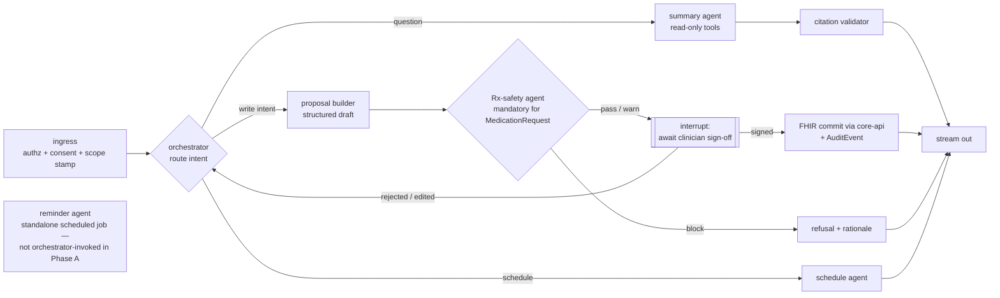

# 04 · AI Agent Platform

Version 1.0 · July 2026 · MedAgent Platform
Status: Draft for review

## Executive summary

The agent platform (spec §3.2) is one **clinical orchestrator** routing work to **specialist agents** over a shared, consent-gated patient context, with four fixed guardrails no route can bypass: clinician sign-off before any write, source citation on every answer, consented scope only, and full audit. It is implemented in `services/agent-service` on **LangGraph 1.x** (durable execution, Postgres checkpointing, interrupt-based human-in-the-loop) calling **Claude via the Anthropic API**, streaming to the web app over the **Vercel AI SDK data protocol**. A clinical **eval harness gates CI**: a golden set of graded cases runs on every change to prompts, tools, or models, and regressions block release. Phase A ships the orchestrator plus summary, Rx-safety, schedule (v1) and reminder (v1) agents; identity is a thin adapter over the external face service; lab, imaging and referral agents are Phase B on the same substrate. Per-agent designs live in [agents/](agents/).

## FR traceability

| Requirement | Section |
|---|---|
| FR-3.1–3.5 summary, record Q&A, citations, interaction flags on ask | §2.1 (question route), §2.2 scoping, §2.3 citations; agents/00, agents/02, agents/03 |
| FR-4.1–4.5, 4.7–4.9 typed proposals, mandatory Rx screening, e-sign-off, committed FHIR writes + audit | §2.1 (write path → Rx-safety → interrupt → commit), §2.2; agents/03, agents/06 |
| FR-4.6 generic orders (OrderProposal → ServiceRequest) | **Phase B** — schema defined day 1, enabled Phase B; agents/04 |
| Spec §3.2 agent roster | §3 |
| Spec §4.4 AI governance (eval gate, no self-updating models) | §5, §6 |

## 1. Placement and boundaries

- `agent-service` is stateless per request except the **LangGraph Postgres checkpointer** (session resume, interrupt persistence) in `app_db`.
- **All clinical reads and writes go through FHIR** (via core-api's decision-checked path), never a private schema — the agent sees exactly what consent and role allow, because the interceptors (03) sit below it. The agent cannot have more access than its clinician.
- **Chat transcripts are operational data** (checkpointer), not clinical record. Clinical outcomes of chat (a signed diagnosis, prescription, note) are FHIR resources with `AuditEvent`s. (ADR A-4 in 01.)
- The service exposes: `POST /agent/chat` (AI SDK-compatible stream), `POST /agent/resume` (sign-off resolution → resume interrupted graph), `GET /agent/proposals/{id}` (pending write proposals), plus internal endpoints for the reminder scheduler.

## 2. Orchestration design

### 2.1 Graph topology

One LangGraph `StateGraph` per conversation turn, checkpointed per session:

Key properties:

- **Write path is physically separate from the answer path.** A write intent always produces a *structured proposal* (typed Pydantic model per resource: DiagnosisProposal, PrescriptionProposal, NoteProposal, VitalsProposal, OrderProposal — the OrderProposal schema is defined day 1 but **enabled Phase B**; FR-4.6 is deferred to Phase B), never free text committed directly. FR-4.1–4.5.
- **The interrupt is the sign-off gate (FR-4.8).** LangGraph `interrupt()` persists graph state; the UI renders the proposal card with the Rx-safety verdict; `POST /agent/resume` carries the clinician's decision (signed / edited / rejected) with a fresh step-up-auth token for prescriptions (02). Only a `signed` resolution reaches the commit node. Timeout: proposals expire after the encounter closes; expired interrupts are cancelled and audited.
- **The orchestrator cannot bypass a specialist's safety check** (spec guardrail): the graph edge from proposal to interrupt runs *through* the Rx-safety node for any `MedicationRequest`; there is no alternative edge. Safety is topology, not prompt instructions.
- **Specialists are subgraphs/tool-equipped nodes, not free agents** (Anthropic orchestrator–worker pattern): each has its own system prompt, its own restricted tool belt, and returns typed results to the orchestrator.

### 2.2 Patient context and scoping

The prototype's strongest pattern is kept and hardened: tools are **constructed per request with the patient ID closed over**, so cross-patient access is impossible by construction. Added on top: the ingress node stamps the graph state with `{clinician, patient, encounter, consent_scope, roles}` from the verified token; every tool call re-asserts the stamp; core-api re-checks the care relationship on each FHIR call (defence in depth — the agent never holds a broader credential than the clinician's own token, OBO-style).

### 2.3 Citations (FR-3.4)

Every read tool returns data as `{content, sources: [{resource_type, resource_id, version, date}]}`. The citation validator node enforces: any factual sentence in the answer must map to at least one returned source; answers citing nothing that was retrieved are regenerated once, then refused with "not found in record". The UI renders citation chips resolving to the FHIR resource (06). Out-of-record questions (general medical knowledge) are answered only with an explicit `[general knowledge — not from this record]` marker, and never for patient-specific facts; the summary agent's prompt plus a post-hoc classifier enforce this.

### 2.4 Streaming

Real token streaming end-to-end (fixing the prototype's run-to-completion word-drip): LangGraph `astream_events` → adapter → **AI SDK data-stream protocol** (text deltas, typed tool-call frames for "Consulting record…" states, proposal-card frames, citation frames). The web app consumes it with `useChat` (06). Abort propagates: client abort cancels the graph run and is audited as `abandoned`.

## 3. Agent roster (spec §3.2 → implementation)

| Agent | Phase | Form | Tools (restricted belt) | Doc |
|---|---|---|---|---|
| Clinical orchestrator | A | Router node + planner | none (delegates only) | [agents/00-orchestrator.md](agents/00-orchestrator.md) |
| Identity agent | A | Thin adapter (not an LLM agent) — consumes face-service events, drives check-in/manual-fallback state | core-api queue APIs | [agents/01-identity.md](agents/01-identity.md) |
| Summary agent | A | LLM node | FHIR read tools: summary, conditions, meds, allergies, observations, encounters, labs, notes — all citation-emitting | [agents/02-summary.md](agents/02-summary.md) |
| Rx-safety agent | A | **Deterministic engine first, LLM second** — DDI dataset + allergy class rules compute the verdict; LLM only explains it | drug-safety service (RxCUI lookup, DDI pairs, RxClass/ATC allergy classes, dose ranges) | [agents/03-rx-safety.md](agents/03-rx-safety.md) |
| Schedule agent | A (v1) | Tool node | slots, book/reschedule, follow-up creation | [agents/06-schedule.md](agents/06-schedule.md) |
| Reminder agent | A (v1) | Scheduled job + LLM templating | due-item queries, notify-service send | [agents/08-reminder.md](agents/08-reminder.md) |
| Lab agent | B | LLM node + LIS tools | order, route, track, results | [agents/04-lab.md](agents/04-lab.md) |
| Imaging agent | B | Pipeline + worklist | PACS/DICOMweb, pre-read models | [agents/05-imaging.md](agents/05-imaging.md) |
| Referral agent | B | LLM node + Task tools | create/track/close referrals | [agents/07-referral.md](agents/07-referral.md) |

The Rx-safety design principle generalises: **anything that must be 100% reliable is deterministic code; the LLM narrates and drafts, it never decides safety.** FR-4.2/4.3's "100% of orders screened" is satisfiable only this way.

## 4. Models and prompts

| Concern | Choice |
|---|---|
| Primary model | Claude Sonnet family via Anthropic API, pinned full model ID in config (the prototype's unpinned `claude-sonnet-4-6` string is replaced by an explicit pinned ID verified at startup) |
| Escalation model | Claude Opus family for complex summarisation on demand (config-gated; cost-tracked) |
| Prompt management | Versioned prompt files in-repo (`agent-service/prompts/*.md`, semver headers); prompt changes are PRs and trigger the eval gate; the prototype's clinical system prompt is the v0 seed for the summary agent (12) |
| Parameters | temperature ≤ 0.2 clinical; structured outputs via tool-forced JSON for proposals |
| Token/cost telemetry | per-request cost recorded (OTel span attrs), dashboards + budget alerts (10) |
| Data boundary | Anthropic API with no-training/enterprise data terms; PHI minimisation in prompts (only consented, needed fields); regional/legal review in 08 |

## 5. Guardrails stack (defence in depth)

1. **Topology** — write→safety→interrupt→commit is the only path (§2.1).
2. **AuthZ below the agent** — FHIR interceptors enforce role/relationship/consent regardless of what the agent asks for (03).
3. **Input hardening** — prompt-injection defence: retrieved record text is fenced as data (`<record>` blocks + instruction hierarchy); tool descriptions instruct no instruction-following from record content; injection probes are part of the eval set.
4. **Output validation** — proposals schema-validated; citations enforced (§2.3); PII egress filter on answers (no other patients' identifiers may appear — regex + NER check).
5. **Rate & scope limits** — per-clinician request rates; tool budget per turn; no network tools; no self-modification of prompts/config.
6. **Refusal behaviours** — out-of-scope requests (other patients, non-clinical tasks, diagnosis without record basis) refuse with rationale; refusal texts are evaluated too.

## 6. Evaluation & governed learning loop (spec §3.2, §4.4)

- **Golden set:** ≥150 graded cases at S3, grown continuously — summary QA over Synthea records, citation faithfulness, Rx-safety verdicts (known DDI/allergy fixtures — 100% required), injection probes, refusal cases, Sinhala/Tamil name handling. Stored in-repo with expected outcomes and graders (exact for verdicts; LLM-rubric for prose with human-audited grader).
- **CI eval gate:** runs on any change to prompts, tools, graph, model pin, or DDI dataset. Hard thresholds: Rx-safety fixtures 100%; citation faithfulness ≥ 98%; regression vs baseline blocks merge (same status as failing tests — spec §4.4).
- **Online monitoring:** sampled live-traffic tracing (Langfuse or LangSmith — final pick S3) with drift dashboards: eval-pass proxy metrics, refusal rate, citation coverage, tool-error rate, clinician edit-distance on proposals.
- **Clinician feedback loop:** every proposal resolution (signed / edited / rejected) and per-answer 👍/👎 with reason is captured (FR-governed learning). Weekly curation turns feedback into new eval cases first; prompt/model changes only ship through the gate. **Models never self-update in production**; model-pin bumps are PRs with eval evidence, rollback is a config revert.
- **Incident path:** clinically significant AI error → incident record, eval case added, root-cause on guardrail layer that should have caught it (08).

## 7. Failure & degradation

| Failure | Behaviour |
|---|---|
| Anthropic API down/slow | Chat degrades to structured record views (workspace works fully without AI); queued reminders unaffected; banner state in UI |
| Tool/FHIR error mid-turn | Partial-answer with explicit gap statement; never silent omission |
| Interrupted sign-off (browser close) | Proposal persists (checkpointer); resumable from proposals list until encounter close |
| DDI dataset unavailable | **Prescription proposals blocked entirely** (fail closed); read/answer paths unaffected |
| notify-service down | Events buffered in Redis streams with TTL; UI polls queue as fallback |

## 8. Decisions

| ADR | Decision | Rationale | Rejected |
|---|---|---|---|
| AG-1 | LangGraph 1.x over custom orchestration | Interrupt-based HITL + Postgres checkpointing are exactly the sign-off/resume semantics FR-4.8 needs; custom = rebuilding both | Custom asyncio state machine; CrewAI/AutoGen (weaker HITL); Temporal (better for back-office pipelines, not chat) |
| AG-2 | Deterministic safety core, LLM narration | "100% screened" is a code guarantee, not a prompt aspiration | LLM-judged drug safety |
| AG-3 | Interrupt-based sign-off over "draft then separate form" | Keeps conversational flow + guarantees the gate in graph topology; edited proposals re-enter the graph with context | Chat writes draft → user re-enters data in a form (double entry, drift) |
| AG-4 | AI SDK data protocol over raw SSE for chat | Typed tool/proposal/citation frames; `EventSource` can't carry them; prototype's fake streaming replaced | Hand-rolled SSE chat |
| AG-5 | Identity "agent" is an adapter, not an LLM | Face matching/liveness live in the external service; nothing to reason about — routing logic only | LLM in the check-in loop (latency, risk, no benefit) |
| AG-6 | Eval harness from S3, before write-back ships | Write-back (S4) must land behind an already-running gate | Evals after go-live |
