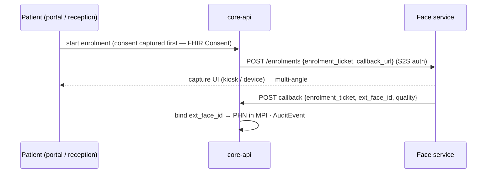

# 05 · Face Recognition Integration (External Service Contract)

Version 1.0 · July 2026 · MedAgent Platform
Status: Draft for review

## Executive summary

Face recognition is an **existing, separately-built service** and is **not rebuilt** in this programme. This document is the binding integration contract between that service and the platform: enrolment linkage, the inbound match-event webhook (hardened — the prototype's endpoint was unauthenticated), the consent gate the platform enforces before any event has effect, the check-in and manual-fallback flows, and the security requirements the platform imposes on the face service for national deployment (liveness/PAD roadmap, ISO/IEC 24745 template protection). The architectural invariant: **biometric data never enters the platform** — no images, no embeddings, no templates. The platform holds only an opaque `ext_face_id` linkage and an event log.

Traceability: FR-1.1–1.8, spec §4.1, success criteria (<3 s identification, ≥99% TAR, ISO/IEC 30107-3 liveness).

## 1. Responsibility split

| Concern | Face service (external, existing) | Platform |
|---|---|---|
| Camera capture, quality checks (FR-1.1) | ✔ | — |
| Multi-angle enrolment, template creation/storage (FR-1.2) | ✔ (encrypted templates, never raw images) | initiates + records linkage only |
| 1:N matching + confidence (FR-1.3) | ✔ | consumes score |
| Liveness / PAD (FR-1.4) | ✔ (roadmap §6) | records `liveness_result`, policy-gates on it |
| Threshold policy + manual fallback trigger (FR-1.5) | reports raw score | **decides** (config per facility, FR-6.2) |
| Consent enforcement (FR-1.6, FR-5.2) | *should* skip capture for opted-out patients (push-list, §4) | **authoritative gate** — always enforced platform-side |
| Record load into workspace (FR-1.7) | — | ✔ (queue → workspace) |
| Edge processing (FR-1.8) | ✔ where feasible | — |
| Audit of identification events | match log | `AuditEvent` per event (NFR-8) |

## 2. Identifier linkage & enrolment flow

The platform never stores biometric data; the join key is an opaque, revocable **`ext_face_id`** (face-service enrolment ID) held in the MPI record (02).



Rules:

- **Consent precedes enrolment**, always: the enrolment ticket is only issued when an active `Consent` (face-recognition scope) exists (03). Revoking consent triggers `DELETE /enrolments/{ext_face_id}` on the face service (template destruction, confirmed by callback) and clears the linkage. Re-enrolment after re-consent gets a **new** `ext_face_id` (revocability).
- `ext_face_id` is meaningless outside the face service — a leak of the platform DB exposes no biometric information.
- Enrolment tickets are single-use, short-lived (15 min), patient-bound.

## 3. Inbound match-event webhook (hardened)

Prototype flaw fixed: `POST /api/v1/agent/face-recognized` accepted **unauthenticated** events — anyone reaching it could forge a match for any patient. The replacement contract:

```
POST {gateway}/integrations/face/events
Headers:
  X-MedAgent-Signature: v1=HMAC-SHA256(secret, timestamp + "." + raw_body)
  X-MedAgent-Timestamp: <unix seconds>
  X-MedAgent-Key-Id: <key rotation id>
Body (JSON):
{
  "event_id":   "uuid — idempotency key",
  "event_type": "match | no_match | liveness_fail",
  "ext_face_id": "opaque enrolment id (match only)",
  "confidence":  0.0–1.0,
  "liveness":    "pass | fail | not_performed",
  "station_id":  "camera/kiosk identifier",
  "facility_id": "site identifier",
  "occurred_at": "RFC 3339"
}
→ 202 Accepted (always, after signature check — processing is async)
```

Gateway/core-api enforcement, in order:

1. **Signature + freshness**: HMAC valid, `|now − timestamp| ≤ 300 s` (replay defence); keyed secrets rotated via `X-MedAgent-Key-Id` (two active keys during rotation). mTLS between face service and gateway where network permits (defence in depth).
2. **Idempotency**: duplicate `event_id` within 24 h → 202, no effect.
3. **Rate limit** per station.
4. **Resolution**: `ext_face_id` → MPI → PHN. Unknown ID → logged, alert on threshold (possible desync or probe).
5. **Consent gate (authoritative)**: no active face-recognition `Consent` → event is dropped with an `AuditEvent(consent_denied)`; nothing is shown to any user; the patient's ID is pushed to the face-service suppression list (§4). This fixes the prototype's modelled-but-never-enforced `face_consent`.
6. **Policy gate** (FR-1.5, FR-6.2): `liveness == pass` required (Phase A policy; `not_performed` allowed only for stations flagged as legacy during rollout, always surfaced in UI); `confidence ≥ threshold(facility)` → **auto check-in**; below threshold → **manual-verification task** to reception, never auto-load.
7. **Effect**: check-in enqueued (arrival queue), `FaceCheckinEvent` row (event log, §7), `AuditEvent`, Redis publish → notify-service → doctor/reception UI (01 §4.1).

No-match and liveness-fail events are logged and drive the reception "assist" view (a person is at the kiosk and needs manual check-in) — care is never blocked (spec invariant).

## 4. Outbound calls to the face service

Platform → face service (S2S: OAuth2 client-credentials or signed requests — match the service's existing auth, to be confirmed in the coordination sync, §8):

| Call | Purpose |
|---|---|
| `POST /enrolments` | begin enrolment (ticketed, §2) |
| `DELETE /enrolments/{ext_face_id}` | consent revoked / re-enrolment — template destruction with confirmation callback |
| `PUT /suppression-list` | opted-out/revoked IDs — service should skip capture/matching for them (FR-1.6 at the edge; platform gate remains authoritative) |
| `GET /health` | liveness for the integration dashboard (10) |

## 5. Check-in UX contract (consumed by 06)

- **Reception/kiosk view**: live match feed, manual-verification queue (photo-less: name, PHN fragment, confidence band), manual search fallback (name/PHN/phone — FR-2.4) that reaches the same queue path. Opt-out patients flow through manual check-in with zero face-service interaction.
- **Doctor workspace**: check-in appears in the live queue (FR-2.1); if the patient's session is already open, an in-chat event card (port of prototype `FaceRecCard`: confidence band, match status, demographics); otherwise a toast with "open session" (port of `FaceRecToast`). Connection state of the event stream is **real** (the prototype's decorative "Listening…" indicator is replaced by actual SSE health with reconnect/backoff).
- Confidence display uses bands (high/medium/low per facility thresholds), not raw scores, to avoid false precision for clinicians.

## 6. Security requirements imposed on the face service (national deployment)

Contractual requirements for Phase A→B graduation; assessed jointly with the face-service team (08 owns compliance tracking):

| Requirement | Pilot (Phase A) | National (Phase B) |
|---|---|---|
| Liveness / PAD (FR-1.4) | SDK-level passive liveness acceptable; result reported per event | ISO/IEC 30107-3 certified PAD (Level 2 target — certified passive SDKs are commodity as of 2025/26); injection-attack detection roadmap |
| Template protection | Encrypted templates, isolated store, separate keys (KMS); **no raw image retention** post-enrolment | ISO/IEC 24745 conformance: irreversibility, revocability, unlinkability — cancelable transforms (e.g. PolyProtect) or HE-based matching; embeddings are demonstrably reconstructible, so encryption-at-rest alone is insufficient |
| Key management | Per-deployment keys in KMS/HSM | + rotation & revocation drills |
| Consent | Honour suppression list | + capture-side consent signalling |
| PDPA | Biometrics = special-category data; processing records, DPIA participation | + DPA registration alignment as enforcement lands (2026) |
| Availability | Degrades to manual check-in only | Same (never a care blocker) |
| SLUDI | — | Coordination point: if SLUDI biometric auth becomes available (rollout end-2026), face check-in and SLUDI verification are **complementary paths**, adapter in MPI (02); no coupling in this contract |

## 7. Platform-side data (complete list)

| Data | Store | Retention |
|---|---|---|
| `ext_face_id` linkage | MPI (`app_db`) | until consent revoked / re-enrolment |
| `FaceCheckinEvent` log (event_id, PHN ref, confidence, liveness, station, outcome) | `app_db`, indexed | operational retention per 08 (default 2 y) |
| `AuditEvent` per event/decision | FHIR audit partitions | audit retention per 08 |
| Consent (face-recognition scope) | FHIR `Consent` | lifetime + history |

Explicitly absent: images, video frames, embeddings, templates, quality vectors.

## 8. Coordination items with the face-service team (S2 gate)

1. Confirm/implement HMAC signing + timestamp on the event webhook (replaces unauthenticated calls) and agree key-rotation procedure.
2. Agree enrolment ticket API + destruction-confirmation callback (§2, §4).
3. Suppression-list mechanism for opt-outs (push or pull).
4. Liveness result availability per event; station capability inventory (which cameras can PAD).
5. Confidence-score semantics (calibration, so platform thresholds are meaningful per station type).
6. Joint review against §6 pilot column; book certified-PAD budget decision (master plan open item 3).
7. Load test: sustained match-event burst (clinic opening hour) → <300 ms platform path (01 §4.1).

## 9. Decisions

| ADR | Decision | Rationale | Rejected |
|---|---|---|---|
| F-1 | Keep face service external; integrate by contract | Already built and working; biometric isolation becomes architectural rather than procedural | Rebuilding in-platform; embedding SDK in web app |
| F-2 | HMAC-signed webhook + timestamp + idempotency (+ mTLS where possible) | Fixes prototype forgery hole; standard, debuggable, key-rotatable | Keycloak client-credentials for the webhook (heavier for the service team); IP allowlist alone (spoofable, breaks on network change) |
| F-3 | Consent gate authoritative on the platform, suppression list best-effort at the edge | Platform owns PDPA accountability; edge suppression adds privacy (no needless capture) but can lag | Trusting the service to enforce consent alone |
| F-4 | Opaque `ext_face_id` join key, reissued on re-enrolment | Revocability + unlinkability; DB leak reveals nothing biometric | Storing embeddings platform-side "for flexibility" |
| F-5 | Threshold and liveness policy owned by platform config (FR-6.2), score semantics owned by service | Admins tune clinical policy without service redeploys | Hard-coding thresholds in the service |
