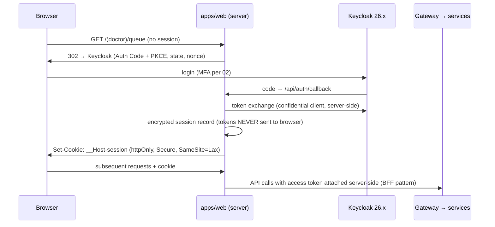

# 06 · Doctor Workspace (Web Frontend)

Version 1.0 · July 2026 · MedAgent Platform
Status: Draft for review

## Executive summary

The doctor workspace is one of three route groups in a single **Next.js 16 LTS** application (`apps/web`), consuming platform services exclusively through the **generated `packages/ts-sdk` client** and streaming AI chat via the **Vercel AI SDK** against `agent-service` (04). Authentication is **Keycloak OIDC (Authorization Code + PKCE) with httpOnly session cookies and server-side route protection** — a deliberate, documented reversal of the prototype's localStorage token model. The UI is built on a **professional clinical-minimal design system** in `packages/ui` (semantic tokens, WCAG 2.1 AA enforced in CI), and ports the prototype's proven chat UX (quick prompts, overview cards, face-recognition card/toast) while replacing its architecture (859-line god component, hand-rolled SSE parsing, `.dark !important` stylesheet). The write-back sign-off experience — structured proposal cards, Rx-safety verdict banner, step-up authentication — is the frontend half of the FR-4.8 clinical safety gate defined in 04.

Traceability: FR-2.1–2.6, FR-3.4 (citation rendering), FR-4.3/4.8 (sign-off UX), FR-13.1 (English dictation v1), NFR-2, NFR-6, NFR-7.

## 1. Stack and application shell

| Concern | Choice | Notes |
|---|---|---|
| Framework | **Next.js 16 LTS** (App Router, Turbopack default) | LTS line chosen for a national programme's support horizon; Next 15 already stale at project start (master plan D6) |
| React | 19.2 | Server Components for data-shaping, client components only where interactivity requires |
| Route protection file | **`proxy.ts`** | Next 16 renames `middleware` → `proxy`; all references in this document use the Next 16 name |
| Language | TypeScript, `strict: true`, no `any` in `packages/*` | ESLint + typecheck gate in CI |
| Styling | Tailwind CSS v4 + `packages/ui` tokens (§4) | No component-library dependency (shadcn-style owned components generated into `packages/ui`, then maintained as ours) |
| Data fetching | **TanStack Query v5** over `packages/ts-sdk` | Generated OpenAPI client is the only HTTP surface (§8) |
| Chat streaming | **Vercel AI SDK** (`useChat`, data-stream protocol) | Consumes agent-service's AI SDK-compatible stream (04 §2.4) |
| Event feeds | Raw SSE (`EventSource` wrapper with reconnect/backoff/health) | Queue updates, face check-in, critical values — from notify-service (01) |
| Icons | lucide-react | Continuity with prototype; consistent 1.5px stroke language |
| Dates | date-fns (tree-shaken) | Ported prototype usage |

There is **one Next.js app** for doctor workspace, patient portal and kiosk (01 §2). Route groups keep bundles, layouts, auth policies and design densities separate without multiplying deployments:

```
apps/web/
├── proxy.ts                      # session validation + route-group authz (server-side, §2)
├── app/
│   ├── (doctor)/                 # doctor workspace — this document
│   │   ├── layout.tsx            # shell: sidebar, event-stream provider, session context
│   │   ├── queue/page.tsx        # live queue (FR-2.1) — default landing
│   │   ├── patients/
│   │   │   ├── page.tsx          # search (FR-2.4)
│   │   │   └── [phn]/page.tsx    # record + chat side-by-side (FR-2.6)
│   │   ├── day/page.tsx          # appointments · follow-ups · pending results (FR-2.3)
│   │   └── proposals/page.tsx    # pending sign-offs resumable list (04 §7)
│   ├── (patient-portal)/         # see 07-patient-portal-pwa.md
│   ├── (kiosk)/                  # check-in / reception assist views (05 §5)
│   │   ├── checkin/page.tsx      # kiosk-mode match feed
│   │   └── reception/page.tsx    # manual-verification queue + manual search
│   ├── api/auth/[...]/route.ts   # OIDC callback, session, logout (BFF endpoints, §2)
│   └── api/chat/route.ts         # thin proxy: session cookie → bearer token → agent-service stream
├── messages/{en,si,ta}/*.json    # next-intl catalogues (§9)
└── e2e/                          # Playwright (§12)
```

Each route group has its own root `layout.tsx`, `error.tsx` and `not-found.tsx`; the kiosk group additionally pins a fullscreen, chrome-less layout with no navigation (a shared reception device is never a browsing surface).

## 2. Authentication and session model

### 2.1 What the prototype did, and why it is rejected

The prototype (`MedicalBot_FE`) stored the JWT in `localStorage` (`lib/api.ts`, read via `localStorage.getItem("token")` in `components/PatientChat.tsx` and page components), attached it client-side, had **no `middleware.ts` at all** (every dashboard route renders for an unauthenticated browser until a fetch 401s), and passed the token as a **query-string parameter** to open the SSE stream (`/notifications/stream?token=…` in `app/dashboard/patients/page.tsx`) — leaking a bearer credential into server logs, proxies and browser history. localStorage tokens are readable by any injected script; for a clinical system this is a disqualifying pattern, not a style preference.

### 2.2 Replacement design (Phase A)



Rules:

- **Tokens never reach browser JavaScript.** The web app is a confidential OIDC client; access/refresh tokens live in an encrypted server-side session (Redis-backed, keyed by the `__Host-session` cookie). Browser code holds nothing exfiltratable.
- **`proxy.ts` is the server-side gate** for every route: validates the session, enforces role → route-group mapping (`doctor|nurse|receptionist` → `(doctor)`/`(kiosk)`, `patient|guardian` → `(patient-portal)`), and redirects unauthenticated requests before any page code runs. Defence in depth: the gateway re-validates the token on every API call regardless (01) — `proxy.ts` is UX-grade protection, the gateway is security-grade.
- **Silent refresh server-side**: the BFF refreshes the access token from the session's refresh token; browser sessions expire on Keycloak SSO idle timeout (02 sets clinical values: 12 h max, 30 min idle for doctor roles).
- **Chat authenticates by cookie** via the same-origin `/api/chat` route, which attaches the bearer token server-side. **SSE follows the ticket handoff of 02 §11**: a cookie-authenticated BFF endpoint asks notify-service for a **single-use, 30-second, opaque Redis ticket** and hands it to the browser, which opens `GET /notify/stream?ticket={id}` directly against notify-service — native `EventSource` cannot set headers. Session and bearer tokens never appear in URLs; the opaque ticket (dead after first redemption, scrubbed from logs) is the one deliberate exception, per 02 ADR I-10.
- **Step-up authentication** for prescription sign-off (FR-4.8, spec §4.2) uses Keycloak ACR/LoA step-up: the sign action requests `acr_values` for the elevated level; Keycloak prompts for the second factor in a focused window/redirect; the resulting elevated-session assertion accompanies `POST /agent/resume` (§7, 02).
- Kiosk stations use a **device service account** (client-credentials, station-scoped) plus staff badge-in for actions that need a human actor; kiosk sessions never carry a clinician's personal credential.

Phase B: SMART on FHIR v2 app-launch profiles when third-party apps arrive (master plan D8) — the BFF/session model above is unchanged by that.

## 3. Screens and FR traceability

| FR | Screen / element | Implementation notes |
|---|---|---|
| FR-2.1 | **Live queue** (`(doctor)/queue`) | SSE-driven from notify-service (check-in events, 01 §4.1). Arrival order preserved (server-assigned sequence, not client sort). Each row: patient name, PHN fragment, arrival time, wait duration, check-in method badge (face / manual), **manual-verification flag** for below-threshold or liveness-degraded events (05 §3 step 6). Reconnect/backoff with a *real* connection-state indicator — the prototype's decorative "Listening…" pulse is replaced by actual `EventSource` health (05 §5). Fallback: poll `GET /queue` every 15 s while SSE is down, with a degraded-mode banner (§10). |
| FR-2.2 | **Patient summary card** | Photo (or initials avatar — clinical photo only where captured with consent), age + DOB, sex, blood group, **allergies rendered as red-flag chips with severity dots** (ported prototype pattern), active medications list. Rendered from a single core-api summary endpoint backed by scoped FHIR queries (<2 s, NFR-2). Persistent in the left rail of the patient session (§6 layout). |
| FR-2.3 | **Today view** (`(doctor)/day`) | Three columns at desktop density: today's appointments (FHIR `Appointment`), follow-ups due, pending lab/imaging results awaiting review. Each item deep-links into the patient session. |
| FR-2.4 | **Patient search** | Single search field accepting **name, PHN, or phone**; server-side MPI search (02) with match-quality grouping; debounced, keyboard-navigable results (arrow keys + enter). Replaces the prototype's email/UUID lookup — patients are found by clinical identifiers, not account emails. Reception's manual check-in reuses the same component (05 §5). |
| FR-2.5 | **Quick stats strip** | Patients seen today, open tasks (unsigned proposals, unread critical values), results awaiting review. Small numeric tiles above the queue; counts from core-api aggregates, refreshed on the same SSE events that mutate them (no polling). |
| FR-2.6 | **Record + AI chat side by side** (`(doctor)/patients/[phn]`) | Two-pane session layout ported from the prototype (`app/dashboard/patients/page.tsx`): left rail = summary card (FR-2.2) + structured record navigation; right pane = chat (§6). Sidebar auto-collapses on entry to maximise chat width (ported `Sidebar.tsx` behaviour). Session header carries active-session state, "Full record" and "End session" actions. Panes independently scrollable; ≥1280 px is the design target (clinic workstations), tablet stacks vertically with a pane switcher. |

Kiosk/reception screens (match feed, manual-verification queue, assist view for no-match/liveness-fail) are specified by the check-in UX contract in 05 §5 and live in `(kiosk)`.

## 4. Design system (`packages/ui`)

### 4.1 Aesthetic position

**Professional clinical minimal.** Doctors scan this UI dozens of times an hour under time pressure; the design optimises for scanability and status legibility, not visual excitement. Concretely: a calm neutral base (slate-derived surfaces), one restrained accent for interactive elements, and **colour reserved for clinical meaning** — severity, verdicts, statuses. The prototype's gradient-heavy chrome (blue-to-violet headers, gradient avatars, decorative pulse animations) is not ported; its **status-colour semantics are** (severity dots and tinted chips for allergies, lab statuses — `SEVERITY`/`STATUS` maps in `components/PatientChat.tsx`), formalised into tokens.

### 4.2 Semantic tokens

All colour, spacing, radius and typography flow from **CSS custom properties** defined once in `packages/ui/styles/tokens.css` and mapped into Tailwind's theme, so components never hard-code palette values:

```css
:root {
  --surface-0: …; --surface-1: …; --surface-2: …;      /* page, card, inset */
  --border-subtle: …; --border-strong: …;
  --text-primary: …; --text-secondary: …; --text-muted: …;
  --accent: …; --accent-emphasis: …;
  --sev-critical: …; --sev-warning: …; --sev-caution: …; --sev-ok: …;   /* clinical severity */
  --status-pending: …; --status-active: …; --status-done: …; --status-cancelled: …;
  --verdict-pass: …; --verdict-warn: …; --verdict-block: …;             /* Rx safety banner (§7) */
}
:root[data-theme="dark"] { /* same token names, dark values */ }
```

**Dark mode is done properly and once.** The prototype's `app/globals.css` carries ~180 lines of `.dark … !important` overrides (91 `!important` declarations) fighting its own utility classes — the direct result of hard-coding light values (`bg-white`, `text-gray-900`) in components and patching afterwards. That file is explicitly killed, not ported. In the new system components reference semantic utilities (`bg-surface-1`, `text-primary`) whose values swap via the token layer, with Tailwind `dark:` variants (class strategy on `data-theme`) only for genuinely asymmetric cases. **CI lint rule: `!important` is forbidden in `packages/ui` and `apps/web` styles**; raw palette utilities (`bg-white`, `text-gray-*`) are lint-warned in favour of semantic ones.

### 4.3 Typography and density

- Type scale: 12 / 13 / 14 / 16 / 18 / 22 / 28 px steps; **14 px body for clinical data density** (the prototype validated this), 16 px in patient-portal contexts (07). Tabular numerals for vitals, times, and lab values.
- Latin face plus **Sinhala and Tamil companions selected day 1** (e.g. Noto Sans / Noto Sans Sinhala / Noto Sans Tamil) so Phase B translation does not force a re-layout; line-height and vertical rhythm validated against Sinhala ascenders in S3, not post-hoc.
- Density: compact row heights (40–44 px) in queues and tables, 8-px spacing grid, cards with 1-px borders over heavy shadows. Whitespace communicates grouping; colour communicates state.

### 4.4 Component inventory (Phase A)

Buttons, inputs/selects/comboboxes, severity/status chips, badges, cards, table/list primitives, tabs, modal + focused-modal (step-up), toast, banner (degraded-mode, verdict), skeletons, avatar, citation chip (§6), proposal card (§7), stat tile, empty-state. Each ships with stories and axe assertions (§12).

### 4.5 Accessibility (WCAG 2.1 AA — NFR-6)

- **Contrast**: all token pairs verified ≥ 4.5:1 (text) / 3:1 (large text, UI components) in both themes; verification is a token-level unit test, so a palette change cannot silently regress.
- **Never colour alone**: severity and verdict states always pair colour with an icon or label (the prototype's dot-only severity indicator gains a text label).
- **Focus**: visible 2-px focus ring token on every interactive element; focus trapped in modals; focus returned on close.
- **Keyboard**: full operation without a pointer — queue row navigation, search results, chat input, proposal card actions (sign = explicit keyboard-reachable button, never Enter-to-sign, §7). Skip-link in each layout.
- **Semantics**: landmarks per layout; live regions (`aria-live="polite"`) for queue updates and streaming chat status; `role="log"` for the chat transcript.
- **CI**: `axe-core` runs against every Storybook story and every Playwright smoke page; violations fail the build (same status as failing tests).

## 5. State management and data flow

| State kind | Mechanism | Rule |
|---|---|---|
| Server data (patients, queue, record, proposals) | **TanStack Query** keyed by resource + PHN | No server data in component state or global stores; SSE events invalidate/patch query caches (single source of truth) |
| Chat session | **AI SDK `useChat`** per patient session | Transport hits `/api/chat` (cookie → token, §2); message parts render typed frames (§6) |
| Small cross-cutting UI state | **Zustand slices** (≤ ~50 lines each): active session, sidebar collapse, event-stream health, toast queue | No monolithic store; slices are per-concern and independently testable |
| URL state | Route params/searchParams for anything shareable (patient PHN, tab, search query) | Back button and refresh always work; no state marooned in memory |
| Forms | React Hook Form + zod schemas shared with ts-sdk types | Validation mirrors server contracts |

The prototype kept the active patient session in `sessionStorage` and component state; here the active session is URL-addressed (`/patients/[phn]`) so refresh, deep links and multi-tab behave correctly.

## 6. AI chat panel

### 6.1 Transport and frames

The chat pane consumes agent-service's **AI SDK data-stream protocol** with `useChat` (04 §2.4) — replacing ~60 lines of hand-rolled `fetch` + `TextDecoder` SSE parsing in the prototype's `PatientChat.tsx`. Typed stream parts and their renderers:

| Stream part | Rendered as |
|---|---|
| text delta | Markdown message body (streaming caret), `react-markdown` + GFM as prototyped |
| tool-call frame | Inline status line — "Consulting medication history…" (ports the prototype's `toolMsg` affordance, now typed instead of sniffed from JSON) |
| citation frame | **Citation chips** appended to the answer: `[Condition · 12 Mar 2024]`; click opens the source FHIR resource in the record pane, scrolled and highlighted (FR-3.4). Chips carry `resource_type/resource_id/version` from the citation validator (04 §2.3) |
| proposal frame | **Write-back proposal card** (§7) |
| verdict frame | Rx-safety verdict banner inside the proposal card (§7) |
| error frame | Inline error state with retry; never a silent stall |

Abort: the stop button cancels the stream; agent-service cancels the graph run (audited `abandoned`, 04). Streaming status (thinking dots, tool status, token caret) ports the prototype's affordances on the new transport.

### 6.2 Ported UX patterns (salvage list, from `d:\Git\MedicalBot_FE`)

| Prototype asset | File | Disposition |
|---|---|---|
| Quick-prompt chips (Allergies / Diagnoses / Meds / Labs / Notes with per-domain icon + tint) | `components/PatientChat.tsx` (`QUICK_PROMPTS`) | **Port.** Chips now send typed intents to the orchestrator rather than canned English strings, so they survive i18n and route deterministically |
| Overview cards (demographics + per-domain sections with counts, empty states, add actions) | `components/PatientChat.tsx` (`OverviewCards`, `SectionShell`, `SectionDataCards`, `DemographicsCard`) | **Port** as `packages/ui` presentational components fed by FHIR-shaped props; "Add" actions open proposal-creating flows (§7) instead of the prototype's direct-write modal (`AddForm`), which bypassed any safety gate |
| View/Add choice pattern after a quick prompt | `components/PatientChat.tsx` (`ChoiceItem` flow) | **Port** — validated interaction; wired to proposals |
| Face-recognition in-chat card (confidence, match status, demographics) | `components/PatientChat.tsx` (`FaceRecCard`) | **Port**, with confidence shown as **bands not raw percentages** (05 §5) and the gradient chrome replaced by token styling |
| Face-recognition toast ("Patient recognized → Open session / Dismiss") | `app/dashboard/patients/page.tsx` (`FaceRecToast`) | **Port**; driven by the authenticated notify-service SSE feed instead of a token-in-URL EventSource |
| Sidebar auto-collapse entering a patient session | `components/Sidebar.tsx` | **Port** |
| Severity/status colour maps | `components/PatientChat.tsx` (`SEVERITY`, `STATUS`) | **Port as tokens** (§4.2) |
| Direct-write `AddForm` modal, hand-rolled SSE parser, localStorage token access, `.dark` override sheet | `components/PatientChat.tsx`, `app/globals.css` | **Not ported** (replaced by §7, §6.1, §2, §4.2 respectively) |

## 7. Write-back proposal card and e-sign-off (FR-4.3, FR-4.8)

The frontend half of the sign-off interrupt (04 §2.1). When the graph pauses at `interrupt()`, the stream delivers a proposal frame; the chat renders a **structured proposal card** — never free text asking "shall I save?":

```
┌─ PROPOSAL · Prescription ────────────────────────────────┐
│ ⛨ Rx safety: ⚠ WARN — interacts with Warfarin (moderate) │  ← verdict banner
│   [view evidence: DDI pair · source]                     │
├──────────────────────────────────────────────────────────┤
│ Drug        Amoxicillin 500 mg          (RxNorm 723)     │
│ Frequency   8-hourly · 7 days                            │  ← structured fields,
│ Route       oral                                         │    diff-style: additions
│ Indication  ⊕ Acute otitis media (ICD-10 H66.9)          │    marked ⊕, changes old→new
├──────────────────────────────────────────────────────────┤
│ [ Edit ]  [ Reject ]              [ 🖉 Sign & commit ]   │
└──────────────────────────────────────────────────────────┘
```

Behaviour rules:

- **Diff-style structured body.** Every proposal type (diagnosis, prescription, note, vitals, order — the five typed Pydantic proposals of 04 §2.1; the Order proposal schema exists day 1 but is enabled Phase B, FR-4.6 deferred) renders as labelled fields; updates show `old → new`; additions are marked. Follow-up booking is not an interrupt proposal — it rides the `schedule_op` path with a lighter confirmation card (agents/06). The clinician reviews *data*, not prose.
- **Rx-safety verdict banner** is the card's first element for any `MedicationRequest`, in three token-backed states: **PASS** (green, proceed normally), **WARN** (amber — sign button becomes "Acknowledge risk & sign", requires ticking the displayed rationale, FR-4.3 warn-and-confirm), **BLOCK** (red — no sign action rendered at all; the card shows the blocking rule and evidence, and the only paths are Edit or Reject). Block is enforced server-side by graph topology (04); the UI's job is to make it legible, not to be the enforcement.
- **Sign is an explicit, separate action** — a dedicated button with a distinct label ("Sign & commit"), never default-focused, never triggered by Enter, always preceded by the full card being on screen. The button states the actor: "Sign as Dr {name}".
- **Step-up modal for prescriptions**: activating sign on a prescription opens the Keycloak step-up flow (§2.2); on success, `POST /agent/resume` carries `{proposal_id, resolution: signed, elevated assertion}`. Failure or cancellation returns to the card unchanged.
- **Edit** re-opens the structured fields inline (same zod schema as the proposal type); an edited proposal re-enters the graph — and is **re-screened** by Rx safety before a new card is shown (04 §2.1); the UI never lets an edit skip re-screening.
- **Reject** requires a one-line reason (feeds the governed learning loop, 04 §6).
- **Persistence**: unsigned proposals survive navigation and browser close (LangGraph checkpointer); the `(doctor)/proposals` list shows pending sign-offs with age, and expired ones (encounter closed) as cancelled. Quick-stats "open tasks" (FR-2.5) counts them.
- After commit, the chat shows a compact confirmation with the created resource's citation chip, and the record pane's affected query invalidates (§5) so the committed data is visibly *in the record*.

## 8. Component architecture rules

Enforced by lint/CI where possible, review otherwise:

1. **No god components.** Hard ceiling ~200 lines / one responsibility per component file; the prototype's 859-line `PatientChat.tsx` (transport + parsing + five card types + modal forms + state machine in one file) is the canonical counter-example, decomposed here into `packages/ui` presentational pieces + thin containers.
2. **Container/presentational split.** `packages/ui` components are pure props-in/JSX-out (no fetching, no stores, no ts-sdk imports — enforced by dependency lint); containers in `apps/web` bind them to queries, streams and stores. This is also what makes Storybook + axe coverage cheap.
3. **Generated client only.** All HTTP goes through `packages/ts-sdk` (OpenAPI-generated from core-api/agent-service specs, regenerated in CI on contract change). Hand-written `fetch` is lint-banned outside the two BFF proxy routes; the prototype's hand-maintained `lib/api.ts` mirror-of-the-backend is the anti-pattern this removes.
4. **Server Components by default**; `"use client"` only at interactivity leaves (chat pane, queue live region, forms).
5. **Co-location**: a route owns its `page.tsx`, `loading.tsx`, `error.tsx`, containers and tests in its folder; shared presentational pieces graduate to `packages/ui` only on second use.

## 9. Internationalisation (NFR-7)

- **next-intl scaffolded day 1** (locked decision): every user-visible string in `messages/en/*.json` from the first commit; hard-coded strings fail lint (`no-literal-strings` in JSX, allowlist for clinical codes/units).
- Locale routing `/{locale}/…` with `en` default; `si`/`ta` catalogues exist as keys-complete files from S1 (values English until translated) so switching locale never crashes.
- ICU message format for plurals/genders (Sinhala/Tamil plural rules differ from English); dates/numbers via `Intl` with locale awareness.
- **Phase B**: professional Si/Ta translation + clinical terminology review, font rendering QA (§4.3), locale-aware PHN/phone formatting. Voice input languages follow the same phasing (§11).

## 10. Error, loading, empty and degraded states — first-class

- Every route ships **`loading.tsx`** (skeletons matching final layout, no spinners-on-white), **`error.tsx`** (user-readable message + retry + trace ID from OTel for support), **`not-found.tsx`**; the app root ships `global-error.tsx`.
- **Empty states are designed, not blank**: queue with no patients, search with no matches, record sections with no entries (prototype's per-section empty texts are kept), proposals list when clear.
- **Degraded-mode banners** (spec invariant: care is never blocked): SSE feed down → banner + polling fallback (§3); agent-service down → chat pane shows structured record views with "AI assistant unavailable" (04 §7 — the workspace is fully usable without AI); write proposal in flight during a network drop → resumable from `(doctor)/proposals`.
- Errors carry no PHI in messages or logs; client errors report to the observability stack with trace correlation (10).

## 11. Voice dictation v1 (FR-13.1 — English, S3)

- **Scope Phase A**: a mic button in free-text note fields (clinical note proposals, chat input). Push-to-talk, live interim transcript rendered into the field, dictated text is **always reviewed/edited before any proposal is created** — dictation feeds the input, never the sign-off.
- **Pluggable by design**: components consume a `DictationProvider` interface (`start/stop/onPartial/onFinal/language`); v1 implementation is an English STT provider behind core-api (server-side relay of audio, so provider keys never reach the browser). Sinhala/Tamil hardening (FR-13.1 full) and voice commands (FR-13.2) are Phase B provider/config additions, not UI rewrites.
- Explicit recording indicator (pulsing mic + `aria-live` announcement), hard mute on blur/navigation, no audio retained after transcription (08 governs retention).

## 12. Testing and quality gates

| Layer | Tooling | Gate |
|---|---|---|
| Unit / component | **Vitest + Testing Library** (jsdom), MSW for ts-sdk mocking | PR-blocking; coverage tracked, critical components (proposal card, verdict banner, citation chip) at 100% branch on state logic |
| Accessibility | axe-core on Storybook stories + Playwright pages | Violations fail CI (§4.5) |
| Contract | ts-sdk regeneration diff check against service OpenAPI in CI | Drift fails the build |
| E2E smoke | **Playwright** against the compose stack with Synthea data (10): login → queue receives a simulated check-in event → open patient → cited chat answer renders → create prescription proposal → WARN verdict → step-up → sign → resource visible in record | Runs on merge to main; release-blocking |
| Visual | Storybook stories per `packages/ui` component; screenshot diffs on tokens/theme changes | Advisory Phase A, blocking Phase B |
| Sign-off UX safety cases | Playwright: BLOCK verdict renders no sign action; edited proposal re-screens; Enter never signs | Release-blocking (these are FR-4.3/4.8 evidence for the compliance pack, 08) |

## 13. Phase A / Phase B split

| Area | Phase A (pilot) | Phase B (national) |
|---|---|---|
| Screens | Queue, today view, search, patient session (record + chat), proposals, kiosk/reception views | Lab worklists, referral views, telemedicine, imaging worklist (per Phase B agents, 04 §3) |
| i18n | Scaffold + English; Si/Ta catalogues keyed | Si/Ta translated + clinical terminology review |
| Voice | English dictation in note fields | Si/Ta dictation, voice commands (FR-13.2) |
| Auth | OIDC PKCE BFF, step-up for Rx | SMART on FHIR v2 launch profiles for third-party apps |
| Offline | Graceful degradation (banners, polling, resumable proposals) | PowerSync-backed offline for rural workflows (01 NFR-5, 09) |
| Visual regression | Advisory | Blocking |

## 14. Decisions

| ADR | Decision | Rationale | Rejected |
|---|---|---|---|
| W-1 | Single Next.js app with route groups for doctor/portal/kiosk | One build/deploy/design-system surface for a 2-dev team; groups give separate layouts, auth policies and bundles; split later only on organisational evidence | Separate apps per audience (3× CI, shared-code drift); SPA + separate API host |
| W-2 | BFF session pattern — httpOnly cookie, tokens server-side only | Removes the XSS-exfiltration class the prototype's localStorage model created; enables server-side route protection in `proxy.ts` and cookie-authenticated issuance of the single-use SSE ticket (02 §11) | localStorage/sessionStorage tokens (prototype flaw); NextAuth-style JWT-in-cookie sent to browser (still browser-held credential); auth fully at gateway only (no server-side page gating) |
| W-3 | Semantic CSS custom-property tokens + Tailwind `dark:` variants; `!important` banned | Single-source theming both modes; kills the prototype's ~180-line `.dark !important` override sheet by removing its cause (hard-coded palette utilities) | Per-component dark overrides (the prototype's path); runtime CSS-in-JS theming (RSC friction, runtime cost) |
| W-4 | TanStack Query for server state + small Zustand slices for UI state | Cache/invalidation/SSE-patching solved once; keeps global state tiny and per-concern | Redux Toolkit (ceremony disproportionate); everything-in-Zustand (re-implements caching); everything-in-RSC (live queue and chat are inherently client-stateful) |
| W-5 | Generated ts-sdk as the only HTTP surface | Contract drift becomes a build failure, not a runtime surprise; types flow from one source of truth | Hand-written `lib/api.ts` client (prototype pattern — drifted immediately); per-component `fetch` |
| W-6 | AI SDK `useChat` for chat; wrapped raw SSE for event feeds | Chat needs typed multi-frame streams (tool/citation/proposal/verdict) which `EventSource` cannot carry; event feeds are simple JSON events where SSE is exactly right (04 AG-4) | Hand-rolled SSE chat parsing (prototype); WebSockets for everything (stateful fan-out complexity notify-service avoids, 01) |
| W-7 | Proposal-card sign-off UX with server-enforced BLOCK, explicit sign action, step-up for Rx | FR-4.3/4.8 are safety requirements: review-of-structured-data, no default-affirmative, no keyboard slip-through; UI renders enforcement done in graph topology (04 AG-3) | Free-text "confirm? yes/no" in chat; auto-commit with undo; client-side-only blocking |
| W-8 | Component ceilings + container/presentational split, presentational purity lint-enforced | Prevents the 859-line god-component failure mode structurally; makes axe/Storybook coverage cheap | Convention-only guidance (the prototype had conventions too) |
| W-9 | Dictation behind a `DictationProvider` interface, server-relayed | v1 English ships in S3 without committing the UI to a vendor; Si/Ta is a provider swap | Browser Web Speech API (quality/language coverage inadequate, no governance); vendor SDK in the browser (key exposure, lock-in) |
