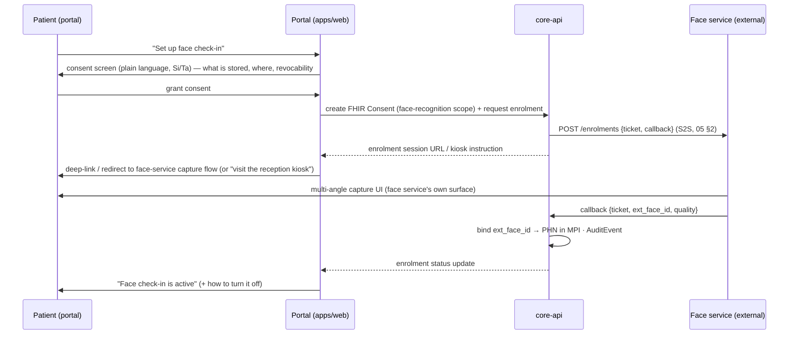

# 07 · Patient Portal (PWA)

Version 1.0 · July 2026 · MedAgent Platform
Status: Draft for review

## Executive summary

The patient portal is the `(patient-portal)` route group of `apps/web` (06 §1), delivered as an installable **Progressive Web App** — the locked Phase A decision (spec §7.1: "PWA now, native app next quarter"). It gives every patient (and guardian proxy) their record, consent controls, bookings, reminders, an emergency profile and a personal access log, in plain language designed for low-literacy and Sinhala/Tamil-first users. Two invariants shape the design: **the portal never touches biometric data** — face enrolment is a hand-off to the external face service, with the platform storing only the returned `ext_face_id` (05) — and **every patient-facing capability degrades to SMS** for the large population without smartphones (FR-15.3). Phase A ships online-first with a cached read-only record snapshot; Phase B adds PowerSync bidirectional offline and TTS.

Traceability: FR-5.1–5.9 (complete), FR-15.1–15.3, FR-13.3 (Phase B hook), FR-6.4 (data-subject request intake), NFR-5/6/7.

## 1. Requirement coverage map

| FR | Requirement | Where | Phase |
|---|---|---|---|
| FR-5.1 | Registration + multi-angle face enrolment | §3 (enrolment = external hand-off) | A |
| FR-5.2 | Consent management: face rec on/off, viewer control | §4 | A |
| FR-5.3 | View appointments, prescriptions, labs, visit summaries, shared notes | §5 | A |
| FR-5.4 | Medication reminders and refill alerts | §6 | A (reminder agent v1) |
| FR-5.5 | Book, reschedule, cancel appointments | §7 | A (basic booking, S5) |
| FR-5.6 | Download / share records as PDF | §8 | A |
| FR-5.7 | Emergency profile for authorised emergency staff | §9 | A (pre-break-glass minimal view) / B (automated break-glass, national surface) |
| FR-5.8 | Personal access log | §10 | A |
| FR-5.9 | Guardian proxy, transition at majority | §11 | A (read-only viewing + child switcher) / B (booking, consent management, automated majority transition) |
| FR-15.1 | Auto-generated reminders (immunization, screening, follow-up, refill) | §6 | A: follow-up/refill · B: immunization/screening engines |
| FR-15.2 | Chronic-condition monitoring nudges | §6 | B |
| FR-15.3 | Reminders respect consent + channel preference (SMS / push) | §6, §13 | A |
| FR-13.3 | TTS for low literacy | §12 | B (hook designed A) |
| FR-6.4 (patient-side) | Export / deletion request intake | §8, §4 | A intake, workflow in 08 |

## 2. Placement, identity and app shell

- **Route group** `(patient-portal)` in `apps/web`, sharing `packages/ui` tokens and the BFF session model (06 §2). Same Keycloak, different audience: patients and guardians authenticate into patient-realm roles; `proxy.ts` confines them to the portal group. A patient session can *never* reach doctor or kiosk routes (and vice versa) — enforced server-side, re-checked at the gateway.
- **Credentials**: phone-number-first registration (username = verified mobile via SMS OTP through notify-service), optional email. Phase A login is **password + SMS OTP on new devices** (02 §4). A passwordless-OTP default — attractive for a population with little password habit — is a Phase B evaluation item: it needs a custom Keycloak authenticator SPI, which is extra scope the pilot does not carry. Identity proofing at first registration binds the account to a PHN via demographic match + staff confirmation at a facility, or via an enrolment code issued at reception — self-asserted accounts get no record access until bound (02 owns the binding rules).
- **Design posture** (vs the doctor workspace's density): mobile-first, one primary action per screen, 16 px+ body text, large touch targets (≥44 px), bottom navigation with icons + labels: **Home · Records · Appointments · Consent · Profile**. Language switcher (En/Si/Ta) permanently in the header from day 1 — Sinhala and Tamil are first-class targets, not settings buried in a menu (translations land Phase B; the switcher and keyed catalogues exist from S1, 06 §9).
- SLUDI: when citizen digital ID becomes usable (rollout end-2026), SLUDI login/verification is added as an *additional* identity-proofing and login path via the reserved MPI adapter (02); nothing in the portal couples to it before then.

## 3. Registration and face enrolment hand-off (FR-5.1)

**The portal never captures, transmits, or displays biometric data.** Enrolment happens entirely in the external face service; the portal's role is consent, hand-off, and linkage — the contract in 05 §2, seen from the patient's side:

Rules the portal enforces or surfaces:

- **Consent precedes the ticket, always** — the "Set up face check-in" flow is unreachable without an active face-recognition `Consent` (05 §2); declining consent simply leaves manual check-in, stated explicitly: *"You can always check in at the desk. Saying no never affects your care."* (spec §4.1).
- Two capture paths, both external: **device deep-link** (face service's web/app capture on the patient's own phone, where the service supports it) and **kiosk/reception referral** (portal shows a QR/reference the receptionist uses to start supervised enrolment). Which paths exist is confirmed in the S2 coordination sync (05 §8); the portal treats them as interchangeable hand-offs.
- The portal shows enrolment **status only** (not enrolled / active / revoked) — never images, quality vectors or templates. Platform-side data remains exactly the 05 §7 list.
- Re-enrolment (after revocation, or quality issues) repeats the full flow and yields a new `ext_face_id`; the old linkage is destroyed with confirmation (05 §2).

## 4. Consent management (FR-5.2)

The consent screen is the portal's PDPA front door, backed by FHIR `Consent` resources via core-api (03 owns the consent model; this section is its UX contract):

| Control | Backing | Effect |
|---|---|---|
| **Face check-in on/off** | `Consent` (face-recognition scope) grant/revoke | Revoke → template destruction call to the face service + suppression-list push + linkage cleared (05 §2/§4); grant → enrolment flow (§3) |
| **Who may view my record** (viewer scopes) | `Consent` provisions: treating clinicians at facility of care (default), other facilities (for referrals), named guardian/family, emergency profile visibility (§9), de-identified research use (separate, default off) | Enforced at the FHIR consent interceptor on every read (01, 03) — not a display preference |
| **Reminder channels** | Notification preference (core-api, `app_db`) + consent for each channel | Gates every notify-service send (FR-15.3, §6) |
| **Export / deletion request** | Data-subject request intake → 08 workflow | Tracked request with status visible in the portal (FR-6.4) |

UX rules:

- **Immediate-effect explanation**: every toggle states, in plain language, what changes *now* — e.g. face rec off: *"From now on, cameras will not recognise you. You check in at the desk instead. Your face data at the recognition service is deleted — this usually completes within a day and you can see confirmation here."* Pending destruction confirmation is shown as a state, not hidden.
- Consent changes propagate immediately platform-side: `Consent` update → Redis consent-cache invalidation → any subsequent face event for this patient is **dropped silently** (AuditEvent `consent_denied`, suppression list; nothing is shown to any user — 05 §3); the patient simply checks in manually at the desk when they present. The UI never promises faster than the system delivers (destruction confirmation is asynchronous and displayed as such).
- Every change is itself audited and appears in the patient's own access log (§10), with full history (granted/revoked timeline) viewable.
- No dark patterns: on/off states equally prominent; no pre-ticked optional scopes; research consent is separate and unbundled.

## 5. Records view (FR-5.3)

Read-only patient-facing projection of the FHIR record, fetched through core-api patient-scoped endpoints (the ts-sdk client; the portal never queries HAPI directly):

- **Home** surfaces what matters next: upcoming appointment, active medications, unread results/summaries, pending actions (consent confirmations, booking suggestions).
- **Records** tabs: **Appointments** (upcoming/past), **Medicines** (active with plain-language dose lines — "1 tablet, morning and night, with food" — and inactive history), **Lab results** (released `DiagnosticReport` only — the release gate is upstream, FR-8.4/8.6; values shown with reference ranges and a plain "within/outside usual range" line, no interpretation beyond that), **Visit summaries** (per encounter: what happened, diagnoses in patient-friendly wording alongside the code, what to do next), **Doctor's notes** — *only* notes the clinician explicitly marked patient-shared; unshared clinical notes never reach patient-facing endpoints (enforced server-side in core-api's patient projection, not by UI filtering).
- Every item shows *which facility and clinician* it came from — the lifetime record spans institutions (spec §1.1) and provenance builds trust.
- Terminology: dual-register display — clinical term + plain-language gloss (Si/Ta glosses Phase B with translation; the gloss field exists from day 1).

## 6. Reminders, refills and preventive nudges (FR-5.4, FR-15.1–15.3)

Generated by the reminder agent v1 (04, agents/08-reminder.md) and delivered by notify-service; the portal is the preference surface and the in-app inbox:

| Reminder | Source | Phase |
|---|---|---|
| Medication dose reminders | Active `MedicationRequest` schedule → patient-tuned times in the portal | A |
| Refill alerts | Course end-date / days-supply arithmetic → "runs out in 5 days" + book/renew action | A |
| Follow-up due | Signed follow-up proposals (FR-4.7) → `Appointment`/care-plan dates | A |
| Visit summary delivery | Encounter close → push + SMS (§13) | A (S5 exit criterion) |
| Immunization / screening due | Immunization engine (Phase B, FR-7.3) | B |
| Chronic out-of-range nudges | Observation thresholds → patient + doctor (FR-15.2) | B |

Rules: every send checks **consent + channel preference** at send time (FR-15.3) — channels are **app push** (PWA Web Push, requested in context after first value delivered, never at first launch) and **SMS** (§13); quiet hours default 20:00–08:00 local (agents/08; except critical); message content follows the minimal-PHI rules of §13; every send is audited and visible in the in-app inbox, which is the durable copy when push is dismissed.

## 7. Booking (FR-5.5)

Backed by core-api scheduling (FHIR `Appointment`/`Slot`; the schedule agent's tool surface, 04):

- **Book**: choose facility/clinic → available slots (published capacity) → confirm; confirmation in-app + SMS.
- **Reschedule/cancel**: list-item actions with facility-configurable cut-offs (e.g. no self-service cancellation < 4 h before; the rule and its reason shown, with "call the clinic" fallback).
- Guardian booking for a child from the child's context (appointment records patient = child, booked-by = guardian) is Phase B — guardian proxy is read-only in Phase A (§11).
- Reminders per §6; no-show tracking and auto-rebooking rules (FR-11.4) are Phase B server-side features that surface here without portal rework.
- Phase A scope honesty (spec S5: "basic booking"): direct clinic bookings only; waitlists, urgency ordering and auto-scheduling (FR-11.1/11.2) are Phase B.

## 8. PDF export and sharing (FR-5.6)

- **Server-side generation** in core-api (patient summary, visit summary, prescription, lab report, or full-record export) — rendered from FHIR data with facility branding, generation timestamp, requesting-identity watermark and a document ID; generated under the patient's own authenticated session and **audited like any other record access** (§10 shows "You exported…").
- **Download** to device; **share** via time-limited signed link (default 72 h, revocable from the portal, access-notified) — because "share with a doctor elsewhere" must not require the recipient to have an account. Link opens a read-only viewer, itself audited.
- Full-record export doubles as the PDPA data-portability intake (FR-6.4): PDF for humans, plus FHIR JSON bundle option (08 governs the formal process and identity re-verification for full exports).
- Phase B: NDHX-aligned structured sharing to another institution supersedes ad-hoc links for in-network transfers (09).

## 9. Emergency profile (FR-5.7)

- **Content, patient-curated but record-anchored**: blood group, allergies (from `AllergyIntolerance` — patient can add free-text notes but cannot delete clinician-recorded allergies from the emergency view), critical conditions, active critical medications, emergency contact.
- **Access rules** (the hard part, designed with 02/08): per 02 §6.2 the emergency profile is a **pre-break-glass minimal view** — blood group, allergies, critical medications, emergency contact — available to **authenticated clinical staff without break-glass**, precisely so the full-record override is rarely needed. Every access is still audited, notifies the patient (push/SMS: "Your emergency profile was accessed at {facility}") and appears in the access log (§10). **Break-glass** — typed reason, prominent UI flagging, immediate high-visibility `AuditEvent`, mandatory post-hoc review queue (spec §4.2) — remains the mechanism for full-record access when the minimal view is not enough and consent cannot be asked; the automated break-glass workflow is Phase B, and the pilot covers that residual case with an audited manual-override procedure.
- Patient controls in the portal: preview exactly what emergency staff would see; toggle optional fields; the core safety set (blood group, allergies) is on by default with a clear explanation of the risk of turning it off.
- Phase A: profile exists, is accessible to authenticated clinical staff at the pilot hospital without break-glass, patient-notified; full-record override is a manual, audited procedure. Phase B: automated break-glass workflow, national emergency-services surface and offline emergency card (downloadable/printable QR-linked summary).

## 10. Personal access log (FR-5.8)

The patient-readable projection of the audit trail (03/08 own the `AuditEvent` pipeline):

- core-api translates AuditEvents about the patient's record into **human-readable entries**: *"Dr B. Herath (Peradeniya Hospital) viewed your lab results — 14 Jul 2026, 09:12"*, *"You exported your record as PDF"*, *"Emergency access by A. Silva (ETU) — reason recorded"*. Actor display name + role + facility, action verb from a fixed patient-friendly vocabulary (viewed / added / updated / exported / emergency access / consent change), target category, timestamp.
- Filters: by time, facility, action type; break-glass entries visually flagged; **"report a concern"** action on any entry opens a data-protection query (routes to the 08 DSR/complaints workflow) — the access log is only worth building if a worried patient can act on it.
- Exclusions are principled and documented: internal system-to-system processing events are aggregated ("automated processing for reminders") rather than itemised; nothing involving a human reader is ever aggregated away.
- Served paginated from the audit read model; patient sees reads *about them* only — the log itself reveals no other patient's data.

## 11. Guardian proxy (FR-5.9)

Backed by explicit, time-bound **proxy grants in `app_db`** (02 §9 owns the authorisation model; a FHIR `RelatedPerson` projection is Phase B, 03 §3; spec §4.2 "guardian access"):

- **Establishment**: at birth registration (mother's record linkage, FR-7.1) or by verified application at a facility (documents checked by staff — self-service proxy claiming is deliberately not offered). Both parents may be linked (FR-7.8); additional guardians (legal custody) via the same verified path.
- **Child switcher**: a guardian's account carries their own record plus a profile switcher ("Viewing: Nethmi, age 4") with unmistakable context marking — persistent banner colour + child's name on every screen while in child context. Every action in child context is audited as *guardian X acting for child Y*.
- **Proxy scope — Phase A is read-only** (11 S5): the guardian views the child's record via the child switcher; booking on the child's behalf, guardian consent management and the automated transition-at-majority workflow are Phase B. In no phase can the guardian revoke clinician-recorded safety data visibility (allergies) or see the child's future adolescent-confidentiality categories (Phase B policy hook, aligned with MoH guidance).
- **Expiry at majority is enforced by data, not memory**: every proxy grant carries `expires_at = child's 18th birthday` (or earlier court-set date) from day 1; the authorisation layer refuses expired grants automatically. The *managed* transition — inviting the 16–17-year-old to create their own credentials (SLUDI-assisted once available), notifying the new adult that they now control their record, reversing the roles so continued family access requires the *patient's* consent grant (§4) — is Phase B automation; Phase A relies on grant expiry plus staff process. All transitions audited.
- Guardian access appears in the child's access log (§10), which the child inherits intact at majority — including the history of who viewed their childhood record.

## 12. PWA specifics, accessibility and low literacy

### 12.1 Installability and service worker

- **Manifest** (name/short_name in three scripts, maskable icons, `display: standalone`, portal start URL and scope). In-context install prompt after first successful record view; never a first-visit interstitial.
- **Service worker scoped to the portal path only** (`/portal/…` scope): doctor workspace and kiosk routes are explicitly outside SW scope — no clinical-workstation caching surprises, and a shared/family device never serves one user's cached shell to another audience.
- Caching strategy (Workbox): app shell + static assets pre-cached; API responses via short-TTL network-first (never cache-first for clinical data).

### 12.2 What works offline (Phase A — honest scope)

- **Cached read-only record snapshot**: last-fetched summary, active medications, upcoming appointments and the emergency profile stored in IndexedDB **encrypted with a session-derived key**, refreshed on every online visit, purged on logout/session expiry. Opening the app offline shows this snapshot with a prominent "Offline — last updated {time}" banner.
- **Nothing writes offline in Phase A**: booking, consent changes and messages require connectivity and say so; consent state shown offline is advisory-only and marked as such (an offline consent toggle that silently fails is worse than none).
- **Phase B**: PowerSync bidirectional sync (offline write queue, field-level merge — never last-write-wins for clinical data) per the locked research decision (01 NFR-5, 09), replacing the snapshot mechanism.

### 12.3 Accessibility and low-literacy design (NFR-6, FR-13.3)

- WCAG 2.1 AA via the shared token/CI regime (06 §4.5) — contrast tests, focus management, axe CI on portal routes.
- **Low-literacy patterns as first-class design constraints**: consistent icon + colour + short-label triads for every core concept (appointment, medicine, result, consent); one action per screen; progress shown as steps ("2 of 3"); numbers and dates in large type; no text-only critical actions.
- **Plain language register enforced editorially**: target ≈ grade-6 reading level for all patient-facing strings; message catalogues reviewed against a plain-language checklist as part of translation QA; clinical terms always carry a gloss (§5).
- **TTS hook (FR-13.3, Phase B)**: patient-facing content components render through a `ReadableContent` wrapper carrying language + text metadata from day 1, so Phase B TTS ("listen" button per screen/section, Si/Ta/En voices) is a provider addition behind the same pluggable pattern as dictation (06 §11) — not a retrofit across every screen.
- Si/Ta priority: script-correct fonts, ICU plurals and layout tolerance for longer strings validated during Phase A even while values remain English (06 §9) — the portal's Phase B translation is a content drop, not a UI project.

## 13. SMS fallback — the non-smartphone patient (FR-15.3, spec §5.1)

A large share of pilot-population patients have feature phones. **SMS is a delivery tier, not an afterthought**; every patient-facing outcome has an SMS expression via notify-service:

| Portal capability | SMS expression |
|---|---|
| Visit summary (§5) | Auto-sent condensed summary on encounter close: facility, date, key instruction, follow-up date (S5 exit criterion: "a patient receives a visit-summary SMS") |
| Medication/refill reminders (§6) | Scheduled SMS with drug name in Latin or transliterated script per preference |
| Appointment booking/reminders (§7) | Confirmation + T−24 h reminder; **keyword replies** (e.g. "1" confirm / "2" cancel) via inbound webhook → core-api, Phase A single-gateway scope permitting; else reply-with-phone-call instruction |
| Consent changes (§4) | Confirmation SMS on every consent change (tamper evidence for the patient) |
| Emergency access (§9) | Immediate notification SMS |
| Access-log concerns (§10) | Monthly digest option: "Your record was viewed N times — visit the portal or call {number} for details" |

Rules: **PHI minimisation in SMS** — no diagnoses, results or drug indications in message bodies beyond what the patient explicitly opted into (drug names themselves are opt-in; default is "your medicine is due"); channel preference and consent checked per send (FR-15.3); Si/Ta message templates from the same next-intl catalogues (SMS-length-audited); delivery receipts logged; SMS-only patients are registered at reception (assisted registration, §2) and can nominate channel preferences on paper → staff entry. Cost and gateway integration in 10; message content governance in 08.

## 14. Testing

Portal-specific additions to the 06 §12 regime: Playwright smoke on mobile viewport (login via OTP → records render → consent toggle round-trips → booking flow → PDF download link issued); offline test (SW serves snapshot with banner; write actions correctly disabled); guardian-context test (switcher, banner, audit attribution, expiry-date refusal); axe on all portal routes; SMS template snapshot tests (length, PHI-lint against forbidden-term list).

## 15. Decisions

| ADR | Decision | Rationale | Rejected |
|---|---|---|---|
| P-1 | PWA in the same `apps/web` route group, not a separate app | Locked spec decision (§7.1) and 2-dev reality; shares tokens, i18n, sdk, session model; native app is a Phase B wrapper decision (capacitor/native) once flows are proven | Native apps now (timeline); separate portal repo (drift, duplicated auth) |
| P-2 | Face enrolment is an external hand-off; portal shows status only | Biometric isolation stays architectural (05 F-1/F-4): the portal never holds camera frames or templates, so portal compromise reveals nothing biometric; consent-before-ticket enforced in one place (core-api) | In-portal capture UI with SDK (drags biometrics into web app scope); iframe-embedding the face service (blurs the trust boundary, CSP/consent ambiguity) |
| P-3 | Phone-first identity with OTP; record access only after facility-verified PHN binding | Matches patient population (phone ubiquity, password fatigue); binding step prevents self-asserted account ↔ record joins — the highest-consequence portal risk | Email/password self-signup with immediate access (prototype's open-registration flaw, patient-side); waiting for SLUDI (timeline mismatch — first IDs Q3 2026) |
| P-4 | Consent UI writes FHIR `Consent` via core-api with immediate cache invalidation; UI states asynchronous effects honestly | Single consent source of truth (03); avoids the prototype's modelled-but-unenforced `face_consent`; trust requires the UI not to overpromise (template destruction is confirmed, not instant) | Portal-local consent flags; optimistic "deleted" messaging |
| P-5 | Phase A offline = encrypted read-only snapshot; no offline writes | An offline write queue without field-level merge risks silent clinical-data loss (worse than unavailability); PowerSync does this properly in Phase B (research decision) | Offline booking/consent queue in Phase A; no offline at all (rural connectivity reality, and emergency profile must be viewable offline) |
| P-6 | SMS as a parity delivery tier with PHI-minimised templates | Non-smartphone patients are a large cohort; FR-15.3 + spec §5.1 make SMS mandatory, and minimisation is the PDPA-safe default for an unencrypted channel | App-only engagement; full clinical detail over SMS |
| P-7 | Access log rendered from AuditEvent via a fixed patient-friendly verb vocabulary, with "report a concern" | FR-5.8's value is accountability a layperson can act on; raw audit dumps are unusable and leak internal detail | Exposing raw AuditEvent fields; omitting system-event aggregation policy (either noise or hidden gaps) |
| P-8 | Guardian expiry enforced by grant `expires_at` data with a managed 16–18 transition | FR-5.9's "transitions at majority" must be a property of the authorisation data, not an operational task someone remembers; managed handover avoids day-18 lockout of an adolescent who never held credentials | Manual revocation processes; indefinite guardian access with policy-only expiry |
| P-9 | Emergency profile is a pre-break-glass minimal view for authenticated clinical staff (02 §6.2); break-glass with typed reason + patient notification + review queue is reserved for full-record access (workflow automated Phase B, audited manual override in the pilot) | Emergencies are precisely when consent cannot be asked; a minimal always-available view keeps the override rare, and audited compensation is the spec's own model (§4.2) — the patient always sees both (§10) | Break-glass gating even the minimal view (makes every emergency an override); pre-consented "emergency viewers" list only (fails for unconscious patient at an unfamiliar facility); unauthenticated emergency URL (indefensible) |
