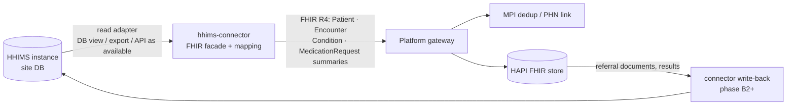
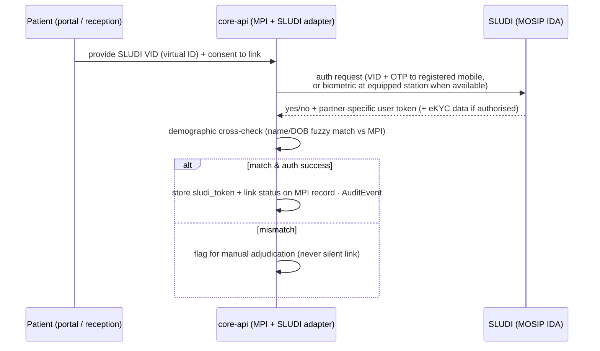

# 09 · National Integrations & Interoperability

Version 1.0 · July 2026 · MedAgent Platform
Status: Draft for review

## Executive summary

This document specifies how the platform integrates with what Sri Lanka already runs — SLUDI, HHIMS, DHIS2, the emerging NDHX/National EHR, private labs — and how the Phase B national modules (lab network, imaging, referrals, scheduling, telemedicine, registries/surveillance) attach to the Phase A foundations without re-architecture. The governing principle is the spec's own (§3.6): **integrate, never replace; exchange-first, standards-only** (FHIR R4, DICOM/DICOMweb, ASTM/HL7, Code 39/128). Phase A ships exactly five live external integrations — the face service, an SMS gateway, the Anthropic API, the self-hosted drug-data pipeline, and a server-relayed English STT (dictation) provider (06 §11, S3) — while reserving adapter seams (SLUDI, NDHX profiles) so later integrations are configuration and connectors, not rebuilds. Traceability: spec §3.6, Part 5 (§5.1), FR-8.x–FR-14.x, FR-15.3.

## 1. Integration inventory and phasing

| Integration | Counterpart | Standard / interface | Phase | Section |
|---|---|---|---|---|
| Face recognition service | Existing external service | HMAC-signed webhook + S2S REST (contract in 05) | **A (live)** | 05 |
| SMS gateway | Local aggregator (Dialog/Mobitel ecosystem) | REST/SMPP via notify-service adapter | **A (live)** | §12 |
| LLM | Anthropic API | HTTPS, enterprise data terms | **A (live)** | 04, 08 §2 |
| Drug data pipeline | RxNorm + curated DDI dataset (self-hosted) | Monthly dataset ingest, no runtime external calls | **A (live, pilot formulary subset)** | §7 |
| STT / dictation provider | Server-relayed speech-to-text service (English v1 — locked decision) | HTTPS server-side relay, keys held server-side, pluggable `DictationProvider` interface (06 §11) | **A (live, S3)** | 06 §11 |
| SLUDI (MOSIP) | ICTA / SLUDI programme | MOSIP ID Authentication (IDA) / eKYC | **A: adapter seam reserved · B: live binding** (first IDs Q3 2026, rollout end-2026) | §5 |
| NDHX / National EHR | UNOPS-procured national programme (award ~Apr 2026, 30 hospitals, open-source, FHIR) | FHIR R4 profiles, e-Referral | **A: profile alignment + engagement · B: exchange node** | §2 |
| HHIMS | ~80 state hospitals, ~9.5 M patients | Read-only FHIR facade connector, phased | **B** | §3 |
| DHIS2 | HIU / public-health reporting | DHIS2 Web API `dataValueSets` (aggregate) | **B** (FR-14.3) | §4 |
| Lab network (LIS hub, analyzers, private labs) | Government + private labs (e.g. Asiri) | ASTM E1381/E1394, HL7 v2.x MLLP, FHIR; Code 39/128 | **B** (FR-8.x) | §8 |
| Imaging / PACS | Hospital PACS or platform-deployed Orthanc | DICOM + DICOMweb (QIDO/WADO/STOW-RS), FHIR `ImagingStudy` | **B** (FR-9.x) | §9 |
| Referrals network | Hospital network tiers, NDHX e-Referral | FHIR `ServiceRequest` + `Task` | **B** (FR-10.x; profile/IG shape defined in A — implementation and mappings are Phase B, per 03) | §10 |
| Telemedicine | WebRTC service (choice deferred) | WebRTC/SFU | **B** (FR-12.x) | §11.2 |
| Registries / Epidemiology Unit | MoH Epidemiology Unit, registry programmes | Config-driven case feeds, notifiable-disease alerts | **B** (FR-14.x) | §11.3 |
| Birth registration | Civil registration | Event-triggered profile creation | **B** (FR-7.1; PHN issuance ships in A) | §5.4 |

Phase A builds nothing speculative for Phase B integrations except: (a) FHIR R4 as the only clinical data plane, (b) the SLUDI adapter interface in the MPI (02), (c) NDHX-aware profiling discipline (§2.2). That is what makes the Phase B column connectors rather than rework.

FR traceability: FR-8.1–8.8 → §8 · FR-9.1–9.4 → §9 · FR-10.1–10.4 → §10 · FR-11.1–11.4 → §11.1 · FR-12.1–12.4 → §11.2 · FR-14.1–14.5 → §4, §11.3 · FR-15.3 → §12 · FR-7.2 → §5 · FR-7.5–7.7 → §5.4 (Phase B) · spec §5.1 standards table → sections above.

## 2. NDHX / National EHR alignment

**Situation (July 2026).** The UNOPS-run procurement for the National Digital Health Exchange / National EHR was awarded around April 2026: 30 hospitals initially, open-source, FHIR-based. The implementer is mobilising now — which means profile and identifier decisions are being made **during our pilot**. This is the single most consequential external dependency: handled well, the platform becomes an NDHX-conformant node and its e-Referral/exchange capabilities plug in; handled badly, Sri Lanka gets one more parallel silo.

### 2.1 Engagement plan

| When | Action | Owner |
|---|---|---|
| S1 (now) | Initiate contact via MoH/HIU sponsor: introduce the platform as a FHIR R4 node intending NDHX conformance; request the implementation guide (IG)/profile drafts and identifier strategy (PHN handling) as they stabilise | Project lead (master plan open item 4) |
| S3 | Map our resource profiles (03) against NDHX draft profiles; log deltas as issues; adopt NDHX terminology bindings where published | Dev A |
| S6 | Include the alignment statement in the go-live compliance pack; agree a connectathon/conformance-test slot for Phase B | Project lead |
| Phase B | Participate in NDHX connectathon; implement the exchange interface (likely FHIR REST + national MPI lookup); map our e-Referral model (§10) to the NDHX e-Referral profile | Dev A + implementer |

### 2.2 Technical alignment rules (in force from S1)

- **FHIR R4 only, no proprietary extensions** for anything that will cross the exchange; local extensions live under a platform namespace and are never required for interpretation of the core clinical content.
- **PHN as `Patient.identifier`** with a national system URI agreed with HIU (interim URI documented in 03, migration-safe because identifiers are additive).
- Terminology: ICD-10/SNOMED CT/LOINC as spec §5.1 mandates; adopt NDHX value-set bindings when published rather than inventing local ones.
- e-Referral (§10) modelled as `ServiceRequest` + `Task` — the pattern the FHIR community and most national exchanges use — so remapping to the NDHX profile is field-level, not structural.

### 2.3 Parallel-silo risk and mitigation

| Risk | Mitigation |
|---|---|
| NDHX profiles land incompatible with ours after we've stored data | Profiles are additive views over standard R4 resources; we store canonical R4 + run migration scripts per profile delta; CI validates against both our IG and NDHX IG once published |
| NDHX programme delays leave no exchange to join | Platform functions standalone (spec §6.2 risk table); HHIMS connector (§3) and direct facility onboarding proceed regardless — the exchange is an accelerant, not a dependency |
| Duplicate national MPI emerges | Position our MPI as facility-tier with PHN as the shared key; SLUDI binding (§5) gives both systems the same root identity; escalate identifier governance to the MoH governance body early |
| Political/It procurement friction ("competing system") | Consistent posture: the platform is an NDHX-*consuming* clinical workflow and AI layer, not a rival exchange; open standards + willingness to conform are the evidence |

## 3. HHIMS coexistence (Phase B)

HHIMS runs in ~80 state hospitals holding ~9.5 M patient records. It is not replaced (spec §3.6): the pattern is **exchange-first coexistence** via a connector that presents HHIMS data as FHIR.

### 3.1 Connector pattern

A dedicated `hhims-connector` service (Phase B, deployed per site or per regional cluster depending on HHIMS topology) implementing a **read-only FHIR facade** first:



Phasing:

- **B1 — read facade:** demographics + encounter/diagnosis/medication summaries exposed as FHIR; patient matching through the MPI (PHN where HHIMS holds it, else demographic match with human adjudication for uncertain pairs — never silent merges). Consent and audit apply exactly as to any other read (03): HHIMS-sourced views emit `AuditEvent`s and respect `Consent`.
- **B2 — referral interop:** e-Referrals (§10) to/from HHIMS sites; outcomes returned as documents where HHIMS cannot consume structured Task updates.
- **B3 — event sync:** near-real-time change feeds where site infrastructure allows; otherwise scheduled sync with explicit data-currency labelling in the UI (clinicians must see "as of" timestamps on HHIMS-sourced data).

### 3.2 Risks

- **No stable HHIMS API / heterogeneous versions across sites:** connector isolates all variance behind the facade; per-site adapter config; engage the MoH Health Information Unit as the owner of HHIMS access rather than reverse-engineering site by site.
- **Data quality (unco-coded diagnoses, free text):** facade maps what is coded, passes free text as `DocumentReference`/narrative, never fabricates codes; terminology-mapping backlog is a managed work item with HIU.
- **Write-back safety:** the platform never writes into HHIMS tables directly (ADR I-2); anything HHIMS must receive goes through its own interfaces or as human-readable referral documents.

## 4. DHIS2 aggregate feed continuity (FR-14.3, Phase B)

DHIS2 remains the national aggregate reporting backbone; the platform **adds case-level depth in its own registries (§11.3) and keeps feeding DHIS2 aggregates** — continuity, not replacement.

- **Mechanism:** the analytics service computes monthly (and where required weekly) aggregates from coded FHIR data (flattened reporting views over `hapi_db` read replica), then pushes DHIS2 `dataValueSets` via the DHIS2 Web API. No patient-level data ever flows to DHIS2.
- **Mapping config (versioned, reviewable):** each indicator is a tuple — FHIR query/measure definition → DHIS2 `dataElement` (+ `categoryOptionCombo`) → facility registry → DHIS2 `orgUnit` UID → period. Illustrative first set:

| Indicator | Source (FHIR) | DHIS2 target |
|---|---|---|
| OPD attendance | `Encounter` count by facility/month | OPD dataset element |
| Dengue notifications | `Condition` with dengue ICD-10 codes (confirmed status) | Notifiable disease element |
| Immunization doses given (per antigen) | `Immunization` by vaccine code | EPI dataset elements |
| Underweight / stunting flags (FR-7.5) | Growth `Observation` classifications | Nutrition programme elements |
| Referrals out-completed | `Task` closed (§10) | Referral dataset |

- **Cutover discipline:** for any facility moving its reporting to the platform feed, run **parallel reporting** (platform feed vs existing manual/HHIMS return) for ≥ 2 periods; discrepancies reconciled with the facility records officer before the manual return is retired. HIU signs each facility cutover.

## 5. SLUDI adapter (MOSIP-based)

SLUDI issues its first digital IDs **Q3 2026** with rollout through end-2026. Therefore: **PHN is the primary identifier now**; the MPI carries a reserved SLUDI adapter interface from S1 (02), and live binding is a Phase B (late-2026) activation, not a redesign.

### 5.1 Binding flow (PHN ↔ SLUDI)



Rules:

- **Never store the UIN.** Store the MOSIP **partner-specific user token** (and the VID only transiently for the transaction). This is MOSIP's own unlinkability design and mirrors our `ext_face_id` posture (05): an MPI leak reveals no national-ID material.
- **eKYC when available:** where the patient authorises it, eKYC response (name, DOB, photo, address) pre-fills registration and strengthens dedup — reducing manual data entry at enrolment (a real queue-time win).
- Binding is consented, audited, and reversible; unlink on request clears the token.
- SLUDI biometric authentication, when its device ecosystem reaches hospitals, is a **complementary** identity path alongside face check-in — explicitly not coupled to the face-service contract (05 §6).

### 5.2 Administrative lead time (start now)

MOSIP relying-party onboarding is process-heavy: partner registration, MISP licence key, auth-partner certification, and device trust arrangements. These are **calendar-long, not effort-long** — the project lead opens the ICTA/SLUDI onboarding conversation during Phase A so credentials exist when binding activates.

### 5.3 Fallback

Citizens without SLUDI (children, rollout gaps) are fully served by PHN forever — SLUDI linkage enriches identity assurance, it is never a prerequisite for care (spec invariant).

### 5.4 Birth registration & child health (FR-7.1, FR-7.5–7.7, Phase B)

Birth event at a connected hospital → PHN issued + profile created + link to mother's record; the civil-registration linkage (birth certificate number as an additional `Patient.identifier`) is agreed with the Registrar General's Department in Phase B alongside the child-health module. SLUDI linkage then attaches when the citizen's ID is issued (FR-7.2) via §5.1.

The child-health module (Phase B) additionally covers:

- **FR-7.5 growth-deviation flagging:** plotted growth `Observation`s are evaluated against WHO standard growth curves; deviations (crossing centile bands, underweight/stunting/wasting classifications) raise a flag surfaced to the PHM/midwife worklist — the same classifications feed the DHIS2 nutrition elements (§4).
- **FR-7.6 longitudinal illness episodes:** an illness episode recorded at *any* connected facility flows into the child's single longitudinal record — an MPI-matching plus `Encounter`/`Condition` ingestion statement: the MPI (PHN) resolves the child across facilities and the episode resources land in the same patient compartment, whatever the point of care.
- **FR-7.7 digitised CHDR:** a Child Health Development Record view assembled from `Immunization` resources, growth `Observation`s, and milestone records — the paper CHDR's content rendered from the canonical FHIR data, not a parallel store.

| FR | Design statement | Phase |
|---|---|---|
| FR-7.5 | Growth-deviation flagging vs WHO curves → PHM/midwife worklist | B |
| FR-7.6 | Any-facility illness episodes into the longitudinal record (MPI + Encounter/Condition ingestion) | B |
| FR-7.7 | Digitised CHDR view from Immunization + growth Observations + milestones | B |

## 6. Standards baseline (spec §5.1 restated with owners)

| Area | Standard | Owner / where |
|---|---|---|
| EHR interoperability | HL7 FHIR R4 (R5 roadmap post-NDHX alignment) | 03; §2 |
| App authorisation | OAuth2/OIDC now; SMART on FHIR v2 post-pilot (D8) | 02 |
| Clinical coding | ICD-10 / SNOMED CT, LOINC | 03 terminology |
| Imaging | DICOM / DICOMweb | §9 |
| Analyzer interfaces | ASTM E1381/E1394 + HL7 v2.x (MLLP), bidirectional | §8 |
| Specimen labels | Code 39 / Code 128 | §8 |
| Medication safety | RxNorm vocabulary + curated DDI dataset (D7) | §7 |
| Identity | PHN; SLUDI/MOSIP adapter; OAuth2/FIDO2 for staff | §5, 02 |
| Notifications | SMS + web push + email, consent-gated | §12 |
| Public health | DHIS2 aggregate feed | §4 |

## 7. Drug data pipeline (decision D7, Phase A live)

Context locking the design: NLM's RxNav drug-interaction API was **discontinued in 2024** and DrugBank's free interaction checker **retired 2026-03-25**. There is no dependable free runtime API. D7 therefore stands: **RxNorm as the drug vocabulary + a self-hosted, clinically curated DDI dataset, keyed by RxCUI, with zero runtime external calls** (sovereignty + offline-safe + fail-closed capable — 04 §7 blocks prescribing if the dataset is unavailable).

### 7.1 Pipeline components

| Component | Content | Refresh |
|---|---|---|
| RxNorm subset | Monthly RxNorm release (RXNCONSO, RXNREL, RXNSAT — concepts, ingredient relationships, dose forms) loaded into the drug-safety store (Postgres, part of `app_db`; packaged as a library inside agent-service Phase A, separable service later) | Monthly, via CI ingest job with checksum + row-count sanity gates |
| DDI dataset (the safety core) | Seed = **ONC high-priority DDI list** (the curated set of interactions broadly agreed to warrant interruptive alerts) normalised to RxCUI ingredient pairs, each with severity (contraindicated / major / moderate) and a clinician-readable rationale. Augment with the **DrugBank open academic subset** (licence review required — its terms are non-commercial-leaning; counsel confirms fitness or it is excluded) and **TWOSIDES/OFFSIDES** as *evidence enrichment only* (signal data, never a blocking source on its own) | Versioned in-repo (CSV + checksums); changes by PR only |
| Allergy class data | RxClass/ATC snapshots: drug → ingredient → ATC class expansion, so an `AllergyIntolerance` coded at ingredient or class level screens the whole class (e.g. penicillins) | With RxNorm refresh |
| Dose reference | Conservative adult/paediatric dose-range table for the pilot formulary subset, clinician-curated | With curation cycles |
| NMRA formulary map | Sri Lanka registered products (NMRA register / SPC data): brand + strength + form → RxCUI. **This is a real work item, not a download** (D7 note): semi-automated string/strength normalisation proposes matches; a pharmacist confirms each; unmapped products are prescribable only at ingredient level with a visible "unmapped brand" flag | Pilot: the pilot hospital's formulary (~500 items) mapped by S4. Phase B: national formulary, sustained by a standing curation function |

### 7.2 Screening semantics (consumed by the Rx-safety agent, 04/agents/03)

1. Proposed `MedicationRequest` → normalise to RxCUI ingredient set (via formulary map or direct RxNorm pick).
2. **DDI check:** ingredient-pair lookup against the dataset × the patient's active `MedicationRequest`s → contraindicated/major = **block** with rationale (terminal on the agent path — override exists only for the warn tier, per agents/03 §5); moderate = warn (FR-4.2/4.3 thresholds configurable per FR-6.2).
3. **Allergy check:** patient `AllergyIntolerance` substances expanded to ATC classes; intersection with the proposed drug's classes = block-or-confirm.
4. **Dose check** against the reference table where mapped.
5. Verdict is **deterministic code**; the LLM only explains it (04 ADR AG-2). Every verdict is recorded on the resulting resource (spec §3.4 "safety-check result") and in audit.

### 7.3 Clinical curation workflow

- A curation board (pilot: one senior clinician + one pharmacist; booked early per spec §7.5 watch-out and master plan open item 2) reviews: severity assignments, additions from NMRA/global safety alerts, false-positive complaints from clinicians (alert fatigue is a safety issue too).
- Dataset changes are PRs: diffable, reviewed, signed off in the PR record; the CI **eval gate runs the Rx-safety fixtures (100% required) on every dataset change** (04 §6), and fixtures are updated in lockstep with the dataset.
- Quarterly review cycle + out-of-cycle on safety alerts.

### 7.4 Phase B commercial database evaluation (Micromedex / First Databank / comparable)

Decision criteria recorded now so the Phase B evaluation is mechanical:

| Criterion | Why it matters |
|---|---|
| Coverage of the Sri Lankan (NMRA) formulary incl. local generics | The dataset is worthless where the formulary isn't covered |
| Severity taxonomy quality + clinical rationale text | Drives warn/block UX and clinician trust |
| Self-host / offline licensing | Fail-closed prescribing (04 §7) forbids runtime dependence on a remote API |
| RxCUI (or mappable) keying | Protects the pipeline architecture — swap dataset, keep engine |
| Update cadence + alert feed | Safety currency |
| Cost model (per site / per prescriber / national licence) | National scale economics |
| Data residency / sovereignty terms | PDPA + national posture (08 §2) |
| Indemnity / liability terms | Clinical-safety risk transfer |

The curated open dataset remains the fallback and the benchmark: a commercial licence must demonstrably beat it on coverage and currency for the price.

## 8. National lab network (Phase B — FR-8.1–8.8)

Standardises the proven private-lab workflow across the network. New deployable: `services/lis-hub` (same monorepo pattern, 01 §2), owning orders, accessioning, analyzer connectivity, validation, and routing. The lab agent (agents/04) is the AI face over it; the safety-relevant paths are deterministic, as with Rx.

### 8.1 Flow (spec §3.5, engineered)

Order (`ServiceRequest` + `Specimen`) → routing decision (own lab / regional government lab / approved private lab — rules by test availability, capacity, urgency; FR-8.1, FR-8.8) → collection: **accession number** issued (facility prefix + date + sequence) and barcode label printed — **Code 128 primary** (denser, checksummed), Code 39 supported for legacy scanners (FR-8.2) → transit states tracked (FR-8.7: ordered → collected → in transit → received → in progress → resulted → released) → analyzer integration (§8.2) → validation (§8.3) → release as `DiagnosticReport` + notification (FR-8.6) with critical-value fast path (§8.4).

### 8.2 Analyzer interfaces (FR-8.3)

- **Driver adapter layer** in lis-hub: one adapter per analyzer family, all normalising to an internal order/result model. Protocols: **ASTM E1381/E1394** (serial, via serial-to-IP converters) and **HL7 v2.x over MLLP/TCP** (OML/OUL, ORM/ORU for older firmware). Bidirectional: analyzer scans the specimen barcode → host-query pulls the order → results push back automatically.
- Analyzer networks are isolated VLANs, allowlisted to the lis-hub only (08 §5.6); adapters are replayable (captured-frame fixtures in CI, §13).
- Site survey per lab enumerates instruments, firmware, and interface modes before onboarding — the adapter backlog is driven by the national instrument census, not guesswork.

### 8.3 Validation & auto-verification (FR-8.4)

Rule engine per test code (LOINC-keyed), configured per lab, following CLSI auto-verification guidance: within reference range + no instrument flags + delta check vs patient's prior result passes → **auto-release**; any failure → pathologist validation worklist. All rules versioned config; every auto-release records which rule version released it (auditability). Abnormal-but-released thresholds are a laboratory-director sign-off, not a developer setting.

### 8.4 Critical values (FR-8.5)

Critical result → immediate push + SMS to the ordering doctor via notify-service, with **acknowledgement tracking and a timed escalation chain** (unacknowledged after N minutes → ward/duty doctor → lab calls by phone, logged). The alert path is exercised in staging with synthetic criticals as part of lab-module go-live.

### 8.5 Private lab onboarding (FR-8.8)

Private labs (e.g. Asiri) connect through **the same interfaces** as government labs: FHIR order/result exchange (or HL7 v2 where their LIS requires), same barcode standards, same specimen-state model. Onboarding pack: sandbox environment + conformance test kit (§13), interface agreement, ISO 15189 accreditation evidence, PDPA processor terms (08 §1). No bespoke per-lab integrations — conformance or no connection.

## 9. Imaging & X-ray AI (Phase B — FR-9.1–9.4)

- **PACS (FR-9.1):** integrate with existing hospital PACS via **DICOMweb (QIDO-RS/WADO-RS/STOW-RS) preferred**, classic DIMSE (C-FIND/C-MOVE) where that's what exists; where a facility has no PACS, deploy open-source **Orthanc** as the facility store. Studies are linked into the record as FHIR `ImagingStudy` referencing study UIDs; the platform stores references and reports, never bulk pixel data.
- **AI pre-read (FR-9.2):** pipeline service subscribes to new-study events → runs the approved pre-read model(s) (initial scope: chest X-ray abnormality triage) → writes a *preliminary* flag + priority score with full provenance (`Device` actor, model version) → **radiologist worklist is ordered by priority**, never filtered by it (nothing is hidden from review).
- **Radiologist final-report rule (FR-9.3):** hard rule, same shape as the e-sign-off invariant: **AI output is never the final report**. The `DiagnosticReport` is created only by the radiologist's signed review; the AI flag remains visibly preliminary until then, and discrepancies (AI-flagged vs radiologist-negative and inverse) feed the model-monitoring dashboard (08 §7 governance applies — versioned models, eval gates, incident path).
- **Distribution (FR-9.4):** final report links into the record; ordering doctor and patient notified through the standard channels (§12).

## 10. Referrals — closed loop (Phase B — FR-10.1–10.4; the profile/IG shape is defined in Phase A, implementation and mappings are Phase B, per 03)

Modelled as **`ServiceRequest` (the referral: reason, urgency, target unit/institution) + `Task` (the workflow state machine)** — the same pattern NDHX e-Referral is expected to profile (§2.2):

```
requested → received → accepted → scheduled → in-progress → completed(+outcome) | rejected(+reason) → returned-to-referrer
```

- **FR-10.2 consent-gated record view:** accepting institution's clinicians get access scoped by a referral-episode `Consent` (purpose-bound, time-bound), enforced by the same interceptors as everything else (03) — a referral is a consented, audited window, not a record transfer.
- **FR-10.3 visibility:** referrer sees Task status live (notify-service events).
- **FR-10.4 closed loop, enforced structurally:** a `Task` cannot reach `completed` without an outcome artefact attached (`DiagnosticReport`/`DocumentReference` outcome summary); the referral agent (agents/07) chases stale referrals automatically. "Every referral closes the loop" is a state-machine constraint, not a policy hope.
- Cross-institution transport: platform-to-platform natively; to HHIMS sites via the connector (§3, B2); via NDHX once the exchange operates (§2).

## 11. Patient-flow and intelligence modules (Phase B)

### 11.1 Scheduling & waitlists (FR-11.1–11.4)

FHIR `Schedule`/`Slot`/`Appointment` per facility; waitlist entries (urgency-ordered, per clinic/procedure) in `app_db` (operational state, 01 §3). Auto-scheduling (FR-11.2) fills capacity from the waitlist by urgency/wait-time policy with automatic patient notification; reminders + no-show tracking with auto-rebooking rules (FR-11.4) run through notify-service and the schedule agent (agents/06). **National view (FR-11.3):** the analytics service aggregates waiting-time distributions per institution/procedure for MoH planners — aggregate only, and it lands on the same dashboards as FR-14.4.

### 11.2 Telemedicine (FR-12.1–12.4)

- **WebRTC service choice is deliberately deferred** (ADR I-5) to the Phase B gate; leading candidate is self-hosted **LiveKit** (sovereignty, SFU scalability, good SDKs), evaluated against managed options on: data residency (PDPA, 08 §2), multi-party support (guardian join FR-12.2 + additional consented family member), TURN reliability on Sri Lankan mobile networks, bandwidth adaptation with **audio-only fallback (FR-12.4)**, recording controls (default **off**; enabling recording is a consent + retention decision per 08 §9), licence and operating cost.
- The consultation is a normal `Encounter` (FR-12.3): documented in the workspace, e-prescription issued through the identical Rx-safety + e-sign-off path — telemedicine changes the transport, never the clinical guardrails.
- Guardian join uses the proxy-access model (FR-5.9, 07); every join is consent-checked and audited.

### 11.3 Registries, surveillance & research data (FR-14.1, 14.2, 14.4, 14.5)

- **Auto-population (FR-14.1):** registry definitions are versioned config — a registry (dengue, TB, cancer, CKD, diabetes, extensible) = a code list (ICD-10/SNOMED) + inclusion rules. A subscription/ETL on `Condition` (and supporting resources) creates registry case records in the analytics store; no clinician re-entry.
- **Notifiable diseases (FR-14.2):** notifiable-code match → immediate alert to the **Epidemiology Unit**, transport configurable to match their operational reality (email/SMS to the MOH office initially; structured API feed when their systems accept it — designed with, not for, the Unit; complements the statutory H544 notification process rather than silently replacing it until formally agreed). Suspected vs confirmed status is carried explicitly.
- **Dashboards (FR-14.4):** trends, outbreak early-warning signals (case-count anomaly detection per MOH area), capacity views — aggregate data only, role-gated for MoH planners.
- **Research datasets (FR-14.5):** released **only** under the MoH-led governance body's approval: de-identification pipeline (direct identifiers stripped, dates shifted per patient, rare-value generalisation, k-anonymity threshold check before export), data-access agreement per release, export itself audited and logged in the DPO's register (08 §9). No self-service raw extracts, ever.

### 11.4 Offline-first sync for rural clinics (Phase B)

The Phase B offline-first capability cross-referenced from 01 §5, 06 §13, and 07 §12.2: rural clinic deployments with unreliable connectivity get a local-first sync layer — leading candidate **PowerSync**, evaluated against RxDB and ElectricSQL on conflict model, Postgres compatibility, and operational weight. Scope is deliberately narrow: **read-mostly clinical snapshots** (the visit-relevant record subset, sync-filtered per facility and care relationship) plus **queued writes** (registrations, observations, notes) replayed on reconnect under an explicit conflict policy — server-authoritative, clinician-adjudicated where a queued write collides with a newer server version, never silent last-write-wins on clinical data. PDPA note: device-at-rest encryption is mandatory for any synced store (encrypted local database, remote-wipe on device loss, per 08 controls), since offline replicas put PHI on clinic hardware.

## 12. Notification channels (Phase A: SMS + web push; FR-15.3, FR-11.4)

notify-service exposes one internal send API with **pluggable channel adapters**; consent and channel preference are checked per message (FR-15.3).

**SMS gateway selection criteria (Sri Lanka):**

| Criterion | Requirement |
|---|---|
| Coverage & routing | All local operators (Dialog, Mobitel/SLT, Hutch, Airtel) — direct aggregator (Dialog Ideamart / Mobitel mSpace ecosystems) or multi-operator third-party aggregator |
| Sender ID | Registered alphanumeric sender ID (hospital-recognisable); registration lead time budgeted |
| Language | **Unicode Sinhala/Tamil (UCS-2)** — mandatory; note the 70-char segment economics for Unicode vs 160 for GSM-7 in cost modelling |
| Delivery reports | Per-message DLRs via callback — reminder compliance (FR-11.4) needs them |
| API & throughput | REST (SMPP acceptable) with documented rate limits; burst capacity for clinic-morning reminder waves |
| Reliability & SLA | Uptime SLA; second provider configured as failover from day one (adapter makes this cheap) |
| Data protection | PDPA processor terms; **policy: SMS content carries minimal PHI** — appointment/reminder facts, never diagnoses or results ("Your report is ready — view in the app/at the clinic"), per 08 §9 |
| Cost | Per-message pricing at national projection volumes |

**Push:** web push (VAPID) for the PWA in Phase A; FCM/APNs when native apps land (Phase B). **Email:** transactional SMTP relay, staff-facing and optional patient documents; same minimal-PHI policy applies to subject lines and previews.

## 13. Integration testing strategy

- **Contract tests per external interface, in CI:** every integration has a machine-checkable contract (OpenAPI/JSON-schema for the face webhook and S2S calls; the `DictationProvider` interface for the STT relay — recorded audio fixtures in, expected transcript/error shapes out, so a provider swap is contract-verified per 06 §11; FHIR profiles for exchange surfaces; message fixtures for HL7/ASTM). Provider-side changes are caught by contract-test failure, not production incidents.
- **Mocks & simulators in the dev stack** (one `docker compose up`, 01 §2): face-service mock (emits signed events incl. malformed/replayed ones for negative tests), SMS sandbox adapter (records instead of sends), STT stub adapter (deterministic transcripts from fixture audio, plus provider-timeout/garbled-response negative cases), Anthropic calls stubbed with recorded fixtures for deterministic CI (real-model runs happen in the eval harness, 04 §6). Phase B adds: analyzer simulator replaying captured ASTM/HL7 frames per adapter, DICOM test node (Orthanc) with sample studies, DHIS2 dev instance for feed validation, HHIMS facade tested against anonymised schema snapshots.
- **Sandbox environments:** staging carries sandbox credentials for every live integration (face service staging endpoint per 05 §8, SMS test route, SLUDI/MOSIP sandbox when onboarding opens — §5.2). Partner-facing: the private-lab conformance kit (§8.5) is the same fixture suite packaged for lab vendors.
- **Negative-path drills as first-class tests:** webhook forgery/replay rejected, SMS provider down → failover, DDI dataset missing → prescribing blocked (fail closed), face service down → manual check-in unaffected. These encode the degradation table (04 §7) and the care-never-blocked invariant.
- **NDHX conformance:** once the NDHX IG publishes, its validator joins CI (§2.3) and connectathon participation becomes the external proof point.

## 14. Decisions

| ADR | Decision | Rationale | Rejected |
|---|---|---|---|
| I-1 | NDHX posture: conform-and-connect — canonical FHIR R4, no proprietary extensions, engage from S1, adopt NDHX profiles as they publish | The national exchange is being specified during our pilot; alignment is cheap now and ruinous later; the platform's value is as a workflow/AI layer over the exchange, not a rival silo | Wait-and-see until NDHX is live (guarantees a migration project); building our own exchange ambitions (political and technical dead end) |
| I-2 | HHIMS integration = read-only FHIR facade connector first, referral interop second, event sync third; never direct DB writes | 80 sites of heterogeneous, mission-critical legacy: read-first earns trust and value (history visibility) with near-zero risk to HHIMS operations; HIU partnership over reverse-engineering | Direct DB write-back (unacceptable risk to running hospitals); waiting for HHIMS to expose FHIR itself; replacement (spec explicitly forbids) |
| I-3 | Drug data: self-hosted RxNorm + curated DDI dataset keyed by RxCUI, zero runtime external dependency; NMRA formulary→RxCUI mapping as a staffed work item; commercial DB deferred to a criteria-driven Phase B evaluation (§7.4) | Restates locked D7 with the pipeline made concrete: the free runtime APIs are gone (RxNav interactions 2024, DrugBank checker Mar 2026); fail-closed prescribing demands local data; curation keeps clinicians accountable for the safety core | Commercial licence now (cost before evidence of need); live third-party API dependency (none dependable exists; violates fail-closed); prose-mining OpenFDA labels (unreliable as a blocking source) |
| I-4 | SMS via pluggable adapter; primary = local aggregator meeting §12 criteria, second provider configured as failover from day one; minimal-PHI content policy | Local aggregators own operator reach and Unicode Si/Ta; adapter isolation makes provider choice reversible and failover trivial; content policy contains breach blast radius | Hard-wiring one provider's API; international CPaaS-only (sender-ID and cost friction locally); rich clinical content in SMS (PDPA exposure for zero clinical gain) |
| I-5 | Telemedicine WebRTC platform decision deferred to the Phase B gate with written criteria (§11.2); leading candidate self-hosted LiveKit | No Phase A telemedicine scope (D4); deciding now buys nothing and forecloses a fast-moving market; the criteria — residency, guardian multi-party, audio fallback, cost — are the durable part | Choosing a vendor now; building raw WebRTC signalling in-house (undifferentiated heavy lifting) |
| I-6 | DHIS2 fed by aggregate `dataValueSets` push from the analytics service with per-facility parallel-run cutover; case-level depth stays in platform registries | FR-14.3 is continuity of national reporting, and DHIS2's unit is the aggregate; parallel-run protects the national statistics series from silent breakage | Per-event streaming into DHIS2 tracker (wrong altitude — registries own case level); manual re-keying continuing indefinitely |
| I-7 | SLUDI: store MOSIP partner-specific token (+ link status) only — never UIN, VID transient; adapter isolated in the MPI; relying-party onboarding paperwork starts in Phase A | Mirrors the `ext_face_id` unlinkability posture (05 F-4); MOSIP's token design exists precisely for this; the onboarding lead time is the real schedule risk, not the code | Storing UIN (unnecessary national-scale liability); postponing all SLUDI work until IDs exist (loses the administrative lead time) |
| I-8 | Lab analyzer connectivity via per-family driver adapters inside `lis-hub`, normalised internal model, ASTM/HL7v2-MLLP transports, replayable fixtures | Analyzer heterogeneity is permanent; the adapter seam contains it and makes every driver CI-testable; lis-hub isolation keeps instrument networks off the clinical core | Point integrations from core-api to analyzers (couples clinical API deploys to lab instruments); requiring FHIR of analyzers (fantasy for the installed base) |
| I-9 | AI pre-read prioritises the radiologist worklist but never filters it; final `DiagnosticReport` only by radiologist signature (FR-9.3 as a structural rule) | Same invariant shape as e-sign-off: assistance ranks, humans decide; discrepancy telemetry then improves models under the 08 governance loop | Auto-finalising "normal" studies (regulatory and safety non-starter); hiding low-priority studies from the worklist |
