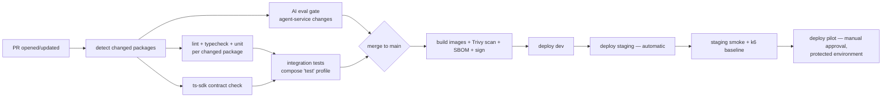

# 10 · DevOps & Infrastructure

Version 1.0 · July 2026 · MedAgent Platform
Status: Draft for review

## Executive summary

This document defines how the platform is built, shipped, observed, and recovered: container standards for every deployable, a one-command local stack seeded with Synthea data, a GitHub Actions pipeline in which the AI evaluation gate blocks merges exactly like failing tests (see 04-ai-agent-platform.md), three IaC-defined environments (dev → staging → pilot per 01-system-architecture.md §6), vault-managed secrets with a rotation schedule (a direct answer to the prototype's plaintext-credential leak, see 12-salvage-migration.md), an OpenTelemetry/Grafana observability stack sized for a two-developer on-call reality, and a backup/DR posture of RPO 24 h / RTO 4 h for the pilot with quarterly restore drills (NFR-5). Database schema discipline is explicit: Alembic is the only mechanism for `app_db`; HAPI alone manages `hapi_db`. Everything here is Phase A scope unless marked Phase B.

Traceability: NFR-3 (availability), NFR-5 (reliability/backups), NFR-9 (observability), NFR-10 (data protection); sprint anchors S1 (spine) and S6 (go-live) in 11-sprint-plan-phase-a.md.

## 1. Containerisation

Every deployable in the monorepo (01 §2) ships as an OCI image built by a multi-stage Dockerfile colocated with the component. Standards, enforced by CI lint (hadolint) and image-policy check:

| Standard | Rule |
|---|---|
| Multi-stage | Build stage (compilers, dev deps) discarded; runtime stage contains app + runtime deps only |
| Base images | Python services: `python:3.12-slim` runtime (distroless evaluated, rejected for Phase A — see ADR DI-1); web: `node:22-alpine` build → standalone Next.js output on `node:22-alpine` runtime; HAPI: official `hapiproject/hapi:v8.10.x` extended with our interceptor JAR (see 03-fhir-data-platform.md) |
| Non-root | Every image declares a numeric `USER` (uid ≥ 10000); compose/IaC set `no-new-privileges`, read-only root FS where the runtime allows, dropped capabilities |
| Determinism | Locked dependencies only (`uv.lock` / `pnpm-lock.yaml`); no `latest` tags anywhere; images tagged `{git-sha}` plus a moving `{env}` tag applied at promotion |
| Provenance | SBOM (syft) generated per image and attached to the GitHub release; images signed (cosign, keyless OIDC) — verification enforced at deploy from staging onward |
| Health | Every service exposes `/healthz` (liveness) and `/readyz` (readiness incl. dependency checks); compose and IaC healthchecks use them |

Images built: `web`, `core-api`, `agent-service`, `notify-service`, `fhir` (HAPI + interceptors), `keycloak` (config-cli baked realm import), `gateway` (Traefik + dynamic config), plus a `seed` job image (Synthea loader, §2.3).

## 2. Local development environment

### 2.1 One-command stack

`docker compose up` from `infra/compose/` brings up the entire platform (01 §2 promise). Service inventory:

| Service | Image | Notes |
|---|---|---|
| `web` | local build, dev target | Next.js dev server, hot reload via bind mount |
| `core-api`, `agent-service`, `notify-service` | local build, dev target | uvicorn `--reload`, bind-mounted source |
| `fhir` | HAPI 8.10.x + interceptors | network-isolated: reachable only from the compose network, never port-published beyond localhost |
| `keycloak` | 26.x + keycloak-config-cli | realm imported from `platform/keycloak/realm/` on boot — realm-as-code, no click-ops (02-identity-access-mpi.md) |
| `postgres` | 16 | three databases: `hapi_db`, `app_db`, `keycloak` (dedicated Keycloak database with its own credentials, per 02 §1); separate credentials per service (NFR-10) |
| `redis` | 7 | pub/sub, queues, rate state |
| `minio` | latest stable | S3-compatible object storage; console on a dev port |
| `mailpit` | latest stable | catches all outbound email (Keycloak flows, notify-service email adapter) |
| `gateway` | Traefik | single entry point `https://localhost` with locally-trusted certs (mkcert); mirrors staging routing so auth flows are realistic |

Face service is external (05-face-recognition-integration.md): compose includes a `face-sim` stub (Phase A dev tool) that emits HMAC-signed webhook events on demand, so the check-in flow is testable without the real service.

### 2.2 Compose profiles

| Profile | Adds | Use |
|---|---|---|
| (default) | core stack above | day-to-day development |
| `observability` | Grafana, Loki, Tempo, Prometheus, otel-collector (§6) | dashboard work, trace debugging |
| `seed` | Synthea seed job (§2.3) | first boot / reset |
| `test` | ephemeral stack on random ports, tmpfs Postgres | CI integration tests (§3.4) and local `make test-integration` |

### 2.3 Synthea seed

`infra/compose/seed/` contains a pinned Synthea release config generating ~1,000 synthetic Sri Lanka-adjusted patients (names/demographics localised via Synthea config). The seed job:

1. Generates (or restores a cached, versioned bundle of) FHIR R4 bundles.
2. Loads via HAPI transaction bundles through the gateway path with a service token — exercising the interceptors, not bypassing them.
3. Registers patients in the MPI (`app_db`), where **PHNs are issued through the real MPI issuance path** (03 §7 / ADR F-8) — the seed exercises the MPI issuance code rather than injecting identifiers post-generation; a deterministic subset carries known PHNs for fixtures, and ~10 “demo patients” are marked with face-consent granted and `ext_face_id` stubs so the `face-sim` flow works out of the box.

Seed data is versioned (`seed/v{n}`); eval golden cases (04 §6) pin the seed version they were graded against.

### 2.4 Never in local dev

No real patient data, no production secrets, no live Anthropic keys with production billing (dev uses a scoped low-limit key from the vault, §5). The prototype's pattern of live credentials in a committed `.env` is banned by policy and by CI secret-scanning (§3.6).

## 3. CI/CD — GitHub Actions

Workflows live in `infra/ci/` (symlinked/referenced from `.github/workflows/`). Monorepo path filters ensure each job runs only when its package changes; a `changes` job (dorny/paths-filter) computes the affected set once per run.

### 3.1 Pipeline overview

### 3.2 Per-package quality jobs

| Package | Jobs |
|---|---|
| `services/*` (Python) | ruff (lint+format), mypy strict, pytest unit (no I/O; DB via fixtures against tmpfs Postgres for model tests) |
| `apps/web`, `packages/ui` | eslint, `tsc --noEmit`, vitest unit, Storybook build, axe accessibility checks (NFR-6, 06-doctor-workspace-frontend.md) |
| `packages/ts-sdk` | **contract-gen check**: regenerate clients from each service's exported OpenAPI schema; `git diff --exit-code` — a service API change without a regenerated, committed SDK fails the build |
| `platform/fhir` | Java interceptor build + unit tests (JUnit); FHIR profile/IG validation against HAPI validator CLI |
| `platform/keycloak` | realm JSON schema validation; config-cli dry-run against a throwaway Keycloak container |
| `docs/` | markdown lint, link check (docs changes never trigger service jobs) |

### 3.3 AI eval gate

Per 04-ai-agent-platform.md §6 and spec §4.4: any change touching `agent-service` prompts, tools, graph topology, model pin, or the DDI dataset runs the golden evaluation set. Hard thresholds (Rx-safety fixtures 100 %, citation faithfulness ≥ 98 %, no regression vs `main` baseline) are enforced as a required status check — **a regression blocks merge with the same standing as a failing unit test**. Results (pass rate, cost, latency percentiles per case class) are posted as a PR comment and pushed to the eval dashboard (§6.3).

### 3.4 Integration tests

The `test` compose profile boots the full stack (tmpfs Postgres, seeded with a small fixed Synthea subset) inside the runner. Suites: gateway auth flows (Keycloak token → service), FHIR interceptor behaviour (authz denial, consent denial, audit emission), face webhook signature/replay handling, check-in → Redis → notify-service SSE end-to-end, agent chat happy path against a recorded-LLM fixture (live-LLM calls belong to the eval gate, not integration tests). Target wall-time ≤ 12 min.

### 3.5 Build, scan, promote

- Images built once per merge commit, pushed to GHCR tagged `{sha}`.
- **Trivy** scans image + filesystem + IaC: CRITICAL/HIGH vulnerabilities fail the build (documented time-boxed exceptions via `.trivyignore` with expiry dates); `pip-audit`/`npm audit` run in the per-package jobs.
- Promotion is retag-and-deploy of the *same* digest: dev (on merge) → staging (automatic, after dev healthchecks pass) → **pilot only via GitHub protected environment with required reviewer approval** and a deploy window agreed with the hospital.
- Deploys are IaC-driven (§4); rollback = re-deploy previous digest (one command, rehearsed in S6).

### 3.6 Repository hygiene

Required checks on `main`: all §3.2 jobs, integration, eval gate (when triggered), secret scanning (gitleaks + GitHub push protection — direct lesson from the prototype leak), Trivy config scan. Branch protection: PR review required, linear history, no force push.

## 4. Environments & IaC

Per 01-system-architecture.md §6:

| Env | Deploy trigger | Shape | Data |
|---|---|---|---|
| dev (local) | `docker compose up` | single node | Synthea only |
| dev (shared, cloud) | merge to `main` | 1× small VM/node, compose or single-node k3s | Synthea only |
| staging | automatic after dev healthy | prod-shaped: gateway, 1× replica per service, managed/HA-configured Postgres, Redis | Synthea + anonymised load-test corpora; UAT, k6, restore drills run here |
| pilot (prod) | manual approval | 2× app replicas, HA Postgres (managed service or Patroni — hosting decision per 01 §6), Redis sentinel, daily encrypted backups | real patients, consented |

IaC in `infra/iac/`: OpenTofu modules per environment (network, compute, managed Postgres/DNS/TLS where cloud-hosted) + Ansible for on-VM composition where the pilot lands on hospital/government hardware. **No environment is hand-built**; drift detection runs weekly (`tofu plan` in CI, diff alerts). Environment-specific values (endpoints, replica counts) live in IaC; secrets never do (§5).

Phase B: national deployment targets government infrastructure per NDHX direction (09-integrations-national.md); the IaC modules are the unit of portability — same containers, new substrate.

## 5. Secrets management

The prototype shipped a live Anthropic API key and Neon database credentials in a committed plaintext `.env` (rotation steps: 12-salvage-migration.md §4). Policy for the platform, effective S1 week 1:

- **No secrets in `.env` files in any repository.** `.env.example` files contain variable names and dummy values only; gitleaks in CI and GitHub push protection enforce.
- **Mechanism (Phase A): SOPS + age.** Encrypted secrets files per environment live in `infra/secrets/{env}.enc.yaml`; age recipient keys are held by the two developers (hardware-backed where possible) plus a CI deploy key stored as a GitHub environment secret scoped to the deploy environment. Deploy tooling decrypts at release time and injects into containers as runtime env/secret mounts — never baked into images, never logged. If the pilot lands on a cloud with a managed secret manager (AWS SM / GCP SM), the SOPS files migrate there per ADR DI-3; the injection interface is identical.
- **Per-service least privilege:** each service has its own DB role/credentials, its own Keycloak client secret, its own Redis ACL user. The Anthropic key is held only by agent-service. HMAC webhook secrets (05 §3) are keyed by `X-MedAgent-Key-Id` to support dual-key rotation.
- **Rotation schedule:**

| Secret | Rotation | Method |
|---|---|---|
| Face-webhook HMAC keys | 90 days (dual-key overlap per 05) | coordinated with face-service team |
| Keycloak client secrets | 90 days | config-cli re-apply |
| DB credentials | 90 days (immediately on any suspicion) | role rotation, rolling restart |
| Anthropic API key | 90 days | provider console + vault update |
| TLS | automated (ACME/Traefik) | continuous |
| age/KMS root keys | yearly, and on any team change | re-encrypt SOPS files |

The rotation schedule is owned by 08 §5.3 (the authoritative table); this table restates it operationally and must not diverge.

- Break-glass secret access (e.g. single developer unavailable — bus-factor watch-out, 11 §8) is documented in a runbook; every manual secret access is logged in the ops journal.

## 6. Observability

NFR-9. Stack: **OpenTelemetry SDK in all services → otel-collector → Tempo (traces), Prometheus (metrics), Loki (logs, via promtail/otel), Grafana (dashboards + alerting)**. Runs as the `observability` compose profile in dev and as a standing deployment in staging/pilot.

### 6.1 Instrumentation rules

- Every inbound request carries/creates a W3C `traceparent`; the gateway injects it; Python services use OTel auto-instrumentation (FastAPI, httpx, SQLAlchemy, redis) plus manual spans around agent graph nodes; HAPI's built-in OTel support is enabled so FHIR query spans join the same trace. A doctor's chat question is one trace from browser → gateway → agent-service → FHIR → back.
- Logs are structured JSON with `trace_id` correlation. **No PHI in logs or span attributes** — patient references are logged as opaque resource IDs only; a CI grep-lint plus code review checklist enforces (08-security-privacy-compliance.md).
- agent-service emits per-run metrics: model, token counts, cost (computed from pinned pricing table), latency, tool-error count, guardrail triggers, interrupt outcomes.

### 6.2 Dashboards (Grafana, provisioned as code in `infra/observability/`)

| Dashboard | Content |
|---|---|
| Golden signals — per service | RPS, error rate, latency p50/p95/p99, saturation (CPU/mem/conn pools) for web, core-api, agent-service, notify-service, gateway |
| HAPI FHIR performance | query latency by interaction type, slow-query log surfacing, connection pool, DB size/partition growth, interceptor deny counts (authz/consent) |
| Agent operations | end-to-end chat latency, LLM cost/day and per-encounter, eval-pass-rate trend (CI + online sampled, per 04 §6), refusal rate, citation coverage, proposal sign/edit/reject rates |
| SSE / event health | active SSE connections, reconnect rate, Redis pub/sub lag, webhook events received/verified/rejected (signature, replay, unknown `ext_face_id` per 05 §3) |
| Check-in funnel | webhook → queue → doctor-open timings vs the NFR-1 <3 s budget (platform share <300 ms per 01 §4.1) |
| Backups & jobs | last backup age/size/verification status, seed/retention job outcomes |

### 6.3 Alerting & on-call-lite

Alert delivery: Grafana Alerting → ntfy/Telegram + email; escalation is human-simple because the team is two developers. **On-call-lite model:** business-hours response commitment for the pilot (hospital operating hours + 1 h), one primary/one secondary rotating weekly, page only on the *page-severity* set; everything else is a next-morning ticket. This is stated honestly in the pilot service agreement rather than pretending 24×7 (NFR-3's 99.9 % is measured monthly on clinical services with maintenance windows agreed with the site).

| Severity | Examples | Response |
|---|---|---|
| Page | gateway down, FHIR unreachable, error rate > 5 % for 5 min, backup failed, audit-write failures, webhook signature-failure spike (possible attack), disk > 85 % | ack ≤ 15 min (business hours) |
| Ticket | p95 latency > NFR budget for 30 min, eval-pass online proxy drops, cert expiry < 14 d, replica down but redundancy holding, cost/day anomaly | next working morning |
| Info | deploys, seed runs, restore-drill results | log only |

Runbook links are embedded in every alert (§7.4).

## 7. Backup & disaster recovery

NFR-5; targets are Phase A pilot commitments, tightened in Phase B.

### 7.1 Targets

| Metric | Pilot target | Rationale |
|---|---|---|
| RPO | ≤ 24 h | nightly backups; WAL archiving (see below) usually gives minutes, but 24 h is the *committed* floor |
| RTO | ≤ 4 h | rehearsed restore of both DBs + redeploy from IaC on cold infrastructure |

Degradation during an outage follows the "care is never blocked" invariant (00 §6): manual check-in and paper fallback procedures are part of the pilot training pack (11 S6).

### 7.2 What is backed up

| Data | Method | Frequency | Encryption |
|---|---|---|---|
| `hapi_db` (clinical truth) | pgBackRest full nightly + WAL archiving; retention 30 d + monthly for retention policy horizon (08) | nightly / continuous | age/AES-256 at rest, off-site copy (second region or separate physical site) |
| `app_db` (MPI, queue, checkpointer) | same pipeline, separate stanza | nightly / continuous | same |
| Object storage (patient files) | bucket **versioning + object lock** (governance mode) + nightly sync to secondary bucket | continuous | SSE + encrypted replica |
| Keycloak realm | realm-as-code in git (source of truth); `keycloak` DB backed up in the same pgBackRest pipeline (separate stanza) | per change | git + DB pipeline |
| Grafana/observability config | provisioned as code in git | per change | git |
| SOPS secrets | git (already encrypted) + offline copy of age keys in sealed escrow | per change | age |

Redis is treated as reconstructable (queues rehydrate from `app_db`; caches rebuild) — no backup, documented explicitly.

### 7.3 Restore drills

**Quarterly** (first one inside S6 before go-live, per 11): restore both databases to a scratch environment from the latest nightly, boot the stack from IaC, run the integration smoke suite, verify a known patient's record and the audit chain integrity (08 hash-chain check), record elapsed time vs RTO. Drill results are logged in `docs/ops/drills/` and surfaced on the backups dashboard. A failed or missed drill is a page-severity ticket for the following week.

### 7.4 Runbooks (`docs/ops/runbooks/`, written by whoever builds the component — bus-factor rule)

Minimum set, complete by end of S6: full restore (DB + stack); single-service rollback; Postgres failover; Redis loss; Keycloak realm restore; face-service outage (manual check-in mode); LLM provider outage (agent degradation per 04 §7); SSE storm/reconnect flood; webhook key compromise (rotate via dual-key); certificate expiry; secret rotation procedures (§5); pilot deploy + rollback; audit-chain verification; incident response entry point (08 owns the process).

## 8. Performance & load testing

k6 scenarios in `infra/perf/`, run against staging: a baseline profile on every staging deploy (smoke thresholds) and the full suite weekly + before pilot go-live. Thresholds encode the NFRs; breach fails the run.

| Scenario | Shape | Asserts |
|---|---|---|
| Check-in burst | 30 signed webhook events in 60 s (clinic opening rush), doctors' SSE connected | platform path (webhook→SSE) p95 < 300 ms (NFR-1 share); zero dropped events; queue consistency |
| Chat concurrency | 20 concurrent doctor chat sessions, mixed read questions (recorded-LLM mode for load runs; a small live-LLM sample for end-to-end latency truth) | first-token p95 < 2 s; stream completion without stalls; agent-service memory stable |
| Record load | 50 VUs opening patient summaries (FHIR query set per 01 §5 NFR-2) | full summary p95 < 2 s (NFR-2); HAPI pool no exhaustion |
| Portal skim | 100 VUs patient PWA browsing records/appointments | p95 < 1.5 s page data; error rate < 0.1 % |
| Soak | 2 h mixed profile at expected pilot load ×2 | no memory growth, no connection leaks, SSE reconnect behaviour sane |

Results are exported to Prometheus and trended on the HAPI/golden-signals dashboards; regressions vs the previous run are ticket-severity.

## 9. Database migration discipline

The prototype ran `Base.metadata.create_all()` at startup *alongside* a vestigial Alembic setup — two competing schema mechanisms and no reliable migration history (12-salvage-migration.md). The platform rule set:

1. **`app_db`: Alembic is the only schema mechanism.** `create_all` is forbidden in application code (CI grep-guard). Every schema change is an Alembic revision in the PR; `alembic upgrade head` runs as a deploy step (migration job before service rollout), and `alembic check` in CI fails if models drift from migrations. Downgrade paths required for the last 5 revisions.
2. **`hapi_db`: HAPI FHIR owns it entirely.** No application, migration tool, or human writes to `hapi_db` DDL; HAPI's own schema migration runs on version upgrades, which are performed as deliberate, staged events (staging first, backup taken, release notes reviewed) — never auto-bumped by a base-image `latest`.
3. **HAPI version upgrades** are a named runbook: pin bump PR → staging deploy → HAPI migration completes → integration + perf smoke → pilot window.
4. LangGraph checkpointer tables (agent-service, in `app_db`) are created via Alembic revisions vendored from the library's DDL, keeping rule 1 absolute.
5. Data migrations (backfills) are separate, idempotent, resumable scripts referenced by the Alembic revision that requires them — never inline DDL+DML mixes.

## 10. Decisions

| ADR | Decision | Rationale | Rejected alternatives |
|---|---|---|---|
| DI-1 | `python:3.12-slim` (non-root, hardened) over distroless for Python services in Phase A | Distroless Python complicates native wheels and debugging for marginal gain at pilot scale; hardening (non-root, RO fs, caps dropped, Trivy-gated) captures most of the benefit; revisit for Phase B national accreditation | Distroless day 1; full Debian images |
| DI-2 | Docker Compose (dev/shared-dev) + IaC-deployed compose/k3s single-tenant for staging/pilot, not Kubernetes-first | 2-dev team, one hospital; k8s operational cost outweighs benefit at this footprint; containers + IaC keep the k8s door open for Phase B national scale | k8s from S1; PaaS (sovereignty/hosting uncertainty) |
| DI-3 | SOPS + age as Phase A vault, migrating to cloud SM if pilot hosting provides one | Zero-infrastructure, git-audited, offline-capable (hospital on-prem possibility); interface (env injection at deploy) identical either way | HashiCorp Vault server (heavy to run well for 2 devs); GitHub secrets only (no env files on hosts, no rotation story) |
| DI-4 | GitHub Actions with path-filtered monorepo jobs | Already the repo host; environments/approvals/OIDC image signing built in; path filters keep 2-dev feedback loops fast | Self-hosted Jenkins/GitLab; Nx/Bazel build graph (overkill Phase A) |
| DI-5 | Grafana + Loki + Tempo + Prometheus (self-hosted) for observability | One coherent OSS stack, runs in compose, no per-GB SaaS costs on health data, data stays in-country | Datadog/New Relic (cost + data residency); ELK (heavier ops) |
| DI-6 | pgBackRest + WAL archiving for both DBs; committed RPO 24 h / RTO 4 h for pilot | Honest, rehearsable targets for a 2-dev pilot; WAL archiving in practice gives near-continuous protection above the committed floor | Streaming replica-only "backups" (not a backup); commercial backup suites |
| DI-7 | k6 for load testing | Scriptable JS scenarios in-repo, thresholds-as-code, Prometheus output; team familiarity | JMeter (heavy), Locust (splits the team's Python across another concern), Gatling |
| DI-8 | Alembic-only for `app_db`; HAPI-only for `hapi_db`; CI guards for both | Eliminates the prototype's dual-mechanism flaw by construction; schema history becomes reviewable | `create_all` in dev "for speed"; manual DDL for HAPI tuning (indexes go through HAPI-sanctioned config) |

## 11. Phase B deltas (flagged, not designed here)

Kubernetes (or NDHX-mandated substrate) via the same images/IaC modules; Elasticsearch offload and Postgres partitioning for HAPI at national volume (01 §5 NFR-4); multi-site active DR with RPO ≤ 15 min / RTO ≤ 1 h; 24×7 NOC handover replacing on-call-lite; certified hosting per government security assessment (08).
