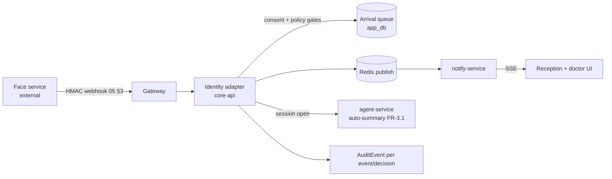
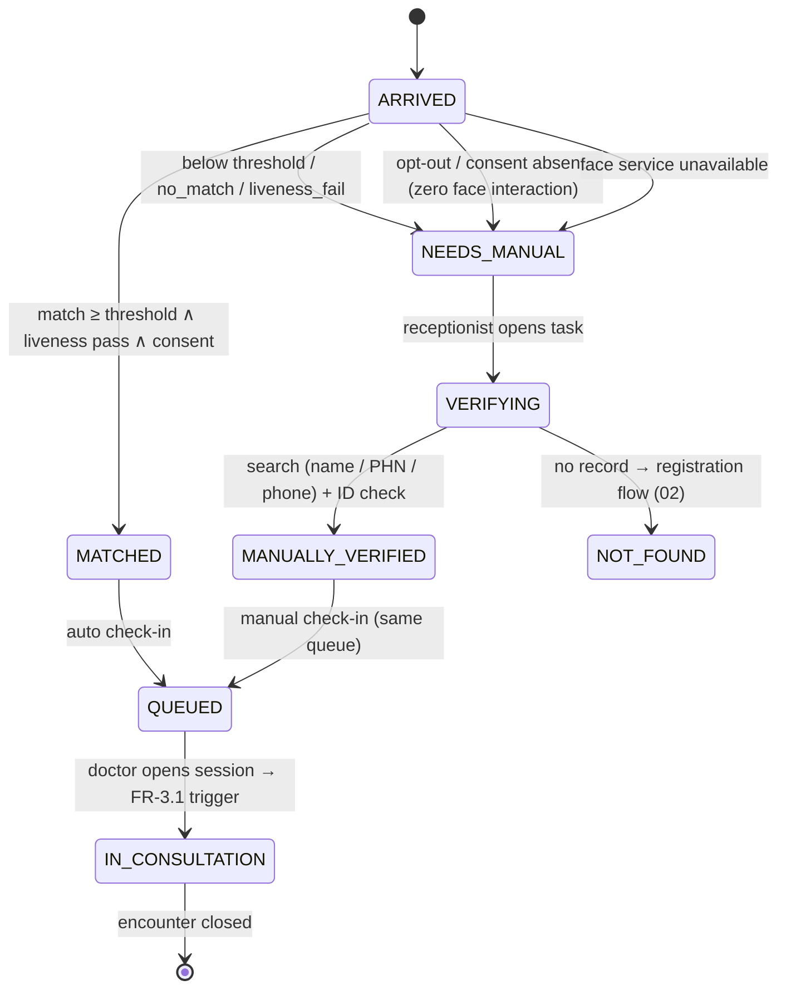

# Agent · Identity (Check-in Adapter)

Version 1.0 · July 2026 · MedAgent Platform
Status: Draft for review
Phase: **A** (pilot-critical)

## Executive summary

The "identity agent" of spec §3.2 is **not an LLM agent** (ADR AG-5 in [04-ai-agent-platform.md](../04-ai-agent-platform.md)): face capture, liveness and 1:N matching live in the existing external face service, and the platform side is pure routing logic with nothing to reason about. It is implemented as a deterministic **check-in adapter** in core-api that consumes hardened face-service events, applies the consent and threshold policy gates defined in [05-face-recognition-integration.md](../05-face-recognition-integration.md), and drives a manual-fallback state machine that guarantees care is never blocked. On confirmed identity it loads the record into the doctor workspace and triggers the summary agent's auto-summary (FR-3.1). Form: adapter + state machine (no model calls anywhere in the check-in loop — latency, risk, no benefit).

## 1. Requirement traceability

| FR | Requirement | Adapter's part |
|---|---|---|
| FR-1.1–1.4 | Capture, enrolment, 1:N match, liveness | **Face service (external)** — adapter only consumes results (05 §1) |
| FR-1.5 | Below-threshold → manual verification | Threshold policy gate + manual-verification task (state machine §5) |
| FR-1.6 | Opt-out → manual identity | Authoritative platform-side consent gate; suppression list push to the service |
| FR-1.7 | Confirmed identity → record loads automatically | Queue entry + Redis publish → notify-service → workspace SSE |
| FR-1.8 | Edge biometric processing | Face service concern; adapter is transport-agnostic |
| FR-2.1 | Live queue of checked-in patients | Adapter writes arrival-queue entries in order |
| FR-2.4 | Manual search fallback | Reception search reaches the same queue path (05 §5) |
| FR-3.1 | Auto-summary on identification | Session-open trigger to agent-service orchestrator |
| FR-6.2 | Configurable confidence threshold | Per-facility policy config, admin-managed |
| NFR-1 | < 3 s capture-to-record | Platform path engineered < 300 ms (01 §4.1) |

## 2. Position in the system (not in the chat graph)

The adapter sits **outside** the LangGraph conversation graph. It is the bridge between the face-service webhook and two consumers:

Its "typed result" to the rest of the platform is the **queue entry + check-in event** (`FaceCheckinEvent` row, 05 §7), not a graph message. The orchestrator receives only a session-open trigger `{patient, encounter, clinician}` — never confidence scores or biometric metadata.

## 3. Tool belt (adapter capabilities — core-api internal APIs)

| Capability | Purpose | FHIR resources | R/W | Citations |
|---|---|---|---|---|
| `resolve_ext_face_id` | `ext_face_id` → MPI → PHN | Patient (lookup via MPI) | R | n/a (no LLM output) |
| `check_face_consent` | Authoritative consent gate | Consent | R | n/a |
| `enqueue_checkin` | Arrival-queue write + event log | — (`app_db`) | W | n/a |
| `create_manual_task` | Manual-verification task for reception | — (`app_db`) | W | n/a |
| `publish_event` | Redis publish → notify-service fan-out | — | W | n/a |
| `emit_audit` | AuditEvent per event and per decision | AuditEvent | W | n/a |
| `push_suppression` | Opt-out list to face service (05 §4) | — | W (external) | n/a |

No read tool here returns `{content, sources[]}` because no LLM consumes them; audit rather than citation is the traceability mechanism on this path.

## 4. Core logic: event processing pipeline

Ordered gates, exactly as bound in 05 §3 (the adapter implements steps 4–7; gateway/core-api middleware owns 1–3):

1. **Signature + freshness + idempotency + rate limit** — before the adapter runs.
2. **Resolution**: `ext_face_id` → PHN. Unknown ID → logged, alert on threshold (desync or probe).
3. **Consent gate (authoritative)**: no active face-recognition `Consent` → event dropped, `AuditEvent(consent_denied)`, nothing shown to any user, patient pushed to suppression list. Fixes the prototype's modelled-but-never-enforced `face_consent`.
4. **Policy gate** (FR-1.5, FR-6.2): requires `liveness == pass` (Phase A policy; `not_performed` tolerated only for stations flagged legacy, always surfaced in UI) **and** `confidence ≥ threshold(facility)`. Pass → auto check-in. Fail → manual-verification task; never auto-load.
5. **Effect**: queue entry, `FaceCheckinEvent` log, AuditEvent, Redis publish. If the doctor already has the patient's session open: in-chat event card; otherwise queue update + toast (05 §5).
6. **Session open** (on doctor accepting the patient): adapter fires the FR-3.1 auto-summary trigger to agent-service.

`no_match` and `liveness_fail` events drive the reception "assist" view — someone is at the kiosk needing help.

## 5. Manual-fallback state machine

Care is never blocked (spec §4.4 invariant). Every path — matched, below-threshold, no-match, liveness-fail, opt-out, service-down — converges on the same queue:

Rules: every transition emits an AuditEvent with actor (system or receptionist) and method (`face | manual`); `MANUALLY_VERIFIED` records which identifier was used; queue ordering is arrival order regardless of method (FR-2.1); a `NEEDS_MANUAL` task older than a configurable staleness window escalates on the reception view.

## 6. Agent-specific guardrails (beyond 04 §5 and 05)

- **No biometric data crosses the boundary** — the adapter handles `ext_face_id`, confidence, and liveness result only; images/embeddings/templates never arrive (05 §7). Confidence is shown to staff as bands (high/medium/low), never raw scores.
- **Consent precedes everything** — the consent gate runs before any UI effect; a revocation mid-day takes effect on the next event via cache invalidation (01 §4.3).
- **No auto-load below threshold** — the policy gate cannot be overridden per event by reception; only the admin threshold config changes behaviour (FR-6.2), and changes are audited.
- **Session-open trigger carries no face metadata** into the agent graph — the LLM never sees biometric context.
- **Forgery containment** — even a validly-signed but anomalous event stream (burst per station, unknown IDs) trips rate alerts (05 §3).

## 7. Failure modes & degradation

| Failure | Behaviour |
|---|---|
| Face service down | Kiosk shows manual check-in guidance; reception uses search; `GET /health` drives the integration dashboard (10); zero clinical impact beyond convenience |
| Webhook signature/clock failures | Events rejected at gateway; alert on rejection rate; manual flow unaffected |
| MPI resolution fails (unknown `ext_face_id`) | Logged + alert threshold; patient handled manually; desync reconciliation job |
| Redis / notify-service down | Events buffered in Redis streams with TTL where possible; UI polls the queue as fallback (04 §7) |
| agent-service down at session open | Record loads normally; auto-summary silently absent with a UI banner — workspace never depends on AI |

## 8. Eval / test cases contributed

The adapter is deterministic, so these are integration fixtures rather than LLM golden-set cases (they run in CI as contract tests):

| # | Input | Expected |
|---|---|---|
| I-1 | Valid signed match, consent active, confidence ≥ threshold, liveness pass | Queued; SSE within 300 ms; AuditEvent(face_checkin) |
| I-2 | Same event replayed (same `event_id`) | 202, no second queue entry |
| I-3 | Match for patient with revoked consent | Dropped; AuditEvent(consent_denied); suppression push; nothing in any UI |
| I-4 | Confidence below facility threshold | Manual-verification task; never auto-load |
| I-5 | `liveness: fail` | No check-in; reception assist view entry |
| I-6 | Unsigned / stale-timestamp webhook | 401 at gateway; alert counter |
| I-7 | Face service unreachable during clinic hours | Manual path fully operational end-to-end |

## 9. Phase A vs Phase B

| | Phase A | Phase B |
|---|---|---|
| Liveness policy | SDK-level passive liveness; result required per event | ISO/IEC 30107-3 certified PAD (Level 2 target), injection-attack detection (05 §6) |
| Identity sources | Face + manual (PHN/name/phone) | + SLUDI biometric verification as a complementary path via the MPI adapter (02); no coupling to this contract |
| Stations | Pilot hospital kiosk + reception | Multi-facility station inventory, per-station threshold calibration (05 §8 item 5) |
| Template protection (imposed on service) | Encrypted templates, KMS isolation | ISO/IEC 24745 conformance — cancelable transforms or HE matching |

## 10. Open questions

1. Staleness/escalation window for unclaimed `NEEDS_MANUAL` tasks — clinic-operations input needed during S2 UAT.
2. Whether kiosk should display queue position after check-in (privacy trade-off in shared waiting areas) — pilot-site policy decision.
