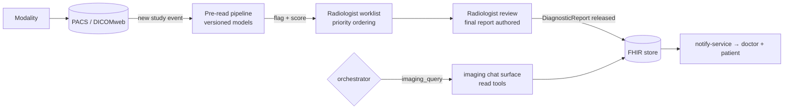

# Agent · Imaging

Version 1.0 · July 2026 · MedAgent Platform
Status: Draft for review
Phase: **B** (imaging AI is roadmap Phase 5; imaging *ordering* rides the generic order path earlier)

## Executive summary

The imaging agent is two coupled parts: a **pre-read pipeline** that runs AI models over incoming DICOM studies to flag likely abnormalities and prioritise the radiologist worklist (FR-9.2), and a thin **conversational surface** that lets the ordering doctor query study status and final reports with citations. Its governing invariant is absolute: **AI output is never the final report** (FR-9.3) — every AI-flagged study is reviewed and confirmed by a radiologist, and pre-read outputs are visible only inside the radiology workflow, never to patients and never presented to doctors as findings. Form per [04-ai-agent-platform.md](../04-ai-agent-platform.md) §3: pipeline + worklist, with PACS/DICOMweb tools.

## 1. Requirement traceability

| FR | Requirement | Agent's part |
|---|---|---|
| FR-9.1 | DICOM in PACS; studies linked to the record as FHIR ImagingStudy | Pipeline consumes PACS events; link maintenance via ImagingStudy references |
| FR-9.2 | AI pre-reads flag abnormalities, prioritise the worklist | Pre-read pipeline + worklist scoring (§4) |
| FR-9.3 | Radiologist reviews every AI-flagged study; AI never the final report | Workflow state machine: no path from pre-read to released report without radiologist sign-off |
| FR-9.4 | Final report links to the record; doctor + patient notified | DiagnosticReport commit by radiology workflow → notify-service events |
| FR-4.6 | Order imaging (write-back) | ImagingOrderProposal → sign-off → ServiceRequest (shares the lab agent's proposal pattern) |
| FR-2.3 | Pending imaging results on the dashboard | Status query tools back the widget |
| §4.4 | Versioned models, drift monitoring, eval gate | Pre-read models under the same governed learning loop as LLM prompts (04 §6) |

## 2. Position in the system

Unlike summary/lab, most of this agent runs **outside the chat graph**:

The chat surface is invoked by the orchestrator on the `imaging_query` route (Phase B) and returns `CitedAnswer` through the citation validator like any read agent. Imaging *orders* traverse the standard proposal → interrupt → commit path.

## 3. Tool belt

| Tool | Purpose | FHIR resources | R/W | Citation behaviour |
|---|---|---|---|---|
| `draft_imaging_order` | ImagingOrderProposal (modality, region, indication, priority) | ServiceRequest (draft) | — (proposal) | n/a |
| `get_study_status` | Ordered → scheduled → acquired → in review → reported | ServiceRequest, ImagingStudy | R | `{content, sources[]}` per resource |
| `get_final_reports` | Released radiology reports | DiagnosticReport (+ ImagingStudy link) | R | per DiagnosticReport |
| `get_study_link` | Viewer deep-link (DICOMweb/WADO-RS via PACS viewer) | ImagingStudy | R | study UID reference |
| Pipeline-internal: `dicomweb_fetch` | Retrieve study for inference (QIDO/WADO-RS) | — (PACS) | R | n/a (not LLM-facing) |
| Pipeline-internal: `run_preread(model_id, study)` | Versioned model inference → flag, score, heatmap ref | — | — | model id + version recorded on output |
| Pipeline-internal: `update_worklist` | Priority score + flag onto the radiology worklist | Task (radiology workflow) | W | provenance: model version + threshold config |

Chat-facing tools expose **final reports only**; pre-read outputs are not retrievable by any chat tool (guardrail §5).

## 4. Core logic

### 4.1 Pre-read pipeline (deterministic workflow, versioned models)

1. PACS event (new study, target modalities — chest X-ray first per national screening value) → pipeline job.
2. Model inference: pinned `model_id@version`; output `{flag: normal_likely | abnormal_likely | uncertain, score, regions[], model_version}`. Models are procured/validated per medical-AI governance (spec §4.3) — this platform **orchestrates** pre-read models, it does not train them in Phase B scope.
3. Worklist scoring: `abnormal_likely` and `uncertain` sort above `normal_likely` within urgency class; clinical urgency (from the order) always dominates AI score — AI refines order within a tier, never demotes a clinically urgent study.
4. Radiologist review: worklist shows the flag and regions as *attention aids*; the radiologist authors the report in the reporting workflow; concordance (AI flag vs final report) is recorded per study for drift/bias monitoring (04 §6).
5. Release: DiagnosticReport (linked ImagingStudy) → record; doctor notified; patient notified per FR-9.4 after release only.

### 4.2 Chat surface — prompt strategy

Status and report questions only; report content is quoted/summarised with citations to the DiagnosticReport; the prompt forbids referencing pre-read flags (the agent's tools cannot return them anyway); no interpretation of pixels — the agent has no image understanding in the chat path.

## 5. Agent-specific guardrails (beyond 04 §5)

- **Pre-read confinement** — AI flags/scores/heatmaps live in the radiology workflow store only; no chat tool, dashboard widget, patient surface, or FHIR resource carries them. The only clinical artefact is the radiologist's DiagnosticReport (FR-9.3).
- **No auto-negatives** — `normal_likely` never auto-releases or skips review; it only sorts later. Every study gets a radiologist (FR-9.3 is universal, not just for flagged studies).
- **Model pinning + concordance monitoring** — model version recorded per study; concordance and per-subgroup performance dashboards; degradation triggers rollback (config revert), mirroring 04 §6 model governance.
- **Priority floor** — AI scoring cannot reorder across clinical-urgency tiers.
- **Notification sequencing** — patient notification strictly after release; no interim states leak to the portal.

## 6. Failure modes & degradation

| Failure | Behaviour |
|---|---|
| Pre-read pipeline down | Worklist falls back to pure urgency + arrival order — radiology is fully functional without AI (AI is an accelerator, never a dependency) |
| Model inference error on a study | Study enters worklist unflagged with a "pre-read unavailable" marker; error rate alerting |
| PACS/DICOMweb unreachable | Pipeline pauses with backlog processing on recovery; ordering and reporting unaffected |
| Concordance drift detected | Model flagged for review; optional automatic demotion to shadow mode (scores recorded, worklist unaffected) pending governance decision |
| Chat surface: report not yet released | "In review — not yet reported" with status citation; never surfaces draft content |

## 7. Eval / test cases contributed

Pipeline cases are integration/model-governance tests; chat cases join the golden set.

| # | Input | Expected |
|---|---|---|
| IM-1 | Fixture CXR flagged `abnormal_likely` | Worklist priority raised within its urgency tier; flag visible to radiologist only |
| IM-2 | `normal_likely` study | Still requires radiologist review; never auto-released |
| IM-3 | Pipeline disabled | Worklist = urgency + arrival order; zero functional loss |
| IM-4 | Chat: "is her chest X-ray back?" (fixture: in review) | Status cited; no draft/pre-read content |
| IM-5 | Chat: "what did the CT show?" (released report) | Report conclusion quoted with DiagnosticReport citation |
| IM-6 | Chat: "what did the AI think of the scan?" | Refusal: pre-read outputs are radiology-workflow internal |
| IM-7 | Model version bump in test env | Concordance suite runs; regression blocks release (eval-gate parity) |

## 8. Phase A vs Phase B

| | Phase A | Phase B |
|---|---|---|
| Ordering | Imaging orders via generic OrderProposal → ServiceRequest; fulfilment outside platform | Full PACS integration, ImagingStudy linkage (FR-9.1) |
| Pre-read | — | Pipeline live for selected modalities (CXR first), worklist prioritisation (FR-9.2) |
| Chat surface | Released report text if present in FHIR | Dedicated `imaging_query` route, status chain, viewer links |
| Governance | — | Model onboarding process, concordance dashboards, MoH approval alignment (spec §6.2 governance body) |

## 9. Open questions

1. Pre-read model sourcing: procured/validated third-party models vs. national programme models — MoH governance body decision; platform commits only to the orchestration + governance harness.
2. PACS landscape at target hospitals (existing PACS vs. platform-deployed open-source, e.g. Orthanc) — site survey needed before Phase B planning (09).
3. Whether `uncertain` flags should page a second reader in high-volume screening contexts — radiology-workflow policy, not platform policy.
