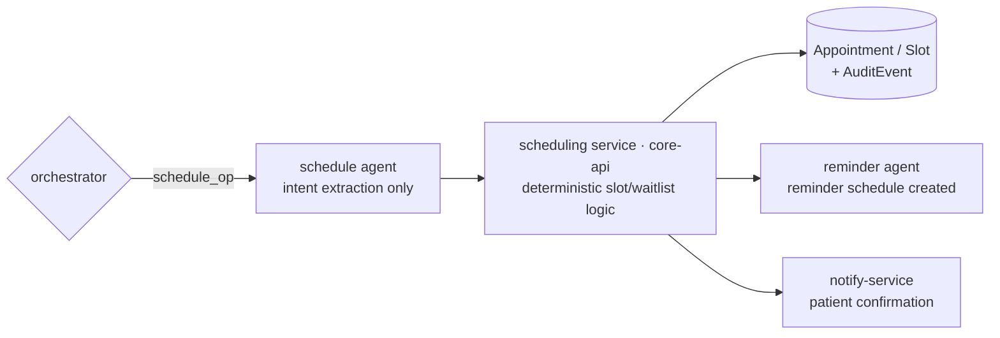

# Agent · Schedule

Version 1.0 · July 2026 · MedAgent Platform
Status: Draft for review
Phase: **A (v1: follow-up booking + slot management for the pilot) · B (waitlists, auto-scheduling, national wait-time views)**

## Executive summary

The schedule agent is the conversational surface over the scheduling service (core-api): in Phase A it books follow-ups from the doctor's chat (FR-4.7), manages pilot-clinic slots, and backs the patient portal's booking flow (FR-5.5); appointment reminders are handed off to the reminder agent (FR-11.4 sending, [08-reminder.md](08-reminder.md)). Phase B adds waitlists with urgency ordering, capacity-based auto-scheduling, and national wait-time views for planners (FR-11.1–11.3). Form per [04-ai-agent-platform.md](../04-ai-agent-platform.md) §3: **tool node** — scheduling decisions are deterministic service logic; the LLM only extracts intent and presents options.

## 1. Requirement traceability

| FR | Requirement | Phase | Agent's part |
|---|---|---|---|
| FR-4.7 | Schedule a follow-up appointment (from chat) | A | `schedule_op` route → slot search → confirm-and-book |
| FR-5.5 | Patient books / reschedules / cancels | A | Same scheduling-service APIs; portal UI is structured (no LLM needed), agent optional assist |
| FR-11.4 | Appointment reminders; no-show tracking + auto-rebooking rules | A (reminders) / B (auto-rebooking) | Creates the reminder schedule on booking → reminder agent sends; no-show rules Phase B |
| FR-11.1 | Clinic/procedure waitlists per institution with urgency ordering | B | Waitlist tools + deterministic ordering policy |
| FR-11.2 | Auto-schedule from waitlists by capacity + urgency; patients notified | B | Scheduled matching job (deterministic), notifications via notify-service |
| FR-11.3 | National wait-time views for planners | B | Aggregation feed to analytics (14.x dashboards); agent exposes no cross-patient data in chat |
| FR-2.3 | Today's appointments + follow-ups due on the dashboard | A | Same read APIs back the widget |

## 2. Position in the graph

Invoked by the orchestrator on the `schedule_op` route. Booking is a state change but **not a clinical record write**, so it uses a lighter gate than the FR-4.8 interrupt: a **confirm step** rendered as a typed option card (slots), committed on the clinician's (or patient's) explicit selection. The Appointment resource commit still flows through core-api with an AuditEvent. Returns `ScheduleResult {action, appointment_ref?, slots[]?, message}` to the orchestrator.

## 3. Tool belt

| Tool | Purpose | FHIR resources | R/W | Citation behaviour |
|---|---|---|---|---|
| `find_slots` | Free slots by clinician/clinic/date window | Slot, Schedule | R | `{content, sources[]}` (slot refs) |
| `book_appointment` | Commit a selected slot (post-confirm) | Appointment | W | audit + confirmation ref |
| `reschedule_appointment` | Move existing booking | Appointment | W | audit trail retains history |
| `cancel_appointment` | Cancel with reason | Appointment | W | audited |
| `get_appointments` | Patient's upcoming/past appointments | Appointment | R | per Appointment |
| `create_followup` | Follow-up intent tied to the encounter (drives FR-2.3 "follow-ups due") | Appointment (proposed) / ServiceRequest | W | audited |
| Phase B: `join_waitlist` / `get_waitlist_position` | Waitlist entry + status | Appointment (waitlisted) / List | W / R | audited / cited |
| Phase B: `auto_match` (job, not chat tool) | Capacity × urgency matching | Appointment, Slot | W | job log + audit per booking |

All chat-facing tools are patient-scoped per request (04 §2.2). `auto_match` and wait-time aggregation run as service jobs outside the chat graph.

## 4. Core logic

### 4.1 LLM part (thin — extraction and presentation only)
Extracts `{operation, timeframe, clinician/clinic constraint}` from utterances like "book her a review in two weeks"; presents returned slots as an option card; confirms the selection. Prompt clauses: never invent slots; never state a booking as done before the service confirms; ambiguous timeframes → one clarify question. No scheduling *decision* is model-made.

### 4.2 Deterministic service logic (core-api)
- **Slot search**: clinic calendars → Slot resources; follow-up default window = clinician's own clinic sessions.
- **Booking**: transactional slot claim (no double-booking by construction), Appointment committed, AuditEvent, patient confirmation via notify-service, reminder schedule created (T-72h and T-24h defaults, channel per preference) and handed to the reminder agent.
- **Phase B waitlist ordering**: strict comparator — urgency class, then clinical priority score (referral urgency, flagged conditions), then wait time. Deterministic and explainable; ordering rationale stored per entry (planner-auditable).
- **Phase B auto-scheduling**: nightly + on-capacity-change matching of waitlist heads to released capacity; offers sent with expiry (accept/decline via portal/SMS); declines/no-responses return to the list under the same comparator; auto-rebooking after no-show per configured rules (FR-11.4).
- **Phase B national wait-time views**: per-institution aggregates (median/p90 wait per clinic type) exported to the analytics service (FR-14.4 dashboards); read-only for planners; contains no patient-level data.

## 5. Agent-specific guardrails (beyond 04 §5)

- **No LLM scheduling decisions** — slot selection is human; waitlist ordering and auto-matching are deterministic policy code (same principle as ADR AG-2).
- **Explicit confirm before any booking write** — the option card's selection is the consent artefact; utterance alone never books.
- **Urgency ordering is not model-influenced** — chat cannot alter waitlist position; urgency escalation is a clinician action through its own audited flow.
- **Cross-patient blindness in chat** — the agent sees this patient's bookings and anonymous free slots only; queue/waitlist contents of other patients are never tool-returnable.
- **Planner views are aggregate-only** (FR-11.3) — national wait-time data carries no identifiers; access is role-gated to planner dashboards, not chat.

## 6. Failure modes & degradation

| Failure | Behaviour |
|---|---|
| Scheduling service down | Chat reports unavailability; reception desk flow (structured UI on core-api or manual) is authoritative fallback — booking never LLM-cached |
| Slot claimed concurrently | Transactional claim fails cleanly → next options presented ("that slot has just gone") |
| Reminder handoff fails | Booking still committed; reminder backfill job re-scans Appointments without reminder schedules (self-healing, [08-reminder.md](08-reminder.md) §4) |
| notify-service down at confirmation | Booking committed; confirmation resent via Redis-buffered redelivery |
| Phase B: auto-match job failure | Waitlist static until next run; alert; no partial offers left dangling (offers transactional with expiry) |

## 7. Eval cases contributed to the golden set

| # | Input | Expected |
|---|---|---|
| SC-1 | "book a follow-up in 2 weeks" | `find_slots` around +14 d in the clinician's clinic; option card; booking only after selection |
| SC-2 | "move her Friday appointment to next week" | Correct Appointment identified (cited); reschedule confirmed before write |
| SC-3 | "cancel the appointment" (patient has 2 upcoming) | Clarify which — never guess |
| SC-4 | "book her before Dr X's other patients" | Refusal: queue/priority manipulation is not a chat operation |
| SC-5 | Booking confirmed | Appointment committed + AuditEvent + reminder schedule exists (integration assertion) |
| SC-6 | "when is her next appointment?" | Cited Appointment answer |
| SC-7 (B) | Waitlist fixture: urgent case added behind routine cases | Comparator places it first; ordering rationale recorded (service test) |
| SC-8 (B) | Capacity released; auto-match run | Offer to list head with expiry; decline returns entry under same comparator (service test) |

## 8. Phase A vs Phase B

| | Phase A (pilot v1) | Phase B (national) |
|---|---|---|
| Booking | Follow-ups from chat (FR-4.7); portal book/reschedule/cancel (FR-5.5); basic slot mgmt for pilot clinics | Multi-institution booking; referral-driven scheduling with the referral agent (FR-10.3) |
| Reminders | Handoff to reminder agent on booking (FR-11.4 send) | + no-show tracking with auto-rebooking rules |
| Waitlists | — | Per-institution, urgency-ordered (FR-11.1) |
| Auto-scheduling | — | Capacity × urgency matching with offer/expiry loop (FR-11.2) |
| Planner views | — | National wait-time aggregates to analytics dashboards (FR-11.3) |
| Telemedicine | — | Video-consult slots as first-class slot type (FR-12.1) |

## 9. Open questions

1. Pilot slot model source: clinician-managed calendars in-platform vs. import from the hospital's existing clinic lists — pilot-site operations decision by S4.
2. Offer-expiry window for Phase B auto-scheduling (SMS-reachable patients may need 24–48 h) — needs patient-communication data from the pilot.
3. Whether patient-initiated chat booking (portal assistant) ships in Phase A or the portal stays structured-UI-only — scope guard: structured UI satisfies FR-5.5 without agent work.
