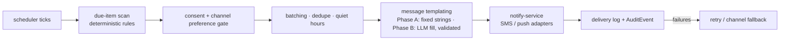

# Agent · Reminder

Version 1.0 · July 2026 · MedAgent Platform
Status: Draft for review
Phase: **A (v1: medication/appointment/follow-up reminders for the pilot) · B (full preventive engagement)**

## Executive summary

The reminder agent is the preventive-engagement engine of spec §2.15: it generates reminders automatically — appointments, medication/refills, follow-ups due, and (Phase B) immunisations and screenings — and sends them through the patient's consented channel (FR-15.1–15.3, FR-5.4). Form per [04-ai-agent-platform.md](../04-ai-agent-platform.md) §3: **scheduled job + LLM templating** — *no LLM makes a scheduling or sending decision*; due-item computation, consent checks, batching and quiet hours are deterministic code, and the LLM's only (Phase B) role is rendering message text in the patient's language from fixed templates. Delivery is exclusively via notify-service (01).

## 1. Requirement traceability

| FR | Requirement | Phase | Agent's part |
|---|---|---|---|
| FR-15.1 | Auto-generate reminders: immunisation due, screening due, follow-up due, medication refill | A (follow-up, refill, appointment) / B (immunisation, screening) | Due-item scan rules §4.1 |
| FR-15.2 | Chronic-condition monitoring: out-of-range vitals trigger nudges to patient and doctor | B | Threshold rules over Observation streams |
| FR-15.3 | All reminders respect consent and channel preference (SMS / app push) | A | Consent + preference gate before every send (§4.2) |
| FR-5.4 | Medication reminders and refill alerts | A | MedicationRequest-derived schedules |
| FR-11.4 | Send appointment reminders (SMS/app) | A | Send execution for schedules created by the schedule agent ([06-schedule.md](06-schedule.md)) |
| NFR-7 | Sinhala / Tamil / English | B (translations) | LLM templating in patient's language, template-constrained |

## 2. Position in the system (outside the chat graph)

The reminder agent never participates in a conversation turn. It is a scheduled worker inside agent-service (internal endpoints per 04 §1) reading FHIR via core-api's consent-checked path and emitting sends to notify-service:

Its "typed result" is the send record: `ReminderDispatch {patient, kind, source_ref, channel, scheduled_for, status}` in `app_db`, with an AuditEvent per send (reminders are record-derived data leaving the platform — always audited).

## 3. Tool belt (worker capabilities)

| Capability | Purpose | FHIR resources | R/W | Citation behaviour |
|---|---|---|---|---|
| `scan_appointments` | Upcoming Appointments needing T-72h/T-24h reminders | Appointment | R | source_ref recorded per dispatch |
| `scan_followups_due` | Follow-ups due/overdue per encounter plans | Appointment (proposed), ServiceRequest | R | source_ref |
| `scan_refills` | Active MedicationRequests approaching supply end | MedicationRequest | R | source_ref |
| Phase B: `scan_immunizations_due` | National schedule vs Immunization records (FR-7.3) | Immunization, Patient (age) | R | source_ref |
| Phase B: `scan_vitals_thresholds` | Out-of-range chronic-monitoring observations | Observation, Condition | R | source_ref |
| `check_consent_and_channel` | Reminder consent + channel preference + guardian routing | Consent, Patient/RelatedPerson (+ prefs in `app_db`) | R | decision logged |
| `render_message(template_id, vars)` | Fill fixed template (Phase B: LLM in patient language, validated) | — | — | template_id + version logged |
| `send(notify-service)` | Dispatch SMS/push | — | W (external) | delivery status + AuditEvent |

No chat tools, no write access to any clinical resource — the reminder agent can never alter the record it reads.

## 4. Core logic (deterministic)

### 4.1 Due-item scan schedule
- Cadence: appointment reminders hourly (catch T-72h/T-24h windows); refills and follow-ups daily (morning batch); Phase B immunisation/screening daily; Phase B vitals thresholds near-real-time via the Observation event stream rather than scan.
- Each rule is pure: `(records, now, config) → due_items[]`. Idempotency: a dispatch key `{patient, kind, source_ref, window}` guarantees at-most-once per reminder window even across reschedules and reruns.
- Self-healing backfill: the scan derives state from the record, not from an internal calendar — a missed run or a failed schedule-agent handoff is corrected on the next scan ([06-schedule.md](06-schedule.md) §6).

### 4.2 Consent and channel gate (FR-15.3 — before every send, not at schedule time)
1. Active reminder-scope `Consent` — revocation between scheduling and sending suppresses the send (checked at dispatch).
2. Channel preference (SMS / app push; portal-managed, FR-5.2 surface) — no preference defaults to SMS for non-smartphone reach (spec §5.1), except message kinds configured as push-only for privacy.
3. Guardian routing: reminders for a child go to linked guardian(s) per proxy rights (FR-5.9/7.8); expiry at majority is respected automatically.
4. Content minimisation on SMS: drug names and diagnoses never appear in SMS payloads ("You have a medication reminder — open the app / contact the clinic"); full detail lives behind portal auth. Push notifications follow the same collapsed-payload rule.

### 4.3 Batching, quiet hours, fatigue control
- Per-patient daily digest: multiple due items in one window collapse to one message per channel.
- Quiet hours (default 20:00–08:00 local, config FR-6.2 style): non-urgent sends held to the next morning batch; only clinician-triggered urgent notifications (not this agent's) bypass.
- Fatigue caps: max reminders per patient per week (config); overflow prioritised by clinical weight (refill > follow-up > screening) and the remainder deferred.
- Escalation ladders (e.g. missed follow-up: T+2d nudge, T+7d second, then flag to clinic list) are rule-defined, not model-defined.

### 4.4 Templating
Phase A: fixed message templates (versioned in-repo) with variable interpolation — English, plus pre-translated static Sinhala/Tamil strings where available from i18n scaffolding. **Phase B**: LLM renders the template in the patient's registered language; output is validated (template semantic slots present, no added clinical content, length limit) before send; failed validation falls back to the static template. The LLM never chooses *whether*, *when*, or *to whom* — only wording within a fixed frame.

## 5. Agent-specific guardrails (beyond 04 §5)

- **No LLM decisions** — scheduling, targeting, channel, and suppression are code; templating is the model's only surface, post-validated (ADR AG-2 principle applied to engagement).
- **Consent checked at send time** — never trusted from schedule time (FR-15.3).
- **PHI minimisation on external channels** — §4.2(4); SMS is an untrusted transport.
- **At-most-once dispatch** — idempotency keys; duplicate reminders erode trust and phone credit.
- **No clinical writes** — read-only belt; nudge-to-doctor items (FR-15.2) create worklist tasks via core-api, never record entries.
- **Rate ceilings toward the SMS gateway** — cost and abuse control; nightly send budgets alerted (NFR-9).

## 6. Failure modes & degradation (04 §7)

| Failure | Behaviour |
|---|---|
| notify-service down | Dispatches buffered in Redis streams with TTL; retried; expiry logged (a stale appointment reminder must not send after the appointment) |
| SMS gateway failing | Channel fallback to push where consented; else deferred with alert; delivery failures per patient surface on the clinic list (unreachable-patient report) |
| Scan job missed (deploy/outage) | Next run self-heals from record state (§4.1); windows too old to be useful are skipped and logged, not sent late |
| Consent read unavailable | **Fail closed — no send without a positive consent decision** |
| Phase B LLM templating fails validation | Static template fallback; validation-failure rate on drift dashboards |

## 7. Eval / test cases contributed

Deterministic logic → CI integration fixtures; Phase B templating → golden-set rubric cases.

| # | Input | Expected |
|---|---|---|
| RM-1 | Appointment at T+24h, consent active, pref=SMS | One SMS dispatch, minimised content, AuditEvent |
| RM-2 | Same appointment, scan re-run | No duplicate (idempotency key) |
| RM-3 | Consent revoked after scheduling, before send | Send suppressed; suppression logged |
| RM-4 | 3 due items same day, one patient | Single digest per channel |
| RM-5 | Refill due at 22:30 (quiet hours) | Held; sent in morning batch |
| RM-6 | Child's immunisation due (Phase B), two linked guardians | Both guardians notified per proxy rights; child never directly |
| RM-7 | 6th reminder in a week (cap = 5) | Deferred by clinical-weight priority; cap event logged |
| RM-8 | Appointment cancelled after reminder scheduled | Scan against record state → no send |
| RM-9 (B) | Sinhala template fill via LLM | Slots intact, no added clinical content, length OK (rubric-graded); fallback works when validation fails |

## 8. Phase A vs Phase B

| | Phase A (v1, S5) | Phase B |
|---|---|---|
| Kinds | Appointment (FR-11.4), follow-up due, medication/refill (FR-5.4), visit-summary-sent notice | + immunisation due, screening due (FR-15.1 full), chronic vitals nudges to patient and doctor (FR-15.2) |
| Channels | SMS + web push (PWA) | + native-app push; TTS-friendly content for low literacy (FR-13.3) |
| Language | English + static Si/Ta strings | LLM-templated Sinhala/Tamil (validated) |
| Escalation | Single nudge | Rule-defined ladders + clinic unreachable-patient lists |

## 9. Open questions

1. Default quiet-hours window and weekly fatigue cap — confirm with pilot-site patient panel during S5 UAT.
2. SMS sender ID and gateway contract (delivery receipts availability drives the retry design) — infra decision with 10-devops-infrastructure.md.
3. Whether visit-summary notifications (S5 "auto-sent visit summary") route through this agent's pipeline or remain a direct notify-service call — recommend this pipeline for the consent gate and audit consistency.
